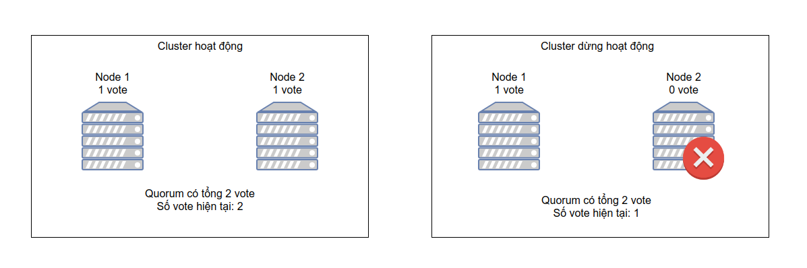
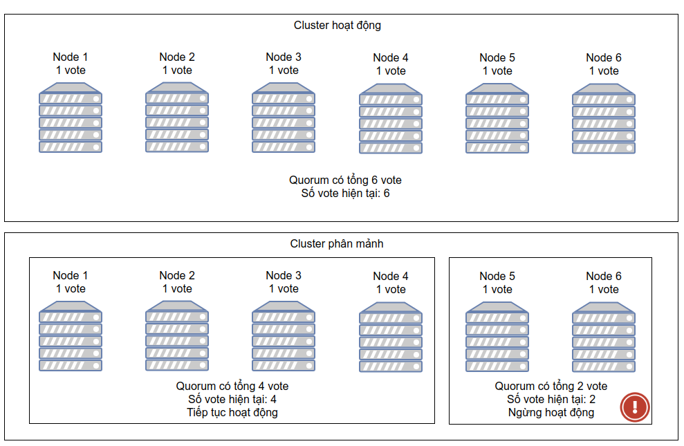

<h1 align="center">Tổng quan về Quorum, STONITH/Fencing</h1>

## Mục lục
I. [Tổng quan Quorum](#tongquanquorum)

  1. [Định nghĩa](#dinhnghiaquorum)
  2. [Ví dụ Quorum](#viduquorum)

II. [Tổng quan về STONITH/Fencing](#STONITH/Fencing)
  1. [Định nghĩa](#dinhnghiaSTONITH/Fencing)
  2. [Ví dụ](#viduSTONITH/Fencing)


## I. <a name="tongquanquorum"></a>Tổng quan Quorum
### 1. <a name="dinhnghiaquorum"></a>Định nghĩa
- **`split-brain`** là hiện tượng lớn cluster lớn bị phân tách ra thành nhiều Cluster nhỏ và hoạt động như những Cluster riêng biệt có khả năng ghi vào cùng 1 dữu liệu và gây ra mất mát dữ liệu. Điều này dẫn đến sự mất đồng bộ giữa các tài nguyên làm ảnh hưởng đến sự vẹn toàn hệ thống

- **`Quorum`** là giải pháp ngăn chặn hiện tượng `splet-brain` trong Cluster. Cluster có quorum chỉ khi số node hoạt động nhiều hơn 50% số node thuộc Cluster ( `Node Active > (Node Cluster)/2`)

- Quorum được thiết lập bằng cơ chế **`Voting`**. Tại thời điểm 1 Node Cluster xảy ra sự cố hoặc mất kết nối đến các phần còn lại của hệ thống Cluster, các node còn lại sẽ `vote` cho việc node nào sẽ bị đóng băng cô lập, node nào sẽ tiếp tục hoạt động

- Kỹ thuật Quorum được hỗ trợ bên trong `pacemaker` với 2 kỹ thuật:
  - Kỹ thuật `Resource-driven cluster`: kỹ thuật phân cấp nhóm tài nguyên để quản lý độc lập
  - Kỹ thuật `Quorate cluster`: Kỹ thuật tính điểm của các node thuộc cluster, ý tưởng ở đây là khi 1 cụm lớn bị phân thành 2 cum, Cluster sẽ đánh gía và so sánh điểm tại 2 cụm để đưa ra quyết định cụm nào sẽ tiếp tục hoạt động và cụm nào sẽ bị cô lập và tắt hẳn 
  - Công thức tính `Quorum` ( số node tối thiểu hoạt động bình thường)
```
(Số Node hoạt động trên Cluster)>(Tổng số Node thuộc Cluster/2)
```

- Các tùy chọn khi `Pacemaker` mất `Qourum` ( Số node hoạt động không thể tạo thành Quorum)
  - ignore: Tiếp tục duy trì quản trị Cluster kể cả khi không có Quorum
  - Freeze: Tiếp tục duy trì và quản trị Cluster nhưng đóng băng tài nguyên xảy ra sự cố nhưng không khắc phục, phục hồi tài nguyên xảy ra sự cố
  - Stop: Ngừng cung cấp dịch vụ Cluster khi không có Quorum
  - Suicide: Cô lập node đang xảy ra sự cố

### 2. <a name="viduquorum"></a>Ví dụ Quorum

- Đối với `Cluster` gồm 2 node, tổng số vote là 2. Dựa theo kỹ thuật voting quorum sẽ chỉ hoạt động nếu số vote lớn hơn 1 nửa số node hoạt động (tức lớn hơn 1 node). Vì vậy nếu có 1 node xảy ra sự cố, cả cluster sẽ **`dừng hoạt động`**
<h3 align="center"></h3>

- Đối với Cluster gồm `3 node`, tổng số vote là 3. Dựa theo kỹ thuật voting quorum sẽ chỉ hoạt động nếu số vote lớn hơn 1 nửa số node hoạt động (tức lớn hơn 1 node). Vì vậy nếu có hơn `2 node xảy ra sự cố`, cả cluster sẽ `dừng hoạt động`
<h3 align="center"></h3>

- Ở trường hợp `cluster` gồm có 6 node bị phân mảng thì tối thiểu cần có 4 node hoạt động để `Quorum` có thể hình thành và hoạt động. Trong trường hợp bị phân mảnh nhỏ hơn `Pacemaker` sẽ cô lập hoặc ngừng cung cấp dịch vụ.
<h3 align="center"></h3>


## II. <a name="STONITH/Fencing"></a>Tổng quan về STONITH/Fencing
### 1. <a name="dinhnghiaSTONITH/Fencing"></a>Định nghĩa

- **`STONITH`** là viết tắt của `Shoot-The-Other-Node-In-The-Head` kỹ thuật bảo vệ dữ liệu khỏi các node xảy ra sự cố. Trong trường hợp node không phản hồi cluster nhưng không chắc chắn trạng thái của node và các dịch vụ trên node thì cách tốt nhất để bảo đảm dữ liệu trên node là tắt nóng, đảm bảo node thực sự `offline` . `STONITH` sẽ sử dụng các giao thức quản trị từ xa được hỗ trợ bởi phần cứng, cho phép Cluster thực thi các thao tác trực tiếp với server vật lý

 - Trong hệ thống Cluster, các node chia sẻ tài nguyên sử dụng với nhau, nếu 1 node gặp phải sự cố tài nguyên chia sẻ giữa các node có thể bị ảnh hưởng dẫn đến trạng thái trên các node khác trong hệ thống Cluster có trạng thái hoạt động thất thường. Để loại bỏ hiện tượng trên, chúng ta sử dụng kỹ thuật `Fencing` để cô lập tài nguyên của các node đang xảy ra sự cố

 - **`Fencing`** sẽ loại bỏ kết nối giữa node tới các tài nguyên chia sẻ Cluster (Share Storage,database,...). `Cluster` thực hiện cô lập tài nguyên (`Fencing`) thông qua kỹ thuật `STONITH`.

 > Đối với Pacemaker khi phát hiện node có sự cố, nó sẽ thông báo tới các node đang hoạt động về node lỗi và tiến hành cô lập node lỗi thông qua STONITH

 - STONITH có thể được thực hiện thông qua nhiều mức, dựa trên nhiều loại thiết bị hỗ trợ:
   - `Uninterruptible Power Supply (UPS)`: Cô lập tài nguyên cung cấp năng lượng bằng bộ lưu điện, sử dụng khi hệ thống cung cấp năng lượng xảy ra sự cố
   - `Power Distribution Unit (PDU)`: Cô lập tài nguyên cung cấp năng lượng bằng thiết bị cấp phát nguồn, sử dụng khi hệ thống cung cấp năng lượng xảy ra sự cố
   - `Blade power control device`: Hệ thống chuyên dụng trong các datacenter, sử dụng để cô lập các cluster node xảy ra sự cố.
   - `Lights-out device`: Thiết bị gắn mạng hỗ trợ giao thức quản trị từ xa có phép cố lập tài nguyên dựa trên thao tác tắt bật. VD: HP Integrated Lights-Out - (HP ILO); Dell Remote Access Controller (DRAC)

- Các giao thức hỗ trợ STONITH:
  - `IPMI` - intelligent Platform Management Interface ( General Standard )
  - `IDRAC` - Integrated Dell Remote Access ( Dell )
  - `ILO` - Integrated Lights-Out ( HP )
  - `IMM` - Integrated Management Module ( IBM )

- Ngoài ra, nếu dịch vụ chạy trên các máy ảo, các vật chủ hỗ trợ phương pháp `fencing`:
  - fence_vmware_soap (vSphere Vmware)
  - Fence virtd, fence-agents-virsh (Cho trình ảo hóa hỗ trợ lib virt

### 2. <a name="viduSTONITH/Fencing"></a>Ví dụ

- Trong trường hợp Node 3 xảy ra sự cố, cluster hình thành giữa node 1 và node 2 sẽ tắt nóng node 3 thông qua cấu hình STONITH (ILO, IDRAC, …)

 <h3 align="center"></h3>