<h1 align="center">Cài đặt, triển khai Haproxy Keepalive cho Apache trên CentOS 7</h1>

# Phần I. Chuẩn bị 
## 1. Mô hình hoạt động
<h3 align="center">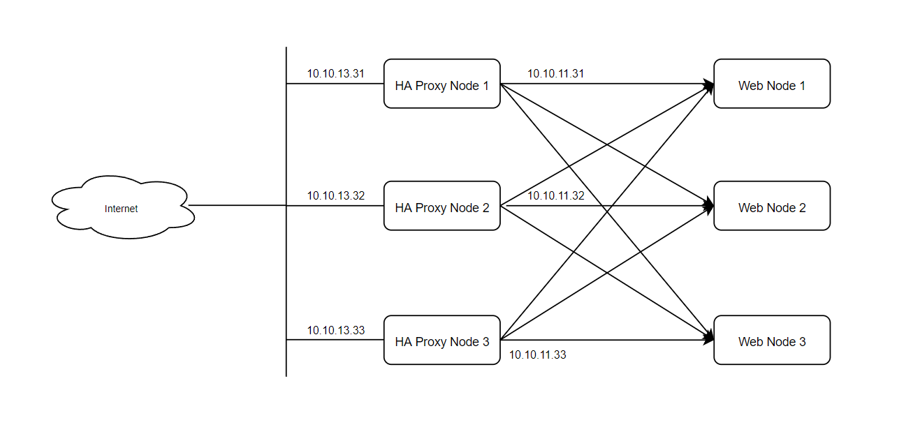</h3>

## 2. Quy hoạch IP

| Hostname | hardware | Interface |
|--------------|-------|------|
| MariaDB-1 | 2 CPU - 2GB RAM - 30GB Disk| Public: 10.10.13.31  (MNGT)- Vlan11: 10.10.11.31|
| MariaDB-2 | 2 CPU - 2GB RAM - 30GB Disk| Public: 10.10.13.32 (MNGT)- Vlan11: 10.10.11.32|
| MariaDB-3 | 2 CPU - 2GB RAM - 30GB Disk| Public: 10.10.13.33 (MNGT)- Vlan11: 10.10.11.33|

# Phần II. Cài đặt và triển khai
## 1. Thiết lập ban đầu
> ## **`Thực hiên trên cả 3 Node: MariaDB-1, MariaDB-2, MariaDB-3`**
### Bước 1: Tắt firewall, Selinux
```sh
sudo systemctl disable firewalld
sudo systemctl stop firewalld
sudo systemctl disable NetworkManager
sudo systemctl stop NetworkManager
sudo systemctl enable network
sudo systemctl start network
sed -i 's/SELINUX=enforcing/SELINUX=disabled/g' /etc/sysconfig/selinux
sed -i 's/SELINUX=enforcing/SELINUX=disabled/g' /etc/selinux/config
```

### Bước 2: Cài đặt Epel repository và Update các gói cài đặt
```sh
yum install epel-release -y
yum update -y
```
### Bước 3: Cài đặt NTP
```sh
yum install chrony -y 

systemctl start chronyd 
systemctl enable chronyd
systemctl restart chronyd 

chronyc sources -v

sudo date -s "$(wget -qSO- --max-redirect=0 google.com 2>&1 | grep Date: | cut -d' ' -f5-8)Z"
ln -f -s /usr/share/zoneinfo/Asia/Ho_Chi_Minh /etc/localtime

```

### Bước 4: Set hostname
```sh
echo "10.10.13.31 MariaDB-1" >> /etc/hosts
echo "10.10.13.32 MariaDB-2" >> /etc/hosts
echo "10.10.13.33 MariaDB-3" >> /etc/hosts
```
### Bước 5: Cài đặt CMD Log
```sh
curl -Lso- https://raw.githubusercontent.com/thang290298/CMD-Log/main/cmdlog.sh | bash
```
### Bước 6: Khởi động lại máy để load được cấu hình selinux
```sh
init 6
```
<h3 align="center">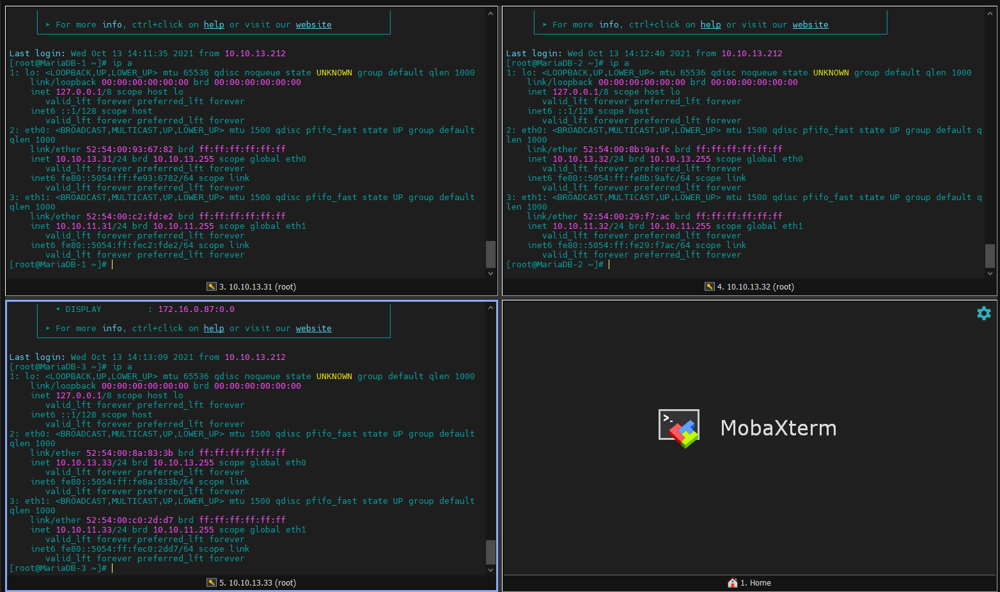</h3>

## 2. riển khai Haproxy Keepalive cho Apache trên CentOS 7
### Bước 1: Cài đặt Apache
> ## thực hiện trên node MariaDB-1

```sh
yum install httpd -y
cat /etc/httpd/conf/httpd.conf | grep 'Listen 80'
sed -i "s/Listen 80/Listen 10.10.11.31:8081/g" /etc/httpd/conf/httpd.conf
```

```sh
echo '<h1>Wellcome to Node MariaDB-1</h1>' > /var/www/html/index.html
systemctl start httpd
systemctl enable httpd
```
- thực hiện tương tương tự trên các node MariaDB-2 và MariaDB-3
- Kiểm tra kết quả:

<h3 align="center">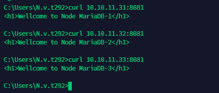</h3>

### Bước 2: Cấu hình Keep Alive
- Thực hiện cài đặt **`keepalived`** trên cả 3 node
```sh
yum install keepalived -y
```
- Copy cấu hình Defaults của `keepalived`
```sh
cp /etc/keepalived/keepalived.conf /etc/keepalived/keepalived.conf.bak
systemctl start keepalived
systemctl enable keepalived
```

- Cấu hình file: `/etc/keepalived/keepalived.conf`
  - Thực hiện cầu hình sử dụng VIP IP: 10.10.13.30/24
#### **Node MariaDB-1 cấu hình làm Master**
```sh
vrrp_script chk_haproxy {
    script "killall -0 haproxy"
    interval 2
    weight 2
}
vrrp_instance VI_1 {
    interface eth0
    state MASTER
    virtual_router_id 51
    priority 101
    virtual_ipaddress {
        10.10.13.30/24
    }
    track_script {
        chk_haproxy
    }
}
```
#### **2 Node  MariaDB-2,MariaDB-3 cấu hình `Backup`**
```sh
vrrp_script chk_haproxy {
    script "killall -0 haproxy"
    interval 2
    weight 2
}
vrrp_instance VI_1 {
    interface eth0
    state BACKUP
    virtual_router_id 51
    priority 100
    virtual_ipaddress {
        10.10.13.30/24
    }
    track_script {
        chk_haproxy
    }
}
```
- Khởi động lại `keepalive` trên 3 node:
```sh
systemctl restart keepalived
```

- Kiểm tra IP VIP trên node MariaDB-1
<h3 align="center">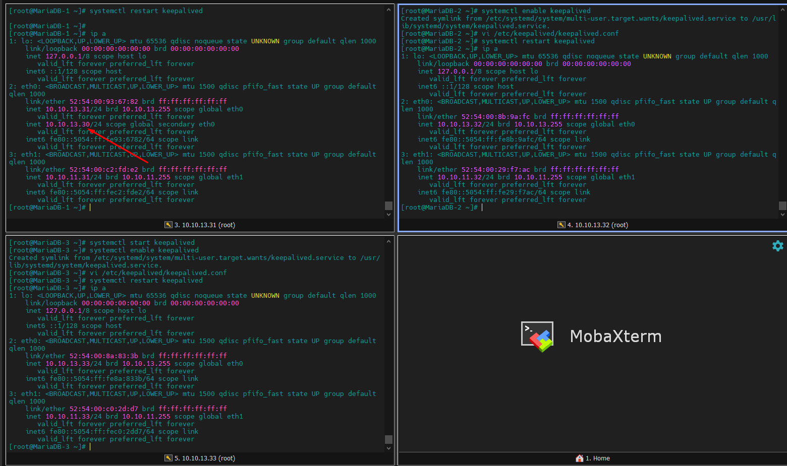</h3>

### Bước 3: Cấu hình haproxy

> ## Thực hiện trên tất cả các Node

- Cài đặt
```sh
sudo yum install wget socat -y
wget https://cbs.centos.org/kojifiles/packages/haproxy/1.8.23/3.el7/x86_64/haproxy18-1.8.23-3.el7.x86_64.rpm
yum install haproxy18-1.8.23-3.el7.x86_64.rpm -y
```

- Cấu hình file config cho haproxy:
```sh
cp /etc/haproxy/haproxy.cfg /etc/haproxy/haproxy.cfg.bak
echo 'global
    log         127.0.0.1 local2
    chroot      /var/lib/haproxy
    pidfile     /var/run/haproxy.pid
    maxconn     4000
    user        haproxy
    group       haproxy
    daemon
    stats socket /var/lib/haproxy/stats

defaults
    mode                    http
    maxconn                 8000
    log                     global
    option                  httplog
    option                  dontlognull
    option http-server-close
    retries                 3
    timeout http-request    20s
    timeout queue           1m
    timeout connect         10s
    timeout client          1m
    timeout server          1m
    timeout http-keep-alive 10s
    timeout check           10s

listen stats
    bind *:8080 interface eth0
    mode http
    stats enable
    stats uri /stats
    stats realm HAProxy\ Statistics
    stats admin if TRUE

listen web-backend
    bind *:80
    balance  roundrobin
    cookie SERVERID insert indirect nocache
    mode  http
    option  httpchk
    option  httpclose
    option  httplog
    option  forwardfor
    server MariaDB-1 10.10.11.31:8081 check cookie node1 inter 5s fastinter 2s rise 3 fall 3
    server MariaDB-2 10.10.11.32:8081 check cookie node2 inter 5s fastinter 2s rise 3 fall 3
    server MariaDB-3 10.10.11.33:8081 check cookie node3 inter 5s fastinter 2s rise 3 fall 3' > /etc/haproxy/haproxy.cfg
```

- Cấu hình Log cho HAProxy
```sh
sed -i "s/#\$ModLoad imudp/\$ModLoad imudp/g" /etc/rsyslog.conf
sed -i "s/#\$UDPServerRun 514/\$UDPServerRun 514/g" /etc/rsyslog.conf
echo '$UDPServerAddress 127.0.0.1' >> /etc/rsyslog.conf

echo 'local2.*    /var/log/haproxy.log' > /etc/rsyslog.d/haproxy.conf

systemctl restart rsyslog
```
- Bổ sung cấu hình cho phép kernel có thể binding tới IP VIP
```sh
echo 'net.ipv4.ip_nonlocal_bind = 1' >> /etc/sysctl.conf

sysctl -p

```
- Khởi đông `haproxy`
```sh
systemctl start haproxy
```
- Truy cập vào IP VIP theo link: http://10.10.13.30:8080/stats để kiểm qua kết quả
<h3 align="center">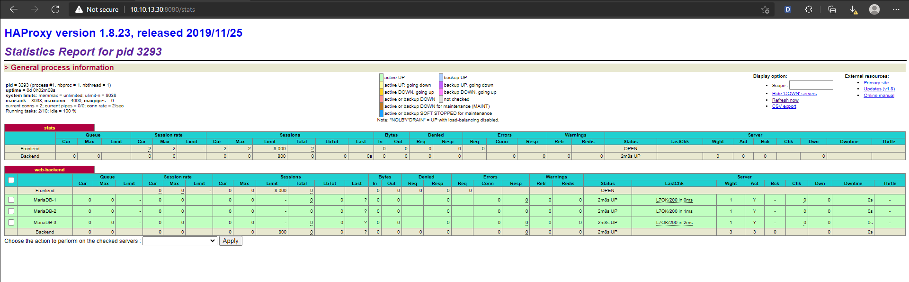</h3>

- Truy cập vào Webserver qua IP VIP:
Cấu hình `s`ticky session` (thể hiện ở config cookie node1, cookie node2, cookie node3 trong file config của haproxy) trên request vì vậy trong một thời điểm chỉ có thể kết nối tới 1 web server. Để truy cập tới các webserver còn lại mở trình duyệt ẩn danh và truy cập lại.

<h3 align="center">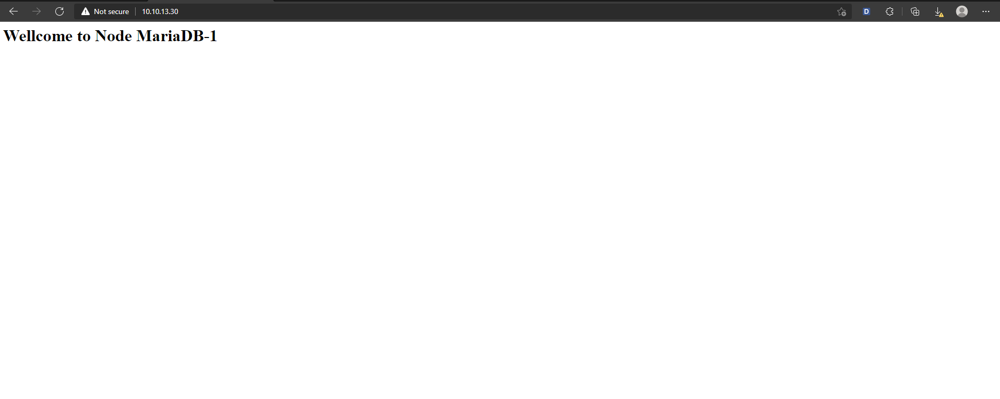</h3>

# Phần II. Kiểm tra các trường hợp
## T/H 1: Down Node MariaDB-1
<h3 align="center">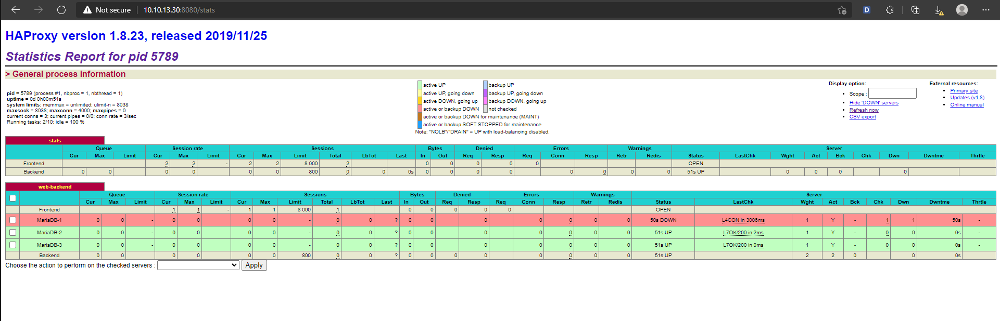</h3>

- IP VIP nhảy sang Node `MariaDB-3`
<h3 align="center">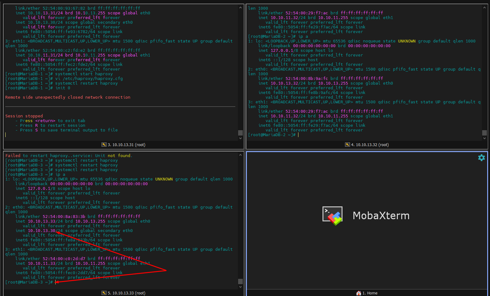</h3>

## T/H 2: Down Node MariaDB-1, MariaDB-3
- IP VIP nhảy sang Node `MariaDB-3`
<h3 align="center">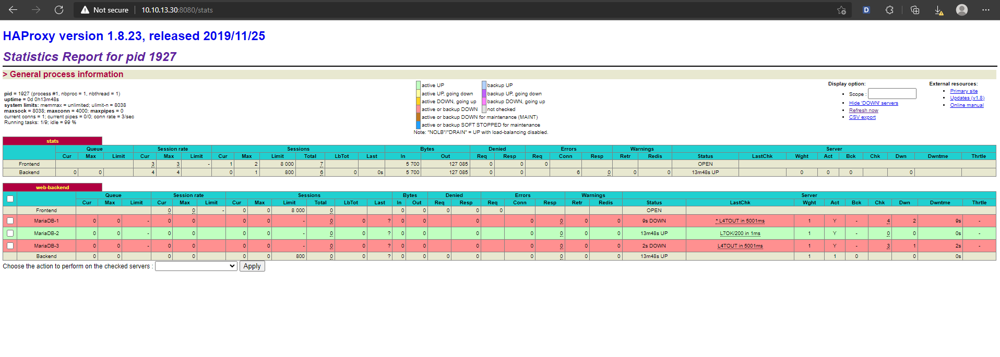</h3>
- IP VIP nhảy sang Node `MariaDB-2`
<h3 align="center">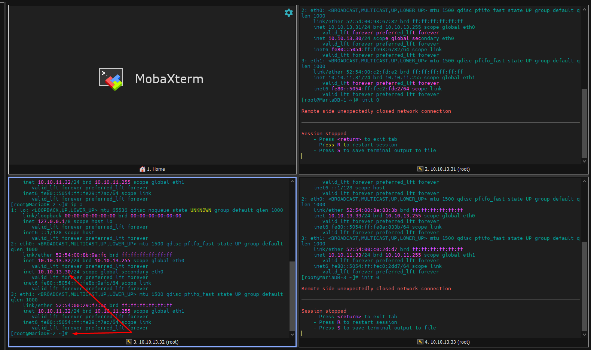</h3>
- Truy cập Web
<h3 align="center">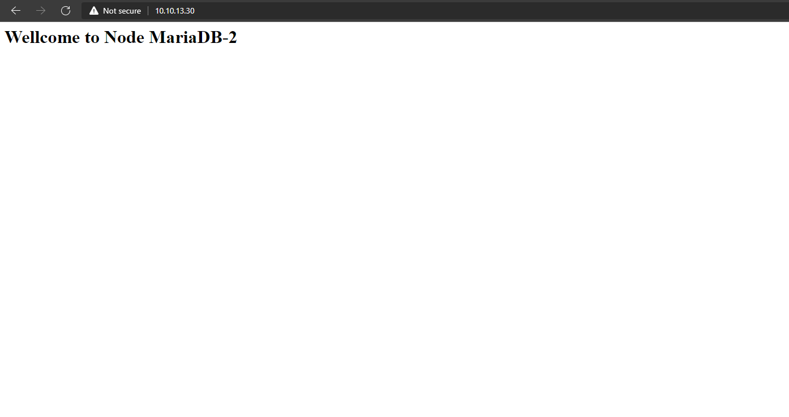</h3>
