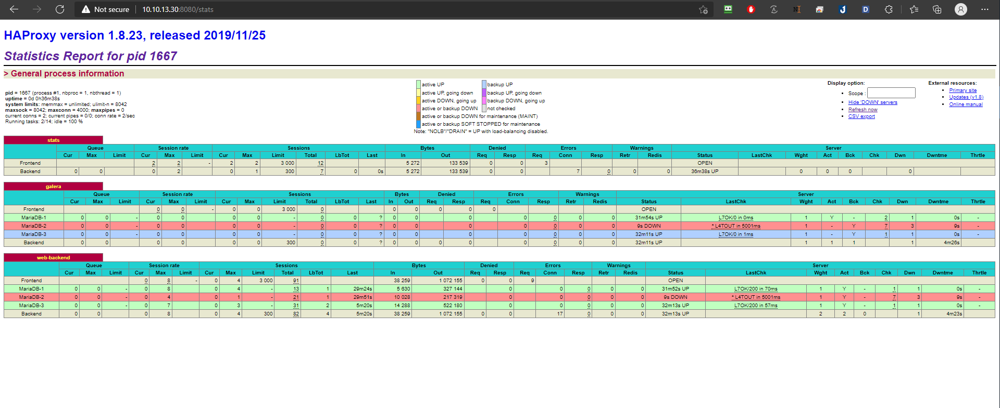

<h1 align="center">xử lý sự cố galera mariadb</h1>

# Phần I. Chuẩn bị môi trường
- Sử dung kết quả và mô hình của bài cài đặt về pacemaker - haproxy - galera mariadb để test các case vận hành với mariadb.

- Thực hiện triển khai Setup pacemaker - haproxy - galera mariadb theo tài liệu [sau đây](https://github.com/thang290298/Cluster-HA/blob/main/02-LAB/02-Haproxy-Pacemaker-Cluster-Galera-3-node-Apache.md)

- **`Định nghĩa về sự cố`**: Trường hợp xảy ra sự cố có 2 loại
  - `An toan`: dịch vụ tắt bình thường `systemctl stop mariadb`
  - `Không an toàn`: Khi tiến trình bị crash, os xảy ra vấn đề, mất điện ....

# Phần II. Xử lý sự cố

## 1. Trường hợp 1 node xảy ra vấn đề
- Đối với mô hình 3 node như đã lab cài đặt thì nếu 1 node down về mặt lý thuyết cụm vẫn hoạt động bình thường.
### **Down 1 node an toàn**
```sh
systemctl stop mariadb
```
<h3 align="center"></h3>
<h3 align="center"></h3>
<h3 align="center"></h3>

- **`Cách xử lý`**: Khởi động lại OS và tiến trình Mariadb, dịch vụ sẽ hoạt động bình thường

<h3 align="center"></h3>

### **Down 1 không an toàn kiểu mất điện tắt nóng server**
<h3 align="center"></h3>
<h3 align="center"></h3>

- **`Cách xử lý`**: Khởi động lại OS và tiến trình Mariadb, dịch vụ sẽ hoạt động bình thường

<h3 align="center"></h3>

## 2. Trường hợp 2 node xảy ra vấn đề
- Down 2 node MariaDB-1 > MariaDB-2 lần lượt
```sh
systemctl stop mariadb
```
<h3 align="center"></h3>
<h3 align="center"></h3>

- **`Cách xử lý`**: Khởi động lại OS và tiến trình Mariadb, dịch vụ sẽ hoạt động bình thường
  - thực hiện lần lượt MariaDB-2 > MariaDB-1 
<h3 align="center"></h3>
<h3 align="center"></h3>

### **Down 2 không an toàn kiểu mất điện tắt nóng server**
- Thực hiện trên 2 node MariaDB-1 và MariaDB-2 
  - Database bị phân mảnh
<h3 align="center"></h3>

-Xác định trạng thái `split brain` cluster đang có vấn đề.
**Login mysql**
```sh
mysql -u root -p
```
```sh
SHOW STATUS LIKE 'wsrep%';
```
Kiểm tra các tham số `wsrep_cluster_status | non-Primary` , `wsrep_local_state_comment | Initialized`, `wsrep_ready | OFF` dấu hiệu của `cluster` đang có vấn đề.
```sh
MariaDB [(none)]> SHOW STATUS LIKE 'wsrep%';
+-------------------------------+--------------------------------------+
| Variable_name                 | Value                                |
+-------------------------------+--------------------------------------+
| wsrep_applier_thread_count    | 1                                    |
| wsrep_apply_oooe              | 0.000000                             |
| wsrep_apply_oool              | 0.116788                             |
| wsrep_apply_waits             | 1                                    |
| wsrep_apply_window            | 1.000000                             |
| wsrep_causal_reads            | 0                                    |
| wsrep_cert_deps_distance      | 1.145985                             |
| wsrep_cert_index_size         | 4                                    |
| wsrep_cert_interval           | 0.000000                             |
| wsrep_cluster_conf_id         | 18446744073709551615                 |
| wsrep_cluster_size            | 1                                    |
| wsrep_cluster_state_uuid      | 77622671-2416-11ec-aeb0-ef1e3290ceaf |
| wsrep_cluster_status          | non-Primary                          |
| wsrep_cluster_weight          | 0                                    |
| wsrep_commit_oooe             | 0.000000                             |
| wsrep_commit_oool             | 0.116788                             |
| wsrep_commit_window           | 1.043796                             |
| wsrep_connected               | ON                                   |
| wsrep_desync_count            | 0                                    |
| wsrep_evs_delayed             |                                      |
| wsrep_evs_evict_list          |                                      |
| wsrep_evs_repl_latency        | 0/0/0/0/0                            |
| wsrep_evs_state               | OPERATIONAL                          |
| wsrep_flow_control_active     | false                                |
| wsrep_flow_control_paused     | 0.000000                             |
| wsrep_flow_control_paused_ns  | 0                                    |
| wsrep_flow_control_recv       | 0                                    |
| wsrep_flow_control_requested  | false                                |
| wsrep_flow_control_sent       | 0                                    |
| wsrep_gcomm_uuid              | 6927eac4-2c02-11ec-80a8-c2c7391a444f |
| wsrep_gmcast_segment          | 0                                    |
| wsrep_incoming_addresses      | 10.10.13.33:3306                     |
| wsrep_last_committed          | 486                                  |
| wsrep_local_bf_aborts         | 4                                    |
| wsrep_local_cached_downto     | 330                                  |
| wsrep_local_cert_failures     | 1                                    |
| wsrep_local_commits           | 83                                   |
| wsrep_local_index             | 0                                    |
| wsrep_local_recv_queue        | 0                                    |
| wsrep_local_recv_queue_avg    | 0.021053                             |
| wsrep_local_recv_queue_max    | 2                                    |
| wsrep_local_recv_queue_min    | 0                                    |
| wsrep_local_replays           | 0                                    |
| wsrep_local_send_queue        | 0                                    |
| wsrep_local_send_queue_avg    | 0.000000                             |
| wsrep_local_send_queue_max    | 1                                    |
| wsrep_local_send_queue_min    | 0                                    |
| wsrep_local_state             | 0                                    |
| wsrep_local_state_comment     | Initialized                          |
| wsrep_local_state_uuid        | 77622671-2416-11ec-aeb0-ef1e3290ceaf |
| wsrep_open_connections        | 0                                    |
| wsrep_open_transactions       | 0                                    |
| wsrep_protocol_version        | 9                                    |
| wsrep_provider_name           | Galera                               |
| wsrep_provider_vendor         | Codership Oy <info@codership.com>    |
| wsrep_provider_version        | 25.3.34(rd7e8241)                    |
| wsrep_ready                   | OFF                               |
| wsrep_received                | 95                                   |
| wsrep_received_bytes          | 39348                                |
| wsrep_repl_data_bytes         | 36312                                |
| wsrep_repl_keys               | 356                                  |
| wsrep_repl_keys_bytes         | 4984                                 |
| wsrep_repl_other_bytes        | 0                                    |
| wsrep_replicated              | 89                                   |
| wsrep_replicated_bytes        | 46992                                |
| wsrep_rollbacker_thread_count | 1                                    |
| wsrep_thread_count            | 2                                    |
+-------------------------------+--------------------------------------+
67 rows in set (0.003 sec)

MariaDB [(none)]>
```
- Xem log mariadb sẽ báo `timed out, connection to peer`
```sh
2021-10-13 17:08:25 0 [Note] WSREP: New COMPONENT: primary = no, bootstrap = no, my_idx = 0, memb_num = 1
2021-10-13 17:08:25 0 [Note] WSREP: Flow-control interval: [16, 16]
2021-10-13 17:08:25 0 [Note] WSREP: Received NON-PRIMARY.
2021-10-13 17:08:25 0 [Note] WSREP: Shifting SYNCED -> OPEN (TO: 333)
2021-10-13 17:08:25 0 [Note] WSREP: New COMPONENT: primary = no, bootstrap = no, my_idx = 0, memb_num = 1
2021-10-13 17:08:25 0 [Note] WSREP: Flow-control interval: [16, 16]
2021-10-13 17:08:25 0 [Note] WSREP: Received NON-PRIMARY.
2021-10-13 17:08:25 2 [Note] WSREP: New cluster view: global state: 77622671-2416-11ec-aeb0-ef1e3290ceaf:333, view# -1: non-Primary, number of nodes: 1, my index: 0, protocol version 3
2021-10-13 17:08:25 2 [Note] WSREP: wsrep_notify_cmd is not defined, skipping notification.
2021-10-13 17:08:25 2 [Note] WSREP: New cluster view: global state: 77622671-2416-11ec-aeb0-ef1e3290ceaf:333, view# -1: non-Primary, number of nodes: 1, my index: 0, protocol version 3
2021-10-13 17:08:25 2 [Note] WSREP: wsrep_notify_cmd is not defined, skipping notification.
2021-10-13 17:08:27 0 [Note] WSREP: (48b3d58f, 'tcp://0.0.0.0:4567') connection to peer 00000000 with addr tcp://10.10.11.32:4567 timed out, no messages seen in PT3S, socket stats: rtt: 0 rttvar: 250000 rto: 4000000 lost: 1 last_data_recv: 4294920855 cwnd: 1 last_queued_since: 253559773653 last_delivered_since: 253559773653 send_queue_length: 0 send_queue_bytes: 0
2021-10-13 17:08:32 0 [Note] WSREP: (48b3d58f, 'tcp://0.0.0.0:4567') connection to peer 00000000 with addr tcp://10.10.11.32:4567 timed out, no messages seen in PT3S, socket stats: rtt: 0 rttvar: 250000 rto: 4000000 lost: 1 last_data_recv: 4294925857 cwnd: 1 last_queued_since: 258561329117 last_delivered_since: 258561329117 send_queue_length: 0 send_queue_bytes: 0
2021-10-13 17:08:36 0 [Note] WSREP: (48b3d58f, 'tcp://0.0.0.0:4567') connection to peer 00000000 with addr tcp://10.10.11.32:4567 timed out, no messages seen in PT3S, socket stats: rtt: 0 rttvar: 250000 rto: 2000000 lost: 1 last_data_recv: 4294930358 cwnd: 1 last_queued_since: 263062733149 last_delivered_since: 263062733149 send_queue_length: 0 send_queue_bytes: 0
2021-10-13 17:08:40 0 [Note] WSREP: (48b3d58f, 'tcp://0.0.0.0:4567') connection to peer 00000000 with addr tcp://10.10.11.32:4567 timed out, no messages seen in PT3S, socket stats: rtt: 0 rttvar: 250000 rto: 2000000 lost: 1 last_data_recv: 4294934360 cwnd: 1 last_queued_since: 267064188017 last_delivered_since: 267064188017 send_queue_length: 0 send_queue_bytes: 0
2021-10-13 17:08:44 0 [Note] WSREP: (48b3d58f, 'tcp://0.0.0.0:4567') connection to peer 00000000 with addr tcp://10.10.11.32:4567 timed out, no messages seen in PT3S, socket stats: rtt: 0 rttvar: 250000 rto: 2000000 lost: 1 last_data_recv: 4294938362 cwnd: 1 last_queued_since: 271066195747 last_delivered_since: 271066195747 send_queue_length: 0 send_queue_bytes: 0
2021-10-13 17:08:48 0 [Note] WSREP: (48b3d58f, 'tcp://0.0.0.0:4567') connection to peer 00000000 with addr tcp://10.10.11.32:4567 timed out, no messages seen in PT3S, socket stats: rtt: 0 rttvar: 250000 rto: 2000000 lost: 1 last_data_recv: 4294942364 cwnd: 1 last_queued_since: 275068143499 last_delivered_since: 275068143499 send_queue_length: 0 send_queue_bytes: 0
2021-10-13 17:08:52 0 [Note] WSREP: (48b3d58f, 'tcp://0.0.0.0:4567') connection to peer 00000000 with addr tcp://10.10.11.32:4567 timed out, no messages seen in PT3S, socket stats: rtt: 0 rttvar: 250000 rto: 2000000 lost: 1 last_data_recv: 4294946365 cwnd: 1 last_queued_since: 279069413289 last_delivered_since: 279069413289 send_queue_length: 0 send_queue_bytes: 0
2021-10-13 17:08:56 0 [Note] WSREP: (48b3d58f, 'tcp://0.0.0.0:4567') connection to peer 00000000 with addr tcp://10.10.11.32:4567 timed out, no messages seen in PT3S, socket stats: rtt: 0 rttvar: 250000 rto: 2000000 lost: 1 last_data_recv: 4294950366 cwnd: 1 last_queued_since: 283070737257 last_delivered_since: 283070737257 send_queue_length: 0 send_queue_bytes: 0
2021-10-13 17:10:04 0 [Note] WSREP: (48b3d58f, 'tcp://0.0.0.0:4567') reconnecting to 4188b761 (tcp://10.10.11.32:4567), attempt 30
2021-10-13 17:11:34 0 [Note] WSREP: (48b3d58f, 'tcp://0.0.0.0:4567') reconnecting to 4188b761 (tcp://10.10.11.32:4567), attempt 60
```
- **`Nguyên nhân của sự cố`**: Database bị phân mảnh sự trên các dấu hiệu trên -> Dẫn tới web không connect được tới database -> Haproxy check sẽ báo lỗi `503` nên dẫn tới `web-backend` httpd cũng báo đỏ.

<h3 align="center"></h3>

- **`Cách xử lý`**: Khôi phục lại database -> web-backend httpd báo xanh.
  - Bước 1: Chắc chắn tắt hẳn 2 node trong trạng thái lỗi.
  - Bước 2: Tại node không lỗi thực hiện
```sh
[root@MariaDB-3 ~]# mysql -u root -p
Welcome to the MariaDB monitor.  Commands end with ; or \g.
Your MariaDB connection id is 3303
Server version: 10.2.35-MariaDB-log MariaDB Server

Copyright (c) 2000, 2018, Oracle, MariaDB Corporation Ab and others.

Type 'help;' or '\h' for help. Type '\c' to clear the current input statement.

MariaDB [(none)]> SET GLOBAL wsrep_provider_options='pc.bootstrap=1';
Query OK, 0 rows affected (0.01 sec)

MariaDB [(none)]> SHOW STATUS LIKE 'wsrep_cluster_size';
+--------------------+-------+
| Variable_name      | Value |
+--------------------+-------+
| wsrep_cluster_size | 1     |
+--------------------+-------+
1 row in set (0.01 sec)

MariaDB [(none)]>exit;
Bye

```
Sau 2 bước trên cluster sẽ hoạt động trở lại. Quá cluster database hoạt động bình thường -> web connect được tới database -> Haproxy check có phản hồi nên dẫn tới web-backend httpd sẽ xanh trở lại.
<h3 align="center"></h3>

Xem các tham số `wsrep_cluster_status | Primary` , `wsrep_local_state_comment | Synced`, `wsrep_ready | ON` `cluster` đã hoạt động trở lại.

Haproxy check phản hồi về `200`
<h3 align="center"></h3>

- Bật lại các node bị lỗ bình thường, dịch vụ mariadb trên các node sẽ tự join vào vào cluster
<h3 align="center"></h3>

## 3. Trường hợp 3 node xảy ra vấn đề
### <a name="3antoan">**Down 3 node an toàn**
Sự cố: Stop các node lần lượt: MariaDB-1 > MariaDB-2 > MariaDB-3
```sh
systemctl stop mariadb
```
<h3 align="center"></h3>

- **`Cách xử lý`**: Khởi động lại lần lượt databases trên các node sẽ thông báo lỗi do cluster đã chết
  <h3 align="center"></h3>
  - Kiểm tra giá trị `seqno` trong file `grastate.dat`. Node có giá trị lớn nhất sẽ là node khởi tạo lại cluster.
  <h3 align="center"></h3>

Trong bài lab database chưa có sự đọc ghi dữ liệu nên seqno = -1 giống nhau ở các node. Tìm node có seqno lớn nhất để khởi tạo lại cluster.

- Để khởi tạo lại `cluster`, thay đổi giá trị **`safe_to_bootstrap`** bằng `1` và chạy câu lệnh `galera_new_cluster`. Sau khi chạy câu lệnh `galera_new_cluster` cluster sẽ `khởi tạo trở lại`.
```sh
sed -i "s/safe_to_bootstrap: 0/safe_to_bootstrap: 1/g" /var/lib/mysql/grastate.dat
```
<h3 align="center"></h3>

- Start lại service 2 node còn lại theo cách thông thường.

<h3 align="center"></h3>
<h3 align="center"></h3>

- Kiểm tra Cluster
```sh
mysql -u root -p
SHOW STATUS LIKE 'wsrep_cluster_size';
```
```sh
[root@MariaDB-1 ~]# mysql -u root -p
Enter password: 
Welcome to the MariaDB monitor.  Commands end with ; or \g.
Your MariaDB connection id is 120
Server version: 10.3.31-MariaDB-log MariaDB Server

Copyright (c) 2000, 2018, Oracle, MariaDB Corporation Ab and others.

Type 'help;' or '\h' for help. Type '\c' to clear the current input statement.

MariaDB [(none)]> SHOW STATUS LIKE 'wsrep_cluster_size';
+--------------------+-------+
| Variable_name      | Value |
+--------------------+-------+
| wsrep_cluster_size | 3     |
+--------------------+-------+
1 row in set (0.002 sec)

MariaDB [(none)]>
```
### **Down 3 node không an toàn `init 0`**
<h3 align="center"></h3>

- **`Cách xử lý`**:
  - Ở trường hợp tốt, trạng thái các Databases được lưu lại, khi các node bật lại Cluster sẽ tự động khôi phục
  - Ở trường hợp xấu hơn không thể khởi động lại, thực hiện lần vết cụm down sau cùng hoặc chọn 1 node bất kỳ để bật lên. Sẽ có rủi ro mất dữ liệu ở trường hợp này

Sau khi bật cả 3 node theo thứ tự down sau bạt trước

<h3 align="center"></h3>

```sh
2021-10-13 22:52:05 0 [Note] WSREP: (7758fc35, 'tcp://0.0.0.0:4567') turning message relay requesting off
2021-10-13 22:52:17 0 [ERROR] WSREP: failed to open gcomm backend connection: 110: failed to reach primary view: 110 (Connection timed out)
         at /home/buildbot/buildbot/build/gcomm/src/pc.cpp:connect():160
2021-10-13 22:52:17 0 [ERROR] WSREP: /home/buildbot/buildbot/build/gcs/src/gcs_core.cpp:gcs_core_open():209: Failed to open backend connection: -110 (Connection timed out)
2021-10-13 22:52:17 0 [ERROR] WSREP: /home/buildbot/buildbot/build/gcs/src/gcs.cpp:gcs_open():1476: Failed to open channel 'ha_cluster' at 'gcomm://10.10.11.31,10.10.11.32,10.10.11.33': -110 (Connection timed out)
2021-10-13 22:52:17 0 [ERROR] WSREP: gcs connect failed: Connection timed out
2021-10-13 22:52:17 0 [ERROR] WSREP: wsrep::connect(gcomm://10.10.11.31,10.10.11.32,10.10.11.33) failed: 7
2021-10-13 22:52:17 0 [ERROR] Aborting
```
 - Thực hiện fix lỗi theo các ở **[`down 3 node an toàn`](#3antoan")**
 - kết quả:
 <h3 align="center"></h3>

 # Phần III. Vận hành