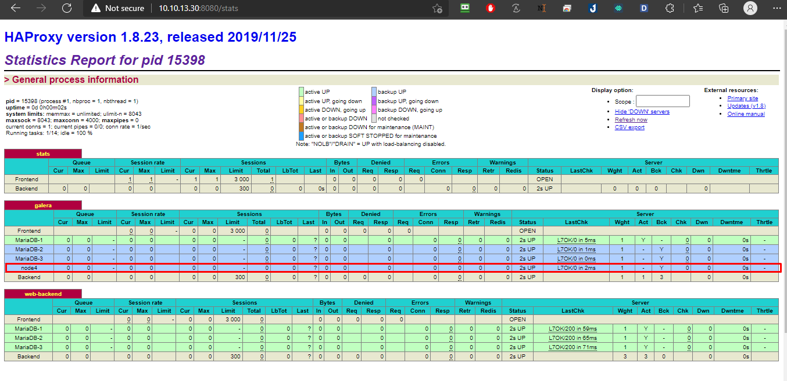

<h1 align="center">xử lý sự cố galera mariadb</h1>

# Phần I. Chuẩn bị môi trường
- Sử dung kết quả và mô hình của bài cài đặt về pacemaker - haproxy - galera mariadb để test các case vận hành với mariadb.

- Thực hiện triển khai Setup pacemaker - haproxy - galera mariadb theo tài liệu [sau đây](https://github.com/thang290298/Cluster-HA/blob/main/02-LAB/02-Haproxy-Pacemaker-Cluster-Galera-3-node-Apache.md)

- **`Định nghĩa về sự cố`**: Trường hợp xảy ra sự cố có 2 loại
  - `An toan`: dịch vụ tắt bình thường `systemctl stop mariadb`
  - `Không an toàn`: Khi tiến trình bị crash, os xảy ra vấn đề, mất điện ....

# Phần II. Xử lý sự cố

## 1. Trường hợp 1 node xảy ra vấn đề
- Đối với mô hình 3 node như đã lab cài đặt thì nếu 1 node down về mặt lý thuyết cụm vẫn hoạt động bình thường.
### **Down 1 node an toàn**
```sh
systemctl stop mariadb
```
<h3 align="center"></h3>
<h3 align="center"></h3>
<h3 align="center"></h3>

- **`Cách xử lý`**: Khởi động lại OS và tiến trình Mariadb, dịch vụ sẽ hoạt động bình thường

<h3 align="center"></h3>

### **Down 1 không an toàn kiểu mất điện tắt nóng server**
<h3 align="center"></h3>
<h3 align="center"></h3>

- **`Cách xử lý`**: Khởi động lại OS và tiến trình Mariadb, dịch vụ sẽ hoạt động bình thường

<h3 align="center"></h3>

## 2. Trường hợp 2 node xảy ra vấn đề
- Down 2 node MariaDB-1 > MariaDB-2 lần lượt
```sh
systemctl stop mariadb
```
<h3 align="center"></h3>
<h3 align="center"></h3>

- **`Cách xử lý`**: Khởi động lại OS và tiến trình Mariadb, dịch vụ sẽ hoạt động bình thường
  - thực hiện lần lượt MariaDB-2 > MariaDB-1 
<h3 align="center"></h3>
<h3 align="center"></h3>

### **Down 2 không an toàn kiểu mất điện tắt nóng server**
- Thực hiện trên 2 node MariaDB-1 và MariaDB-2 
  - Database bị phân mảnh
<h3 align="center"></h3>

-Xác định trạng thái `split brain` cluster đang có vấn đề.
**Login mysql**
```sh
mysql -u root -p
```
```sh
SHOW STATUS LIKE 'wsrep%';
```
Kiểm tra các tham số `wsrep_cluster_status | non-Primary` , `wsrep_local_state_comment | Initialized`, `wsrep_ready | OFF` dấu hiệu của `cluster` đang có vấn đề.
```sh
MariaDB [(none)]> SHOW STATUS LIKE 'wsrep%';
+-------------------------------+--------------------------------------+
| Variable_name                 | Value                                |
+-------------------------------+--------------------------------------+
| wsrep_applier_thread_count    | 1                                    |
| wsrep_apply_oooe              | 0.000000                             |
| wsrep_apply_oool              | 0.116788                             |
| wsrep_apply_waits             | 1                                    |
| wsrep_apply_window            | 1.000000                             |
| wsrep_causal_reads            | 0                                    |
| wsrep_cert_deps_distance      | 1.145985                             |
| wsrep_cert_index_size         | 4                                    |
| wsrep_cert_interval           | 0.000000                             |
| wsrep_cluster_conf_id         | 18446744073709551615                 |
| wsrep_cluster_size            | 1                                    |
| wsrep_cluster_state_uuid      | 77622671-2416-11ec-aeb0-ef1e3290ceaf |
| wsrep_cluster_status          | non-Primary                          |
| wsrep_cluster_weight          | 0                                    |
| wsrep_commit_oooe             | 0.000000                             |
| wsrep_commit_oool             | 0.116788                             |
| wsrep_commit_window           | 1.043796                             |
| wsrep_connected               | ON                                   |
| wsrep_desync_count            | 0                                    |
| wsrep_evs_delayed             |                                      |
| wsrep_evs_evict_list          |                                      |
| wsrep_evs_repl_latency        | 0/0/0/0/0                            |
| wsrep_evs_state               | OPERATIONAL                          |
| wsrep_flow_control_active     | false                                |
| wsrep_flow_control_paused     | 0.000000                             |
| wsrep_flow_control_paused_ns  | 0                                    |
| wsrep_flow_control_recv       | 0                                    |
| wsrep_flow_control_requested  | false                                |
| wsrep_flow_control_sent       | 0                                    |
| wsrep_gcomm_uuid              | 6927eac4-2c02-11ec-80a8-c2c7391a444f |
| wsrep_gmcast_segment          | 0                                    |
| wsrep_incoming_addresses      | 10.10.13.33:3306                     |
| wsrep_last_committed          | 486                                  |
| wsrep_local_bf_aborts         | 4                                    |
| wsrep_local_cached_downto     | 330                                  |
| wsrep_local_cert_failures     | 1                                    |
| wsrep_local_commits           | 83                                   |
| wsrep_local_index             | 0                                    |
| wsrep_local_recv_queue        | 0                                    |
| wsrep_local_recv_queue_avg    | 0.021053                             |
| wsrep_local_recv_queue_max    | 2                                    |
| wsrep_local_recv_queue_min    | 0                                    |
| wsrep_local_replays           | 0                                    |
| wsrep_local_send_queue        | 0                                    |
| wsrep_local_send_queue_avg    | 0.000000                             |
| wsrep_local_send_queue_max    | 1                                    |
| wsrep_local_send_queue_min    | 0                                    |
| wsrep_local_state             | 0                                    |
| wsrep_local_state_comment     | Initialized                          |
| wsrep_local_state_uuid        | 77622671-2416-11ec-aeb0-ef1e3290ceaf |
| wsrep_open_connections        | 0                                    |
| wsrep_open_transactions       | 0                                    |
| wsrep_protocol_version        | 9                                    |
| wsrep_provider_name           | Galera                               |
| wsrep_provider_vendor         | Codership Oy <info@codership.com>    |
| wsrep_provider_version        | 25.3.34(rd7e8241)                    |
| wsrep_ready                   | OFF                               |
| wsrep_received                | 95                                   |
| wsrep_received_bytes          | 39348                                |
| wsrep_repl_data_bytes         | 36312                                |
| wsrep_repl_keys               | 356                                  |
| wsrep_repl_keys_bytes         | 4984                                 |
| wsrep_repl_other_bytes        | 0                                    |
| wsrep_replicated              | 89                                   |
| wsrep_replicated_bytes        | 46992                                |
| wsrep_rollbacker_thread_count | 1                                    |
| wsrep_thread_count            | 2                                    |
+-------------------------------+--------------------------------------+
67 rows in set (0.003 sec)

MariaDB [(none)]>
```
- Xem log mariadb sẽ báo `timed out, connection to peer`
```sh
2021-10-13 17:08:25 0 [Note] WSREP: New COMPONENT: primary = no, bootstrap = no, my_idx = 0, memb_num = 1
2021-10-13 17:08:25 0 [Note] WSREP: Flow-control interval: [16, 16]
2021-10-13 17:08:25 0 [Note] WSREP: Received NON-PRIMARY.
2021-10-13 17:08:25 0 [Note] WSREP: Shifting SYNCED -> OPEN (TO: 333)
2021-10-13 17:08:25 0 [Note] WSREP: New COMPONENT: primary = no, bootstrap = no, my_idx = 0, memb_num = 1
2021-10-13 17:08:25 0 [Note] WSREP: Flow-control interval: [16, 16]
2021-10-13 17:08:25 0 [Note] WSREP: Received NON-PRIMARY.
2021-10-13 17:08:25 2 [Note] WSREP: New cluster view: global state: 77622671-2416-11ec-aeb0-ef1e3290ceaf:333, view# -1: non-Primary, number of nodes: 1, my index: 0, protocol version 3
2021-10-13 17:08:25 2 [Note] WSREP: wsrep_notify_cmd is not defined, skipping notification.
2021-10-13 17:08:25 2 [Note] WSREP: New cluster view: global state: 77622671-2416-11ec-aeb0-ef1e3290ceaf:333, view# -1: non-Primary, number of nodes: 1, my index: 0, protocol version 3
2021-10-13 17:08:25 2 [Note] WSREP: wsrep_notify_cmd is not defined, skipping notification.
2021-10-13 17:08:27 0 [Note] WSREP: (48b3d58f, 'tcp://0.0.0.0:4567') connection to peer 00000000 with addr tcp://10.10.11.32:4567 timed out, no messages seen in PT3S, socket stats: rtt: 0 rttvar: 250000 rto: 4000000 lost: 1 last_data_recv: 4294920855 cwnd: 1 last_queued_since: 253559773653 last_delivered_since: 253559773653 send_queue_length: 0 send_queue_bytes: 0
2021-10-13 17:08:32 0 [Note] WSREP: (48b3d58f, 'tcp://0.0.0.0:4567') connection to peer 00000000 with addr tcp://10.10.11.32:4567 timed out, no messages seen in PT3S, socket stats: rtt: 0 rttvar: 250000 rto: 4000000 lost: 1 last_data_recv: 4294925857 cwnd: 1 last_queued_since: 258561329117 last_delivered_since: 258561329117 send_queue_length: 0 send_queue_bytes: 0
2021-10-13 17:08:36 0 [Note] WSREP: (48b3d58f, 'tcp://0.0.0.0:4567') connection to peer 00000000 with addr tcp://10.10.11.32:4567 timed out, no messages seen in PT3S, socket stats: rtt: 0 rttvar: 250000 rto: 2000000 lost: 1 last_data_recv: 4294930358 cwnd: 1 last_queued_since: 263062733149 last_delivered_since: 263062733149 send_queue_length: 0 send_queue_bytes: 0
2021-10-13 17:08:40 0 [Note] WSREP: (48b3d58f, 'tcp://0.0.0.0:4567') connection to peer 00000000 with addr tcp://10.10.11.32:4567 timed out, no messages seen in PT3S, socket stats: rtt: 0 rttvar: 250000 rto: 2000000 lost: 1 last_data_recv: 4294934360 cwnd: 1 last_queued_since: 267064188017 last_delivered_since: 267064188017 send_queue_length: 0 send_queue_bytes: 0
2021-10-13 17:08:44 0 [Note] WSREP: (48b3d58f, 'tcp://0.0.0.0:4567') connection to peer 00000000 with addr tcp://10.10.11.32:4567 timed out, no messages seen in PT3S, socket stats: rtt: 0 rttvar: 250000 rto: 2000000 lost: 1 last_data_recv: 4294938362 cwnd: 1 last_queued_since: 271066195747 last_delivered_since: 271066195747 send_queue_length: 0 send_queue_bytes: 0
2021-10-13 17:08:48 0 [Note] WSREP: (48b3d58f, 'tcp://0.0.0.0:4567') connection to peer 00000000 with addr tcp://10.10.11.32:4567 timed out, no messages seen in PT3S, socket stats: rtt: 0 rttvar: 250000 rto: 2000000 lost: 1 last_data_recv: 4294942364 cwnd: 1 last_queued_since: 275068143499 last_delivered_since: 275068143499 send_queue_length: 0 send_queue_bytes: 0
2021-10-13 17:08:52 0 [Note] WSREP: (48b3d58f, 'tcp://0.0.0.0:4567') connection to peer 00000000 with addr tcp://10.10.11.32:4567 timed out, no messages seen in PT3S, socket stats: rtt: 0 rttvar: 250000 rto: 2000000 lost: 1 last_data_recv: 4294946365 cwnd: 1 last_queued_since: 279069413289 last_delivered_since: 279069413289 send_queue_length: 0 send_queue_bytes: 0
2021-10-13 17:08:56 0 [Note] WSREP: (48b3d58f, 'tcp://0.0.0.0:4567') connection to peer 00000000 with addr tcp://10.10.11.32:4567 timed out, no messages seen in PT3S, socket stats: rtt: 0 rttvar: 250000 rto: 2000000 lost: 1 last_data_recv: 4294950366 cwnd: 1 last_queued_since: 283070737257 last_delivered_since: 283070737257 send_queue_length: 0 send_queue_bytes: 0
2021-10-13 17:10:04 0 [Note] WSREP: (48b3d58f, 'tcp://0.0.0.0:4567') reconnecting to 4188b761 (tcp://10.10.11.32:4567), attempt 30
2021-10-13 17:11:34 0 [Note] WSREP: (48b3d58f, 'tcp://0.0.0.0:4567') reconnecting to 4188b761 (tcp://10.10.11.32:4567), attempt 60
```
- **`Nguyên nhân của sự cố`**: Database bị phân mảnh sự trên các dấu hiệu trên -> Dẫn tới web không connect được tới database -> Haproxy check sẽ báo lỗi `503` nên dẫn tới `web-backend` httpd cũng báo đỏ.

<h3 align="center"></h3>

- **`Cách xử lý`**: Khôi phục lại database -> web-backend httpd báo xanh.
  - Bước 1: Chắc chắn tắt hẳn 2 node trong trạng thái lỗi.
  - Bước 2: Tại node không lỗi thực hiện
```sh
[root@MariaDB-3 ~]# mysql -u root -p
Welcome to the MariaDB monitor.  Commands end with ; or \g.
Your MariaDB connection id is 3303
Server version: 10.2.35-MariaDB-log MariaDB Server

Copyright (c) 2000, 2018, Oracle, MariaDB Corporation Ab and others.

Type 'help;' or '\h' for help. Type '\c' to clear the current input statement.

MariaDB [(none)]> SET GLOBAL wsrep_provider_options='pc.bootstrap=1';
Query OK, 0 rows affected (0.01 sec)

MariaDB [(none)]> SHOW STATUS LIKE 'wsrep_cluster_size';
+--------------------+-------+
| Variable_name      | Value |
+--------------------+-------+
| wsrep_cluster_size | 1     |
+--------------------+-------+
1 row in set (0.01 sec)

MariaDB [(none)]>exit;
Bye

```
Sau 2 bước trên cluster sẽ hoạt động trở lại. Quá cluster database hoạt động bình thường -> web connect được tới database -> Haproxy check có phản hồi nên dẫn tới web-backend httpd sẽ xanh trở lại.
<h3 align="center"></h3>

Xem các tham số `wsrep_cluster_status | Primary` , `wsrep_local_state_comment | Synced`, `wsrep_ready | ON` `cluster` đã hoạt động trở lại.

Haproxy check phản hồi về `200`
<h3 align="center"></h3>

- Bật lại các node bị lỗ bình thường, dịch vụ mariadb trên các node sẽ tự join vào vào cluster
<h3 align="center"></h3>

## 3. Trường hợp 3 node xảy ra vấn đề
### <a name="3antoan">**Down 3 node an toàn**
Sự cố: Stop các node lần lượt: MariaDB-1 > MariaDB-2 > MariaDB-3
```sh
systemctl stop mariadb
```
<h3 align="center"></h3>

- **`Cách xử lý`**: Khởi động lại lần lượt databases trên các node sẽ thông báo lỗi do cluster đã chết
  <h3 align="center"></h3>
  - Kiểm tra giá trị `seqno` trong file `grastate.dat`. Node có giá trị lớn nhất sẽ là node khởi tạo lại cluster.
  <h3 align="center"></h3>

Trong bài lab database chưa có sự đọc ghi dữ liệu nên seqno = -1 giống nhau ở các node. Tìm node có seqno lớn nhất để khởi tạo lại cluster.

- Để khởi tạo lại `cluster`, thay đổi giá trị **`safe_to_bootstrap`** bằng `1` và chạy câu lệnh `galera_new_cluster`. Sau khi chạy câu lệnh `galera_new_cluster` cluster sẽ `khởi tạo trở lại`.
```sh
sed -i "s/safe_to_bootstrap: 0/safe_to_bootstrap: 1/g" /var/lib/mysql/grastate.dat
```
<h3 align="center"></h3>

- Start lại service 2 node còn lại theo cách thông thường.

<h3 align="center"></h3>
<h3 align="center"></h3>

- Kiểm tra Cluster
```sh
mysql -u root -p
SHOW STATUS LIKE 'wsrep_cluster_size';
```
```sh
[root@MariaDB-1 ~]# mysql -u root -p
Enter password: 
Welcome to the MariaDB monitor.  Commands end with ; or \g.
Your MariaDB connection id is 120
Server version: 10.3.31-MariaDB-log MariaDB Server

Copyright (c) 2000, 2018, Oracle, MariaDB Corporation Ab and others.

Type 'help;' or '\h' for help. Type '\c' to clear the current input statement.

MariaDB [(none)]> SHOW STATUS LIKE 'wsrep_cluster_size';
+--------------------+-------+
| Variable_name      | Value |
+--------------------+-------+
| wsrep_cluster_size | 3     |
+--------------------+-------+
1 row in set (0.002 sec)

MariaDB [(none)]>
```
### **Down 3 node không an toàn `init 0`**
<h3 align="center"></h3>

- **`Cách xử lý`**:
  - Ở trường hợp tốt, trạng thái các Databases được lưu lại, khi các node bật lại Cluster sẽ tự động khôi phục
  - Ở trường hợp xấu hơn không thể khởi động lại, thực hiện lần vết cụm down sau cùng hoặc chọn 1 node bất kỳ để bật lên. Sẽ có rủi ro mất dữ liệu ở trường hợp này

Sau khi bật cả 3 node theo thứ tự down sau bạt trước

<h3 align="center"></h3>

```sh
2021-10-13 22:52:05 0 [Note] WSREP: (7758fc35, 'tcp://0.0.0.0:4567') turning message relay requesting off
2021-10-13 22:52:17 0 [ERROR] WSREP: failed to open gcomm backend connection: 110: failed to reach primary view: 110 (Connection timed out)
         at /home/buildbot/buildbot/build/gcomm/src/pc.cpp:connect():160
2021-10-13 22:52:17 0 [ERROR] WSREP: /home/buildbot/buildbot/build/gcs/src/gcs_core.cpp:gcs_core_open():209: Failed to open backend connection: -110 (Connection timed out)
2021-10-13 22:52:17 0 [ERROR] WSREP: /home/buildbot/buildbot/build/gcs/src/gcs.cpp:gcs_open():1476: Failed to open channel 'ha_cluster' at 'gcomm://10.10.11.31,10.10.11.32,10.10.11.33': -110 (Connection timed out)
2021-10-13 22:52:17 0 [ERROR] WSREP: gcs connect failed: Connection timed out
2021-10-13 22:52:17 0 [ERROR] WSREP: wsrep::connect(gcomm://10.10.11.31,10.10.11.32,10.10.11.33) failed: 7
2021-10-13 22:52:17 0 [ERROR] Aborting
```
 - Thực hiện fix lỗi theo các ở **[`down 3 node an toàn`](#3antoan")**
 - kết quả:
 <h3 align="center"></h3>

### Down 3 node không an toàn `tắt nóng Server`**

- Sự cố

Thực hiện force off trên cả 3 node.


- Xử lý

Trong trường hợp tốt này trạng thái database sẽ được lưu lại, khi các node hoạt động trở lại Cluster sẽ tự khôi phục.

Trong trường hợp xấu cụm không thể khởi động lại, lần vết cụm down sau cùng (tốt nhất) hoặc chọn 1 node bất kỳ thực hiện, sẽ có rủi ro mất mát dữ liệu. 

Sau khi bật cả 3 node lần lượt lên (node tắt sau cùng trước).


Làm theo các bước `Down 3 node an toàn` ở trên nếu không được thực hiện như ở dưới.

Thực hiện trên tất cả các node

```
pkill -KILL -u mysql
systemctl stop mariadb
```

Thực hiện trên một node

```
vi /var/lib/mysql/grastate.dat

sửa safe_to_bootstrap: 0 -> safe_to_bootstrap: 1
```

```
[root@node3 ~]# cat /var/lib/mysql/grastate.dat
# GALERA saved state
version: 2.1
uuid:    bc40f3b7-22c3-11eb-a2d6-f21ad702ac27
seqno:   -1
safe_to_bootstrap: 1

[root@node3 ~]#
```

Tắt dịch vụ mariadb, khôi phục cluster

```
systemctl stop mariadb
galera_recovery
galera_new_cluster
```


Các node còn lại khởi động lại dịch vụ như bình thường

```
systemctl restart mariadb
```


### 2.4. Trường hợp 4: Khởi động lại Cluster

Trong trường hợp khởi động cluster (restart OS), cluster không hoạt động.

Trong trường hợp xấu cụm không thể khởi động lại, lần vết cụm down sau cùng (tốt nhất, ít rủi ro mất mát dữ liệu) hoặc chọn 1 node bất kỳ thực hiện(sẽ có rủi ro mất mát dữ liệu):

```
vi /var/lib/mysql/grastate.dat

sửa safe_to_bootstrap: 0 -> safe_to_bootstrap: 1
```

```
[root@node3 ~]# cat /var/lib/mysql/grastate.dat
# GALERA saved state
version: 2.1
uuid:    bc40f3b7-22c3-11eb-a2d6-f21ad702ac27
seqno:   -1
safe_to_bootstrap: 1

[root@node3 ~]#
```

Tắt dịch vụ mariadb, khôi phục cluster

```
systemctl stop mariadb
galera_recovery
galera_new_cluster
```

Kiểm tra dịch vụ

```
[root@node3 ~]# systemctl status mariadb
● mariadb.service - MariaDB 10.2.35 database server
   Loaded: loaded (/usr/lib/systemd/system/mariadb.service; enabled; vendor preset: disabled)
  Drop-In: /etc/systemd/system/mariadb.service.d
           └─migrated-from-my.cnf-settings.conf
   Active: active (running) since Thu 2020-11-12 20:48:15 +07; 9s ago
     Docs: man:mysqld(8)
           https://mariadb.com/kb/en/library/systemd/
  Process: 1920 ExecStartPost=/bin/sh -c systemctl unset-environment _WSREP_START_POSITION (code=exited, status=0/SUCCESS)
  Process: 1782 ExecStartPre=/bin/sh -c [ ! -e /usr/bin/galera_recovery ] && VAR= ||   VAR=`cd /usr/bin/..; /usr/bin/galera_recovery`; [ $? -eq 0 ]   && systemctl set-environment _WSREP_START_POSITION=$VAR || exit 1 (code=exited, status=0/SUCCESS)
  Process: 1780 ExecStartPre=/bin/sh -c systemctl unset-environment _WSREP_START_POSITION (code=exited, status=0/SUCCESS)
 Main PID: 1882 (mysqld)
   Status: "Taking your SQL requests now..."
   CGroup: /system.slice/mariadb.service
           └─1882 /usr/sbin/mysqld --basedir=/usr --wsrep-new-cluster --wsrep_start_position=bc4...

Nov 12 20:48:13 node3 systemd[1]: Starting MariaDB 10.2.35 database server...
Nov 12 20:48:15 node3 sh[1782]: WSREP: Recovered position bc40f3b7-22c3-11eb-a2d6-f21ad702ac27:572
Nov 12 20:48:15 node3 mysqld[1882]: 2020-11-12 20:48:15 139642644900032 [Note] /usr/sbin/mys... ...
Nov 12 20:48:15 node3 mysqld[1882]: 2020-11-12 20:48:15 139642644900032 [Warning] Could not ...186)
Nov 12 20:48:15 node3 systemd[1]: Started MariaDB 10.2.35 database server.
Hint: Some lines were ellipsized, use -l to show in full.
[root@node3 ~]#
```

Các node còn lại khởi động lại dịch vụ như bình thường.

```
systemctl restart mariadb
```

# Phần III. Vận hành
## 1. Bổ sung thêm node vào cluster galera mariadb
### Bước 1: Cài đặt 1 node mới với đấu nối tương tự mô hình, có IP:
```
IP Public: 10.10.13.243
IP Local: 10.10.11.243
```
thực hiện cấu hình cơ bản: IP, time, selinux, cmdlog, ...
### Bước 2: Cập nhật nội dụng file host trên các node cũ và node mới
```sh
echo "10.10.13.31 MariaDB-1" >> /etc/hosts
echo "10.10.13.32 MariaDB-2" >> /etc/hosts
echo "10.10.13.33 MariaDB-3" >> /etc/hosts
echo "10.10.13.243 node4" >> /etc/hosts
```
### Bước 3: Cài đặt MariaDB và Galera trên node mới
```sh
echo '[mariadb]
name = MariaDB
baseurl = http://yum.mariadb.org/10.3/centos7-amd64
gpgkey=https://yum.mariadb.org/RPM-GPG-KEY-MariaDB
gpgcheck=1' >> /etc/yum.repos.d/MariaDB.repo
yum -y update
```
```sh
yum install -y mariadb mariadb-server
```
```sh
yum install -y galera rsync
```
```sh
systemctl stop mariadb
```
>Lưu ý: Không khởi động dịch vụ mariadb sau khi cài (Liên quan tới cấu hình Galera Mariadb)

### Bước 4: Cấu hình Galera Cluster trên node4

```sh
cp /etc/my.cnf.d/server.cnf /etc/my.cnf.d/server.cnf.bak

echo '[server]
[mysqld]
bind-address=10.10.13.243

[galera]
wsrep_on=ON
wsrep_provider=/usr/lib64/galera/libgalera_smm.so
#add your node ips here
wsrep_cluster_address="gcomm://10.10.11.31,10.10.11.32,10.10.11.33,10.10.11.243"
binlog_format=row
default_storage_engine=InnoDB
innodb_autoinc_lock_mode=2
#Cluster name
wsrep_cluster_name="ha_cluster"
# Allow server to accept connections on all interfaces.
bind-address=10.10.13.243
# this server ip, change for each server
wsrep_node_address="10.10.11.243"
# this server name, change for each server
wsrep_node_name="node4"
wsrep_sst_method=rsync
[embedded]
[mariadb]
[mariadb-10.3]
' > /etc/my.cnf.d/server.cnf
```
- kiểm tra đã nhận đủ IP các node
> Lưu ý: `wsrep_cluster_address` đầy đủ IP các node

```sh
[root@node4 ~]# systemctl restart mariadb
[root@node4 ~]# mysql -u haproxy -e "SHOW STATUS LIKE 'wsrep_incoming_addresses'"
+--------------------------+----------------------------------------------------------------------+
| Variable_name            | Value                                                                |
+--------------------------+----------------------------------------------------------------------+
| wsrep_incoming_addresses | 10.10.13.33:3306,10.10.13.31:3306,10.10.13.32:3306,10.10.13.243:3306 |
+--------------------------+----------------------------------------------------------------------+
[root@node4 ~]#
```
Bước 4: Thay đổi config trên các node MariaDB-1,MariaDB-2,MariaDB-3,MariaDB-4
- Thay đổi settings `wsrep_cluster_address`, điền đẩy đủ IP các node thuộc cluser hiện tại (bổ sung IP node mới), sau đó restart mariadb ở từng node.
- Bổ sung cấu hình config HAProxy.
```sh
global
    log         127.0.0.1 local2
    chroot      /var/lib/haproxy
    pidfile     /var/run/haproxy.pid
    maxconn     4000
    user        haproxy
    group       haproxy
    daemon
    stats socket /var/lib/haproxy/stats
defaults
    mode                    http
    log                     global
    option                  httplog
    option                  dontlognull
    option http-server-close
    option forwardfor       except 127.0.0.0/8
    option                  redispatch
    retries                 3
    timeout http-request    10s
    timeout queue           1m
    timeout connect         10s
    timeout client          1m
    timeout server          1m
    timeout http-keep-alive 10s
    timeout check           10s
    maxconn                 3000

listen stats
    bind :8080
    mode http
    stats enable
    stats uri /stats
    stats realm HAProxy\ Statistics

listen galera
    bind 10.10.13.30:3306
    balance source
    mode tcp
    option tcpka
    option tcplog
    option clitcpka
    option srvtcpka
    timeout client 28801s
    timeout server 28801s
    option mysql-check user haproxy
    server MariaDB-1 10.10.13.31:3306 check inter 5s fastinter 2s rise 3 fall 3
    server MariaDB-2 10.10.13.32:3306 check inter 5s fastinter 2s rise 3 fall 3 backup
    server MariaDB-3 10.10.13.33:3306 check inter 5s fastinter 2s rise 3 fall 3 backup
    server node4 10.10.13.243:3306 check inter 5s fastinter 2s rise 3 fall 3 backup

listen web-backend
    bind *:80
    balance  roundrobin
    cookie SERVERID insert indirect nocache
    mode  http
    option  httpchk
    option  httpclose
    option  httplog
    option  forwardfor
    server MariaDB-1 10.10.11.31:8081 check cookie node1 inter 5s fastinter 2s rise 3 fall 3
    server MariaDB-2 10.10.11.32:8081 check cookie node2 inter 5s fastinter 2s rise 3 fall 3
    server MariaDB-3 10.10.11.33:8081 check cookie node3 inter 5s fastinter 2s rise 3 fall 3
```
Kết quả:
 <h3 align="center"></h3>
 