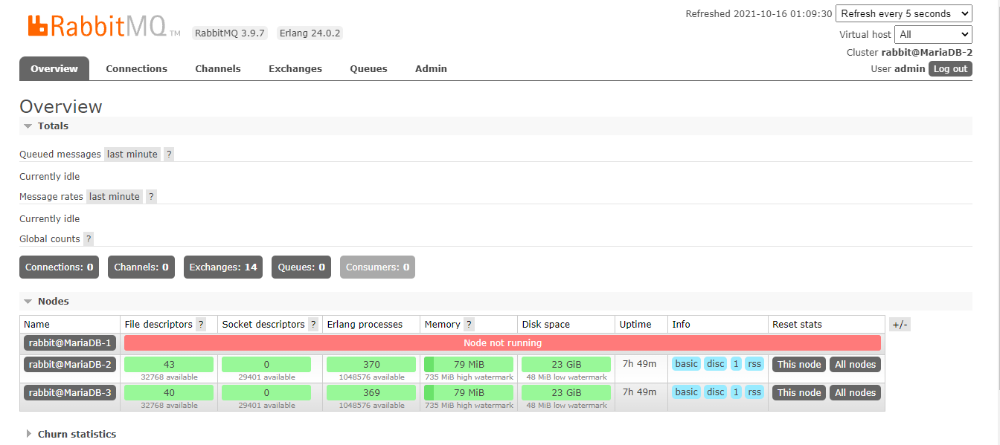
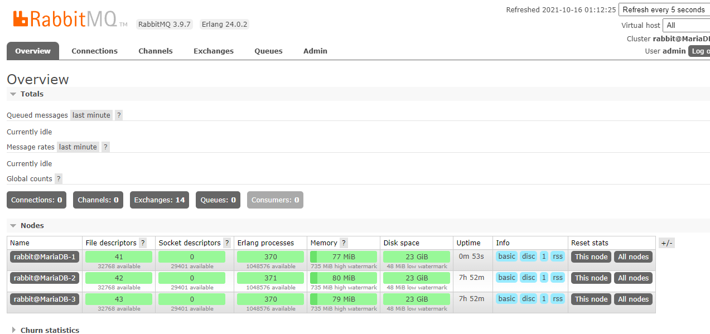
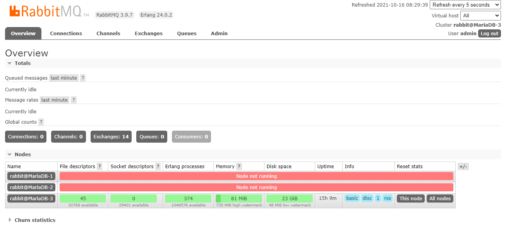
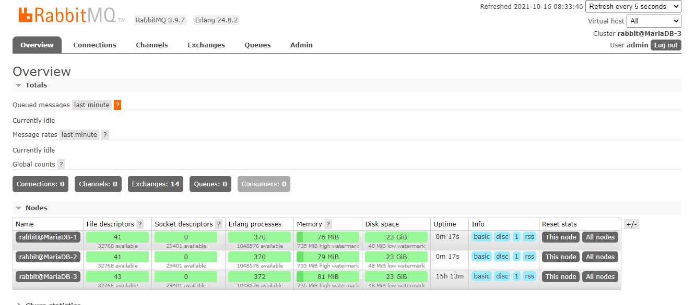
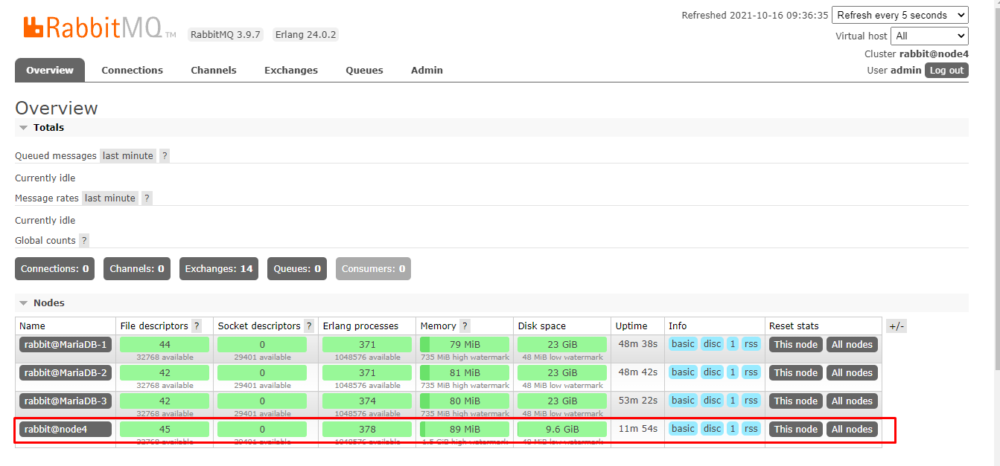
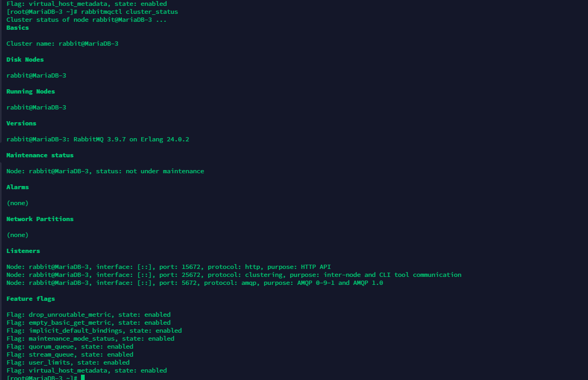
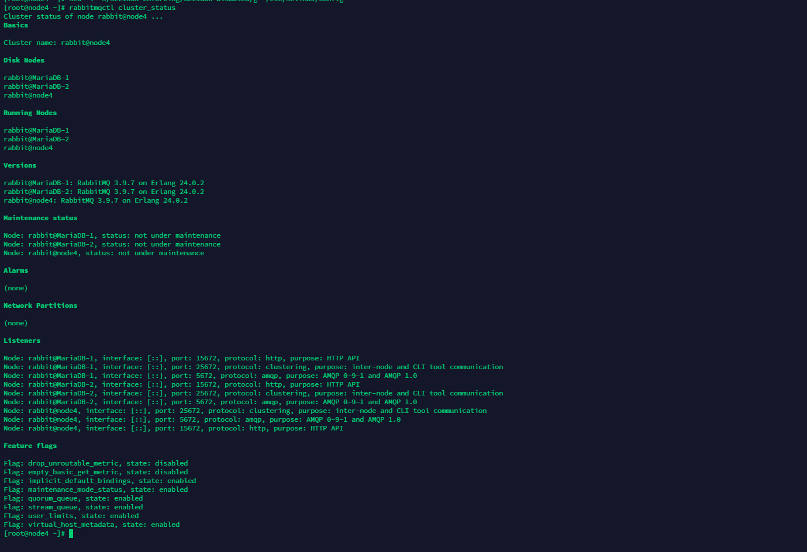
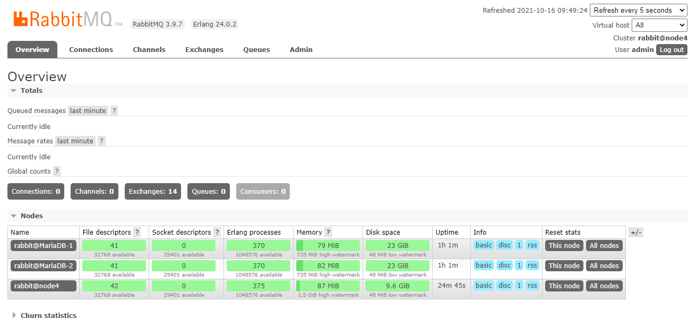
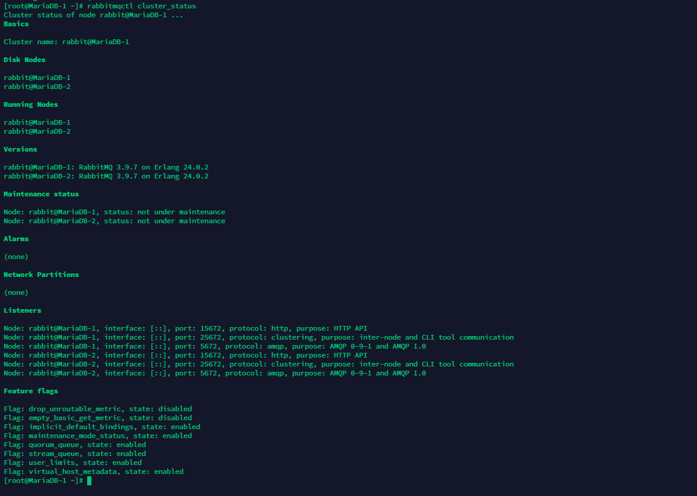
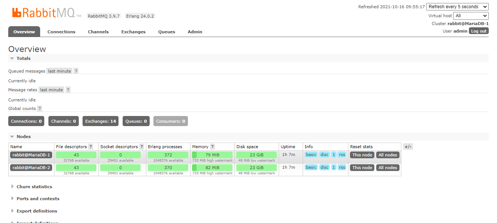

<h1 align="center">vận hành, xử lý sự cố rabbitmq
</h1>
# Phần I. Chuẩn bị môi trường

- Sử dụng tiếp kết quả bài lab triển khai cài đặt `rabbitmq` để thực tiếp bài lab
- Xem hướng dẫn trển khai cài đặt `rabbitmq` [tại đây](https://github.com/thang290298/Cluster-HA/blob/main/02-LAB/04-Cai-dat-rabbitmq-3node-centos7.md)

# Phần II. Xử lý sự cố
## 1. Trường hợp 1 node xảy ra vấn đề
- Mô hình triển khai 3 node, nếu 1 node có vấn đề thì hệ thống vẫn hoạt động bình thường
- Down 1 node an toàn
- **`Sự cố`**: :
```sh
systemctl stop rabbitmq-server
```
- Kiểm tra trạng thái trên các node MariaDB-2, MariaDB-3
```sh
[root@MariaDB-2 ~]# rabbitmqctl cluster_status
Cluster status of node rabbit@MariaDB-2 ...
Basics

Cluster name: rabbit@MariaDB-2

Disk Nodes

rabbit@MariaDB-1
rabbit@MariaDB-2
rabbit@MariaDB-3

Running Nodes

rabbit@MariaDB-2
rabbit@MariaDB-3

Versions

rabbit@MariaDB-2: RabbitMQ 3.9.7 on Erlang 24.0.2
rabbit@MariaDB-3: RabbitMQ 3.9.7 on Erlang 24.0.2

Maintenance status

Node: rabbit@MariaDB-2, status: not under maintenance
Node: rabbit@MariaDB-3, status: not under maintenance

Alarms

(none)

Network Partitions

(none)
```
```sh
[root@MariaDB-3 ~]# rabbitmqctl cluster_status
Cluster status of node rabbit@MariaDB-3 ...
Basics

Cluster name: rabbit@MariaDB-3

Disk Nodes

rabbit@MariaDB-1
rabbit@MariaDB-2
rabbit@MariaDB-3

Running Nodes

rabbit@MariaDB-2
rabbit@MariaDB-3

Versions

rabbit@MariaDB-2: RabbitMQ 3.9.7 on Erlang 24.0.2
rabbit@MariaDB-3: RabbitMQ 3.9.7 on Erlang 24.0.2

Maintenance status

Node: rabbit@MariaDB-2, status: not under maintenance
Node: rabbit@MariaDB-3, status: not under maintenance

Alarms

(none)

Network Partitions

(none)
```
- Node MariaDB-1 không hoạt động
```sh
Disk Nodes

rabbit@MariaDB-1
rabbit@MariaDB-2
rabbit@MariaDB-3

Running Nodes

rabbit@MariaDB-2
rabbit@MariaDB-3
```
<h3 align="center"></h3>

- Xử lý: truy cập vào node và thực hiện khởi động lại dịch vụ: `rabbitmq`
```sh
systemctl start rabbitmq-server
```
- kiểm tra sau khi start thành công
<h3 align="center"></h3>

**Down 1 không an toàn init 0**

- **`Sự cố`**: 

```
init 0
```

- **`Cách xử lý`**: 

Start lại server và start lại tiến trình service rabbitmq

```
systemctl start rabbitmq-server
```

**Down 1 không an toàn kiểu mất điện tắt nóng server**

- **`Cách xử lý`**: 

Start lại server và start lại tiến trình service rabbitmq

```
systemctl start rabbitmq-server
```

 

**Down 2 node an toàn**

- **`Sự cố`**: 

```
systemctl stop rabbitmq-server
```

- Kiểm tra
<h3 align="center"></h3>

2 Node MariaDB-1 và MariaDB-2 down, cluster vẫn đang hoạt động trên node MariaDB-3

- **`Cách xử lý`**: Start lại service ở 2 node down.

```
systemctl start rabbitmq-server
```

<h3 align="center"></h3>

**Down 2 không an toàn init 0**

- **`Sự cố`**: 

```
init 0
```

- **`Cách xử lý`**: 

Start lại server và start lại tiến trình service rabbitmq

```
systemctl start rabbitmq-server
```

**Down 2 không an toàn kiểu mất điện tắt nóng server**
- **`Cách xử lý`**: 

Start lại server và start lại tiến trình service rabbitmq

```
systemctl start rabbitmq-server
```

### 3. Trường hợp 3 node xảy ra vấn đề.

**Down 3 node an toàn**

- **`Sự cố`**: 

```
systemctl stop rabbitmq-server
```

- **`Cách xử lý`**: 

Yêu cầu bật start service node cuối cùng lên đâu tiên. Còn các node còn lại không cần thứ tự.

Trong trường hợp cả 3 node đều down, không xác nhận được node nào tắt sau cùng. Cần bật 1 node bật kỳ để cluster có thể hoạt động trở lại, giải quyết theo cách này có thể gây mất mát dữ liệu queue, các node còn lại bật không cần thứ tự.

```
systemctl stop rabbitmq-server
```
**Down 3 không an toàn init 0**

- **`Sự cố`**: 

```
init 0
```

- **`Cách xử lý`**: 

Start lại server và start lại tiến trình service rabbitmq node cuối cùng lên đâu tiên. Còn các node còn lại không cần thứ tự.

Trong trường hợp cả 3 node đều down, không xác nhận được node nào tắt sau cùng. Cần bật 1 node bật kỳ để cluster có thể hoạt động trở lại, giải quyết theo cách này có thể gây mất mát dữ liệu queue, các node còn lại bật không cần thứ tự.

```
systemctl start rabbitmq-server
```

**Down 3 không an toàn kiểu mất điện tắt nóng server**

- **`Sự cố`**: 

Tắt nóng cả 3 node cluster không bật lên được.

- **`Cách xử lý`**: 

Start lại server và start lại tiến trình service rabbitmq node cuối cùng lên đâu tiên. Còn các node còn lại không cần thứ tự.

Trong trường hợp cả 3 node đều down, không xác nhận được node nào tắt sau cùng. Cần bật 1 node bật kỳ để cluster có thể hoạt động trở lại, giải quyết theo cách này có thể gây mất mát dữ liệu queue, các node còn lại bật không cần thứ tự.

```
systemctl start rabbitmq-server
```

# Phần III. Vận hành
## 1. Bổ sung thêm node vào cluster Rabbitmq
### Bước 1: Cài đặt 1 node mới với đấu nối tương tự mô hình, có IP:
```
IP Public: 10.10.13.243
IP Local: 10.10.11.243
```
thực hiện cấu hình cơ bản: IP, time, selinux, cmdlog, ...
### Bước 2: Cập nhật nội dụng file host trên các node cũ và node mới
```sh
echo "10.10.13.31 MariaDB-1" >> /etc/hosts
echo "10.10.13.32 MariaDB-2" >> /etc/hosts
echo "10.10.13.33 MariaDB-3" >> /etc/hosts
echo "10.10.13.243 node4" >> /etc/hosts
```
### Bước 3: Cài đặt rabbitmq trên node4 mới
- Cài đặt Erlang, các gói phụ trợ
```
yum -y install epel-release
yum update -y
yum -y install socat wget
cd ~ && wget https://packages.erlang-solutions.com/erlang/rpm/centos/7/x86_64/esl-erlang_24.0.2-1~centos~7_amd64.rpm
sudo yum -y install esl-erlang_24.0.2-1~centos~7_amd64.rpm
```
- Cài đặt 
```sh
wget https://github.com/rabbitmq/rabbitmq-server/releases/download/v3.9.7/rabbitmq-server-3.9.7-1.el7.noarch.rpm
rpm --import https://www.rabbitmq.com/rabbitmq-release-signing-key.asc
sudo yum -y install rabbitmq-server-3.9.7-1.el7.noarch.rpm
```
- Start service
```sh
systemctl start rabbitmq-server
systemctl enable rabbitmq-server
systemctl status rabbitmq-server
```
- Copy file `/var/lib/rabbitmq/.erlang.cookie` từ node`MariaDB-1 - node khởi tạo` sang node `node4` mới.

```
scp /var/lib/rabbitmq/.erlang.cookie root@node4:/var/lib/rabbitmq/.erlang.cookie
```

**Tại node4 mới**

- Phân quyền file /var/lib/rabbitmq/.erlang.cookie

```
chown rabbitmq:rabbitmq /var/lib/rabbitmq/.erlang.cookie
chmod 400 /var/lib/rabbitmq/.erlang.cookie
```

- Khởi động lại dịch vụ

```
systemctl restart rabbitmq-server.service
```

- Join cluster MariaDB-1

```
[root@node4 ~]# chown rabbitmq:rabbitmq /var/lib/rabbitmq/.erlang.cookie
[root@node4 ~]# chmod 400 /var/lib/rabbitmq/.erlang.cookie
[root@node4 ~]# systemctl restart rabbitmq-server.service
[root@node4 ~]# rabbitmqctl stop_app
Stopping rabbit application on node rabbit@node4 ...
[root@node4 ~]# rabbitmqctl join_cluster rabbit@MariaDB-1
Clustering node rabbit@node4 with rabbit@MariaDB-1
[root@node4 ~]# rabbitmqctl start_app
Starting node rabbit@node4 ...
[root@node4 ~]# rabbitmqctl cluster_status
Cluster status of node rabbit@node4 ...
Basics

Cluster name: rabbit@node4

Disk Nodes

rabbit@MariaDB-1
rabbit@MariaDB-2
rabbit@MariaDB-3
rabbit@node4

Running Nodes

rabbit@MariaDB-1
rabbit@MariaDB-2
rabbit@MariaDB-3
rabbit@node4

Versions

rabbit@MariaDB-1: RabbitMQ 3.9.7 on Erlang 24.0.2
rabbit@MariaDB-2: RabbitMQ 3.9.7 on Erlang 24.0.2
rabbit@MariaDB-3: RabbitMQ 3.9.7 on Erlang 24.0.2
rabbit@node4: RabbitMQ 3.9.7 on Erlang 24.0.2

Maintenance status

Node: rabbit@MariaDB-1, status: not under maintenance
Node: rabbit@MariaDB-2, status: not under maintenance
Node: rabbit@MariaDB-3, status: not under maintenance
Node: rabbit@node4, status: not under maintenance

Alarms

(none)

Network Partitions

(none)

Listeners

Node: rabbit@MariaDB-1, interface: [::], port: 15672, protocol: http, purpose: HTTP API
Node: rabbit@MariaDB-1, interface: [::], port: 25672, protocol: clustering, purpose: inter-node and CLI tool communication
Node: rabbit@MariaDB-1, interface: [::], port: 5672, protocol: amqp, purpose: AMQP 0-9-1 and AMQP 1.0
Node: rabbit@MariaDB-2, interface: [::], port: 15672, protocol: http, purpose: HTTP API
Node: rabbit@MariaDB-2, interface: [::], port: 25672, protocol: clustering, purpose: inter-node and CLI tool communication
Node: rabbit@MariaDB-2, interface: [::], port: 5672, protocol: amqp, purpose: AMQP 0-9-1 and AMQP 1.0
Node: rabbit@MariaDB-3, interface: [::], port: 15672, protocol: http, purpose: HTTP API
Node: rabbit@MariaDB-3, interface: [::], port: 25672, protocol: clustering, purpose: inter-node and CLI tool communication
Node: rabbit@MariaDB-3, interface: [::], port: 5672, protocol: amqp, purpose: AMQP 0-9-1 and AMQP 1.0
Node: rabbit@node4, interface: [::], port: 25672, protocol: clustering, purpose: inter-node and CLI tool communication
Node: rabbit@node4, interface: [::], port: 5672, protocol: amqp, purpose: AMQP 0-9-1 and AMQP 1.0

Feature flags

Flag: drop_unroutable_metric, state: disabled
Flag: empty_basic_get_metric, state: disabled
Flag: implicit_default_bindings, state: enabled
Flag: maintenance_mode_status, state: enabled
Flag: quorum_queue, state: enabled
Flag: stream_queue, state: enabled
Flag: user_limits, state: enabled
Flag: virtual_host_metadata, state: enabled
```

- Kích hoạt plugin rabbit management thực hiện trên node4 mới.

```
rabbitmq-plugins enable rabbitmq_management
chown -R rabbitmq:rabbitmq /var/lib/rabbitmq
```

```
[root@node4 ~]# rabbitmq-plugins enable rabbitmq_management
Enabling plugins on node rabbit@node4:
rabbitmq_management
The following plugins have been configured:
  rabbitmq_management
  rabbitmq_management_agent
  rabbitmq_web_dispatch
Applying plugin configuration to rabbit@node4...
The following plugins have been enabled:
  rabbitmq_management
  rabbitmq_management_agent
  rabbitmq_web_dispatch

started 3 plugins.
[root@node4 ~]# chown -R rabbitmq:rabbitmq /var/lib/rabbitmq
[root@node4 ~]#
```

> **Lưu ý:**: Khi join cluster, node join không được chạy dịch vụ, nếu chạy sẽ dẫn tới lỗi. Có thể chọn 1 node bất kỳ trong cluster để join, không phụ thuộc vào node khởi tạo cluster.

<h3 align="center"></h3>

## 2. Loại bỏ một node khởi cluster rabbitmq
- Có 2 cách thực hiện loại bỏ 1 node ra khỏi cluster rabbitmq
```sh
Cách 1: Đứng từ node muốn loại bỏ ra khỏi cụm cluster rabbitmq
Cách 2: Tại 1 node bất kỳ trong cụm, loại bỏ node mong muốn
```
- Thực hiện cách 1: Đứng tại node `MariaDB-3`
  - Tại node muốn loại bỏ
   ```sh
   rabbitmqctl stop_app
   rabbitmqctl reset
   rabbitmqctl start_app
   rabbitmqctl cluster_status
   ```
   <h3 align="center"></h3>
   - kiểm tra trên các node còn lại

   <h3 align="center"></h3>

 <h3 align="center"></h3>

- Thực hiện cách 2: Đứng tài node `MariaDB-1` loại bỏ node `node4`
  - truy cập node `node4` tắt dịch vụ
    ```
    rabbitmqctl stop_app
    ```
  - Đứng tại `MariaDB-1` loại bỏ `node4`
    ```sh
    rabbitmqctl forget_cluster_node rabbit@node4
    ```
  - Kiểm tra
  <h3 align="center"></h3>
  <h3 align="center"></h3>
## 3. Khởi tạo lại Cluster
- **`Sự cố`**: 

```
init 0
```

- **`Cách xử lý`**: - **`Sự cố`**: 

  - Trong trường hợp lỗi không thể khôi phục chạy lại cluster, cần thực hiện khởi tạo chạy lại cluster nhanh chóng

- **`Cách xử lý`**: 
  - Xóa bỏ dữ liệu cluster cũ đi
```
cd /var/lib/rabbitmq/mnesia/
rm -rf *
```
  - Loại bỏ các tiến trình của rabbitmq
```
# Kiểm tra tiến trình
ps -ef | grep rabbitmq 

# Loại bỏ
pkill -KILL -u rabbitmq
```
  - thực hiện khởi tạo lại tiến trình
```sh
systemctl restart rabbitmq-server
```
  - kiểm tra trạng thái sau khi khởi tạo
```sh
systemctl status rabbitmq-server
```
  - Kiểm tra danh sách user 
```sh
rabbitmqctl list_users
```
  - Kiểm tra trạng thái Cluster
```sh
rabbitmqctl cluster_status
```
  - Làm mới Cluster hiện có
```sh
rabbitmqctl stop_app
rabbitmqctl reset
rabbitmqctl start_app
```
  - Ở thời điểm này các node sẽ được hiểu là các cluster chạy độc lập với nhau, cần thực hiên Join các node vào cluster (thực hiện đối với từng node cần join vào cluster)
```sh
systemctl restart rabbitmq-server.service
rabbitmqctl stop_app
rabbitmqctl join_cluster rabbit@MariaDB-1
rabbitmqctl start_app
```
  - Đứng tại node MariaDB-1 thực hiện tạo user và phân quyền
```sh
rabbitmqctl add_user admin 0962012918tT# //Tạo user admin/0962012918tT#
rabbitmqctl set_user_tags admin administrator //Phân quyền administrator
rabbitmqctl add_vhost admin_vhost
rabbitmqctl set_permissions -p admin_vhost admin ".*" ".*" ".*"
```
  -  Cấu hình policy HA Rabbit Cluster trên node khởi tạo (MariaDB-1)
```sh
rabbitmqctl -p admin_vhost set_policy ha-all '^(?!amq\.).*' '{"ha-mode": "all"}'
```