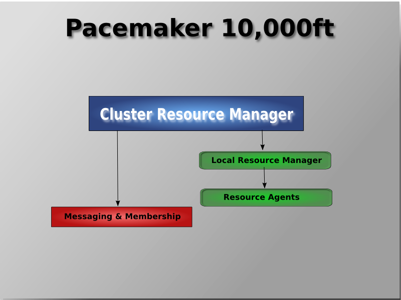
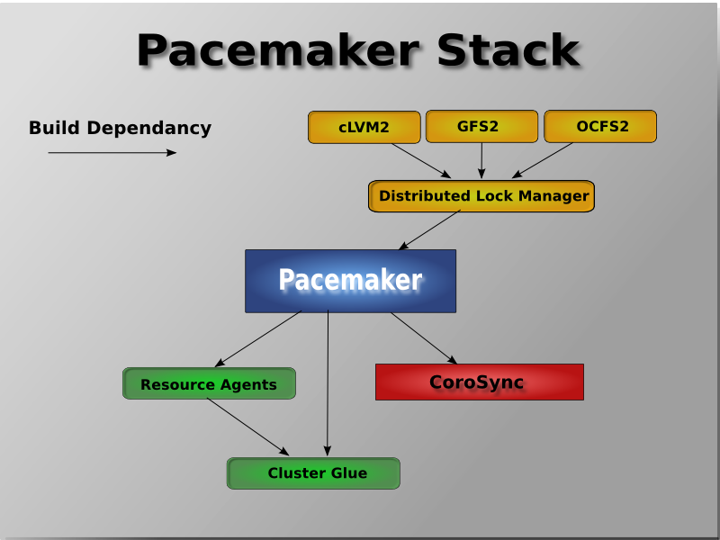
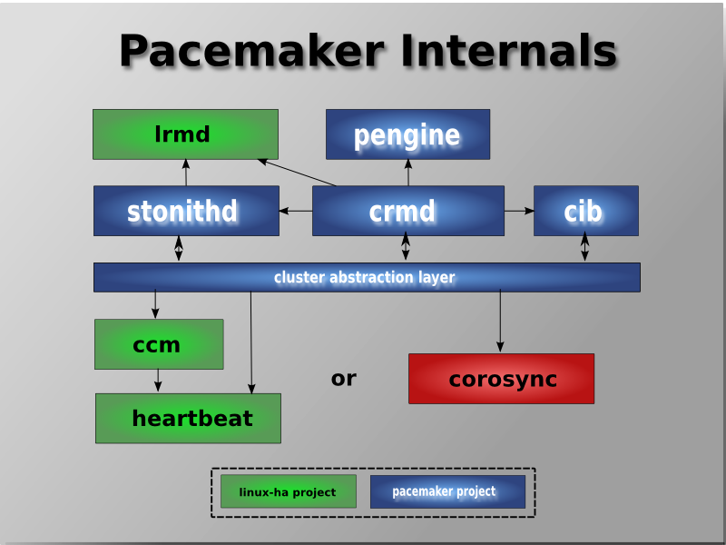
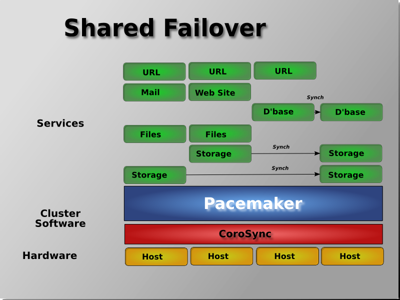
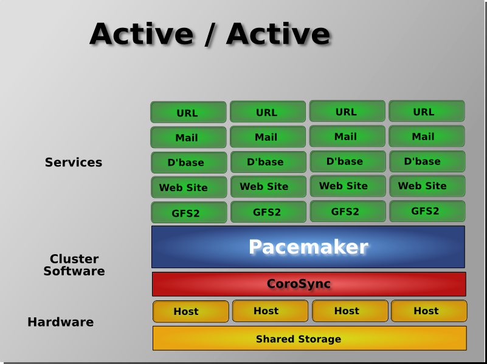

<h1 align="center">High Availability: Tổng quan về Pacemaker Corosync</h1>

## Mục lục
I. [Tổng quan](#tongquan)

II. [Kiến trúc Pacemaker](#kientruc)

III. [Các thành phần bên trong](#thanhphan)

IV. [Mô hình triển khai](#mohinh)

## I. Tổng quan

### 1. Pacemaker
- **`Pacemaker`**: là trình quản lý tài nguyên bên trong `Cluster` được phát triển bởi **ClusterLabs**.`Pacemaker` tương thích với rất nhiều dịch vụ phổ biến hiện có và hoàn toàn có thể tự phát triển module để quản lý các tài nguyên mà pacemaker chưa hỗ trợ
- Kiến trúc triển khai bới `Pacemaker` cho phép tùy biến, hỗ trợ tối đa để các tài nguyên (`resource`) thuộc cluster luôn sẵn sàng. Đồng thời pacemaker có khả năng phát hiện phục hồi các tài nguyên, các node đang xảy ra sự cố thông qua các **`engine`** hỗ trợ (`Corosync, Heartbeat`), cho phép tùy biến tùy theo các kiến trúc khác nhau.

- Các tính năng chính:
  - Tự động phát hiện, khôi phục các node, các tài nguyên dịch vụ trên node
  - Không yêu cầu chia sẻ không gian lưu trữ (`shared storage`)
  - Tất cả tài nguyên có thể quản lý bằng **`script`** đều có thể quản lý bằng `Pacemaker`
  - Hỗ trợ kỹ thuật `fencing`, kỹ thuật cô lập tài nguyên trên mỗi node
  -  Hỗ trợ các `cluster` từ nhỏ tới lớn
  - Hỗ trợ kỹ thuật `Resource-driven cluster`: Kỹ thuật phân cấp, nhóm tài nguyên để quản lý độc lập
  - Hỗ trợ kỹ thuật `Quorate Clusters`: Kỹ thuật tính điểm trên các node thuộc `Cluster`, ý tưởng của kỹ thuật là khi cụm lớn bị phân mảnh thành 2 phần, cluster sẽ đánh giá so sánh số điểm của 2 cụm để quyết định cụm nào sẽ tiếp tục chạy, cụm nào sẽ bị đóng băng hoặc tắt hẳn.
  - Hỗ trợ các thiết lập dự phòng
  - Tự động nhân bản cấu hình tới các node thuộc cụm `Cluster`
  - Có khả năng nhân thức sự thay đổi trên tài nguyên
  - Hỗ trợ các kiểu dịch vụ nâng cao
    - `Nhân bản` (Clone): Dịch vụ được nhân bản tới nhiều node dể tăng tinhs sẵn sàng
    - `Đa trạng thái` (Multi-state): Các dịch vụ có nhiều trạng thái (`Master/Slave, Primary/ Secondary`)
  - Thống nhất, có kịch bản, những công cụ quản lý cluster

### 2. Corosync 
- `Corosync` hay `Corosync Cluster Engine` là dự án mã nguồn mở bắt nguồn từ dự án OpenAIS. Mục đích phát triển của `Corosync` là tạo ra hệ thống có tính liên kết, cung cấp tính sẵn sàng cao cho các ứng dụng chạy trên.

Corosync cung cấp 4 API viết bằng ngôn ngữ C:
- Nhóm các tiến trình thành mô hình khép kín, bảo đảm trạng thái tiến trình nhân rộng trong nhóm
- Cung cấp trình quản trị đơn giản cho phép khởi động lại tiến trình ứng dụng khi chúng xảy ra sự cố
- Cung cấp cơ sở dữ liệu bộ nhớ (in-memory database) lưu trữ các cấu hình, thông kế trạng thái (in-memory database). Cho phép truy vấn, thiết lập, nhận thông báo khi thay đổi.
- Cung cấp hệ thống quorum, cảnh bảo khi có hoặc mất quorm

  ## II. Kiến trúc Pacemaker

  - Ở mức độ cao nhất, Cluster được tạo thành từ 3 phần:
    - Kiến trúc hạ tầng chính của cluster cung cấp khả năng trao đổi, mối quan hệ , thông tin về tài nguyên, node, quorum của cụm từ các project như Corosync,Heartbeat (**`màu đỏ`**)
    - Thành phần nhận biết `non-cluster`: Các thành phần được script hóa để có thể tắt, bật, giám sát.(**`màu xanh lam`**)
    - Quản lý tài nguyên `Pacemaker` cung cấp trung tâm giám sát, phản ứng với các sự kiện xảy ra trong cluster. Các event có thể là các node bị loại bỏ, tham gia vào cụm, các hoạt động bảo trì, các thao tác quản trị cơ bản. `Pacemaker` sẽ nhận thức, tự động đánh giá trạng thái lý tưởng cho cụm ra chỉ thị cho cụm trở lại trạng thái lý tưởng (tự động di chuyển tài nguyên, loại bỏ thành phần lỗi bằng cách tắt dịch vụ hoặc tắt hẳn node).(**`màu xanh lá cây`**)

<h3 align="center"></h3>

- Khi kết hợp `Corosync, Pacemaker` cho phép cluster quản trị các `Cluster Filesystem` tiêu chuẩn. Tính năng này được phát triển từ tiêu chuẩn `distributed lock manager` trên các hệ thống `Cluster Filesystem` mã nguồn mở, từ đó cho phép `corosync` thu thập sự kiện về tính trạng các node thuộc cluster filesystem và cho phép Pacemaker ra lệnh cô lập dịch vụ tại các node.

<h3 align="center"></h3>

## III. Các thành phần bên trong

<h3 align="center"></h3>

- Cluster Information Base (CIB)

  CIB sử dụng XML để biểu diễn cả cấu hình của cụm và trạng thái hiện tại của tất cả các tài nguyên trong cluster. Các nội dung của CIB được tự động giữ đồng bộ trên toàn bộ cụm và được sử dụng bởi PEngine để tính toán trạng thái lý tưởng của cluster và làm thế nào để nó đạt được.

- Cluster Resource Management Daemon (CRMd)
  
  Các hành động resource của Pacemaker cluster được chuyển qua daemon này. Resources được quản lý bởi CRMd và có thể được truy vấn bởi các hệ thống client, di chuyển nhanh chóng và thay đổi khi cần thiết.

  Mỗi node của cluster cũng bao gồm một trình quản lý tài nguyên cục bộ LRMd (Local Resource Management Daemon) hoạt động tương tự giữa CRMd và các resource. LRMd truyền lệnh từ CRMd tới các agent chẳng hạn như khởi động (start) và dừng lại (stop) hay chuyển tiếp thông tin trạng thái tới các thành phần tài nguyên mà nó quản lý

- Policy Engine (PEngine)
 
  Chịu tránh nhiệm tính toán trạng thái lý tưởng của cụm, ra chỉ thị, kịch bản cho CRMd để hiện thực hóa trạng thái mong muốn.

- Shoot the Other Node in the Head (STONITH)
  
  Giải pháp cho các node **`cứng đầu`** không phản hồi, không nhận chỉ thị mềm, CRMd sẽ chỉ thị cho STONITH tắt nóng, hoặc khởi động lại trực tiếp thông qua phần cứng (IPMI, IDRAC, ILO, ..)

## IV. Mô hình triển khai

- `Pacemaker` không có giới hạn về cách triển khai của bạn, chính điều này mà nó cho phép ta có thể triển khai theo hầu hết các mô hình như:
  - Active/ Passive
  - Active/ Active
  - N + 1
  - N + M
  - N to 1
  - N to M

- Dưới đây là một vài mô hình triển khai:
  - Active/ Passive:
<h3 align="center"></h3>

Sử dụng `Pacemaker` và `DRBD` là giải pháp hiệu quả về chi phí cho nhiều tình huống High Availability.

  - Mô hình Shared Failover:
<h3 align="center"></h3>

`Pacemaker`có thể làm giảm đáng kể chi phí phần cứng bằng cách cho phép một số nhóm Active/ Passive được kết hợp và chia sẻ một node sự phòng chung
  
  - Active/ Active ( N to N)
<h3 align="center"></h3>

khi bộ nhớ chia sẽ sẵn sàng, mọi node đều có khả năng sử dụng để chuyển đổi dự phòng. Pacemaker thậm chí có thể chạy nhiều bản sao của các dịch vụ để trải đều khối lượng công việc