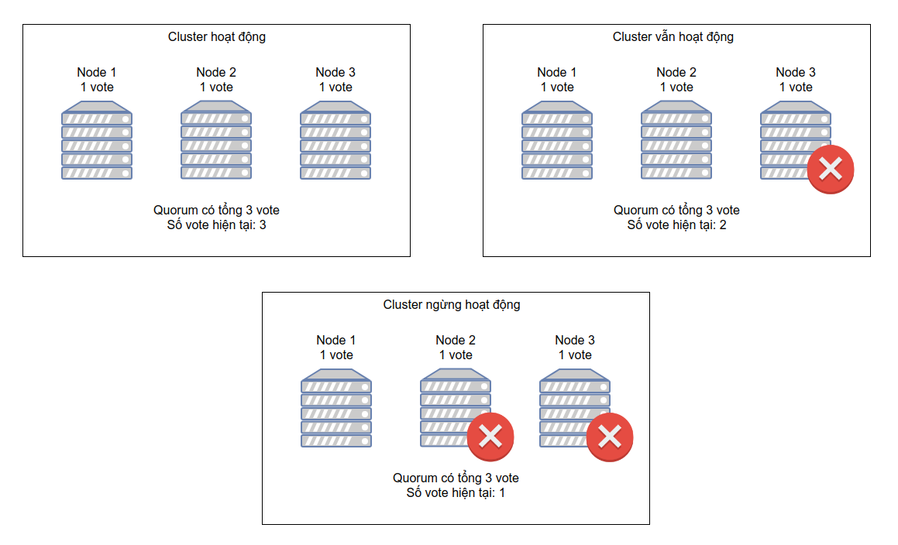

<h1 align="center">High Availability: Tổng quan về Quorum, STONITH/Fencing</h1>

## Mục lục
I. [Tổng quan Quorum](#tongquanquorum)

  1. [Định nghĩa](#dinhnghiaquorum)
  2. [Ví dụ Quorum](#viduquorum)

## I. <a name="tongquanquorum"></a>Tổng quan Quorum
### 1. <a name="dinhnghiaquorum"></a>Định nghĩa
- **`split-brain`** là hiện tượng lớn cluster lớn bị phân tách ra thành nhiều Cluster nhỏ và hoạt động như những Cluster riêng biệt có khả năng ghi vào cùng 1 dữu liệu và gây ra mất mát dữ liệu. Điều này dẫn đến sự mất đồng bộ giữa các tài nguyên làm ảnh hưởng đến sự vẹn toàn hệ thống

- **`Quorum`** là giải pháp ngăn chặn hiện tượng `splet-brain` trong Cluster. Cluster có quorum chỉ khi số node hoạt động nhiều hơn 50% số node thuộc Cluster ( `Node Active > (Node Cluster)/2`)

- Quorum được thiết lập bằng cơ chế **`Voting`**. Tại thời điểm 1 Node Cluster xảy ra sự cố hoặc mất kết nối đến các phần còn lại của hệ thống Cluster, các node còn lại sẽ `vote` cho việc node nào sẽ bị đóng băng cô lập, node nào sẽ tiếp tục hoạt động

- Kỹ thuật Quorum được hỗ trợ bên trong `pacemaker` với 2 kỹ thuật:
  - Kỹ thuật `Resource-driven cluster`: kỹ thuật phân cấp nhóm tài nguyên để quản lý độc lập
  - Kỹ thuật `Quorate cluster`: Kỹ thuật tính điểm của các node thuộc cluster, ý tưởng ở đây là khi 1 cụm lớn bị phân thành 2 cum, Cluster sẽ đánh gía và so sánh điểm tại 2 cụm để đưa ra quyết định cụm nào sẽ tiếp tục hoạt động và cụm nào sẽ bị cô lập và tắt hẳn 
  - Công thức tính `Quorum` ( số node tối thiểu hoạt động bình thường)
```
(Số Node hoạt động trên Cluster)>(Tổng số Node thuộc Cluster/2)
```

- Các tùy chọn khi `Pacemaker` mất `Qourum` ( Số node hoạt động không thể tạo thành Quorum)
  - ignore: Tiếp tục duy trì quản trị Cluster kể cả khi không có Quorum
  - Freeze: Tiếp tục duy trì và quản trị Cluster nhưng đóng băng tài nguyên xảy ra sự cố nhưng không khắc phục, phục hồi tài nguyên xảy ra sự cố
  - Stop: Ngừng cung cấp dịch vụ Cluster khi không có Quorum
  - Suicide: Cô lập node đang xảy ra sự cố

### 2. <a name="viduquorum"></a>Ví dụ Quorum

- Đối với `Cluster` gồm 2 node, tổng số vote là 2. Dựa theo kỹ thuật voting quorum sẽ chỉ hoạt động nếu số vote lớn hơn 1 nửa số node hoạt động (tức lớn hơn 1 node). Vì vậy nếu có 1 node xảy ra sự cố, cả cluster sẽ **`dừng hoạt động`**
<h3 align="center"></h3>

- Đối với Cluster gồm `3 node`, tổng số vote là 3. Dựa theo kỹ thuật voting quorum sẽ chỉ hoạt động nếu số vote lớn hơn 1 nửa số node hoạt động (tức lớn hơn 1 node). Vì vậy nếu có hơn `2 node xảy ra sự cố`, cả cluster sẽ `dừng hoạt động`
<h3 align="center"></h3>