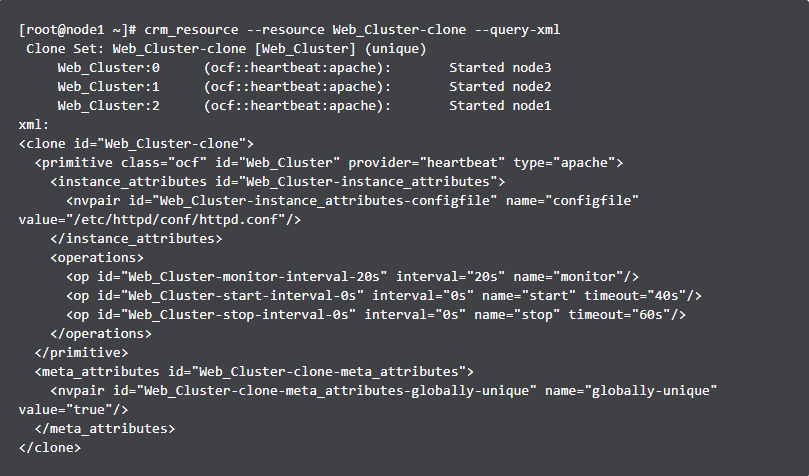

<h1 align="center">High Availability: Tổng quan về Resource trong Pacemaker</h1>

## Mục lục
I. [Định nghĩa](#dinhnghia)

II. [Các loại resource cơ bản](#phanloai)

III. [Tham số cơ bản trên Resource](#thamsocoban)

IV. [Tham số tùy chọn trên Resource](#thamsotuychon)

V. [Tham số vận hành trên Resource](#thamsovanhanh)

## I. <a name="dinhnghia"></a>Định nghĩa

- **`Resource`** hay tài nguyên được Pacemaker đảm bản sự sẵn sàng. Resource có nhiều loại, bao gồm các dịch vụ cơ bản (http.https,...) đến các dịch vụ phức tạp như group resource, clone resource

- Tất cả các dịch vụ cơ bản như ssh,...đều sở hưu `resource agent`. Resource Agent là một module mở rộng trừu tượng hóa dịch vụ cung cấp thành đối tượng cho phép `cluster Pacemaker` có thể quản trị. Một số hoạt động quản trị gồm :`Start`,`Stop`,`mornitor`


## II. <a name="phanloai"></a>Các loại resource cơ bản

**`Pacemaker`** hỗ trợ nhiều loại `Resource` khác nhau

### 2.1 `OCF (Open Cluster Framework)`:

Tiêu chuẩn quy ước của Linux Standard Base cho các Scripts. Quy chuẩn các đối số đầu vào (Support pacemaker), các tham số tự định nghĩa (self-describing),khả năng tùy biến, mở rộng (extensile).Các quy ước của `OCF` tập trung vào các `exit code` trả lại bởi các thao tác: stop,start,mornitor.Các đối số OCF được truyền vào thông qua môi trường thực thi với từ khóa `OCF_RESKEY_`

Xem thêm [tại đây](https://en.wikipedia.org/wiki/Open_Cluster_Framework)

### 2.2 `LSB (Linux Standard Base)`:

Tiêu chuẩn được cung cấp, hỗ trợ trên nhiều bản phối linux, các tài nguyên thường được tìm thất trong `/etc/init.d`

Xem thêm [tại đây](https://en.wikipedia.org/wiki/Linux_Standard_Base)


### 2.3 `Systemd`

Tiêu chuẩn mới trong các bản phân phối Linux, thay thế cho SysV. `Pacemaker `có thể quản trị tất các dịch vụ Systemd nếu chúng tồn tại.`systemd` quản trị dịch vụ thông qua `unit` files

Lưu ý:
   - Nếu sử dụng `Pacemaker` quản trị tiến trình systemd thì bảo đảm không cấu hình dịch vụ tự động khởi tạo khi boot (start service at boot time).


Xem thêm [tại đây](https://en.wikipedia.org/wiki/Systemd)

### 2.4 `Upstart`

Tiêu chuẩn mới trong các bản phân phối Linux, thay thế cho `SysV`. `Pacemaker` có thể quản trị tất các dịch vụ `Upstart` nếu chúng tồn tại. Upstart quản trị dịch vụ thông qua `jobs`

Xem thêm [tại đây](https://en.wikipedia.org/wiki/Upstart)

### 2.5 `Service`

Vì hệ thống có nhiều loại tiến trình quản trị dịch vụ, (`systemd, upstart, lsb`). `Pacemaker` hỗ trợ kiểu `service`, cho phép tự động phát hiện kiểu dữ liệu của dịch vụ (`systemd, upstart, lsb`) để quản trị dễ dàng hơn

### 2.6 `STONITH`

`STONITH/ Fencing`: STONITH là viết tắt của cụm từ `Shoot Other Node In The Head` đây là một kỹ thuật dành cho fencing. Fencing là kỹ thuật cô lập tài nguyên tại từng node trong `Cluster`. Mục tiêu STONITH là tắt hoặc khởi động lại node trong trường hợp Node trong trường hợp dịch vụ không thể khôi phục (Thực hiện thông qua vật chủ hoặc thông qua phần cứng).

Xem thêm [tại đây](https://github.com/thang290298/Cluster-HA/blob/main/1-Cluster/01-Dosc/03-Tong-quan-Quorum-STONITH-Fencing.md)


### 2.7 `Nagios Plugins`

Giảm sát tài nguyên từ xa thông qua `Nagios Plugins` trong trường hợp các dịch vụ là các máy ảo, các dịch vụ bên trong máy ảo.

## III. <a name="thamsocoban"></a>Tham số cơ bản trên Resource
Các tham số cơ bản:
  - `ID`: Tên resource
  - `class`: Kiểu scripts (ocf, service, upstart, systemd, lsb, stonith)
  - `type`: Tên dịch vụ quản trị được quản trị (Apache, ssh, ..)

  Ví dụ minh họa:
  <h3 align="center"></h3>

## IV. <a name="thamsotuychon"></a>Tham số tùy chọn trên Resource

Sử dụng tùy chọn mở rộng cho phép định nghĩa cách cluster quản lý các resource. Bổ sung tham số thông qua tùy chọn `--meta` thuộc `crm_resource` command

Các tham số cần lưu ý:

- `priority` (default = `0`): Nếu tất cả resource không thể sẵn sàng, cluster sẽ ngừng các resource có độ ưu tiên thấp, bảo đảm resource có độ ưu tiên cao sẵn sàng.

- `target-role` (default = `Started`): Trạng trái mong muốn, cluster sẽ cố gắng giữ trạng thái này trên resource.

    - Stopped: Buộc tài nguyên ngừng hoạt động.

    - Started: Cho phép tài nguyên hoạt động (Trong trường hợp cấu hình multistate (Dạng Active Passive))

    - Master: Cho phép tài nguyên hoạt động nếu trong trạng thái thích hợp.

- `is-managed` (default = `TRUE`): Cluster cố gắng start hoặc stop dịch vụ (Mặc định tự động start)

- `resource-stickiness` (default = `0`): Ràng buộc vị trí tài nguyên

- `migration-threshold` (default = `INFINITY`(disabled)): Nếu quá nhiều lỗi xảy ra trên 1 node, tài nguyên sẽ di chuyển sang node khác.

- `multiple-active` (default = `stop_start`): Phản ứng khi phát nhiều một resource tương ứng đang chạy trên node khác.

    - `block`: Quy định resource không được quản lý. Sẽ tạm dừng hoạt động resource. Đưa ra cảnh báo.

    - `stop_only`: Dừng tất cả các trường hợp hoạt động.

    - `stop_start`: Dừng tất cả các trường hợp hoạt động và thử khởi động lại.

## V. <a name="thamsovanhanh"></a>Tham số vận hành trên Resource

Các tham số cần lưu ý trong quá trình vận hành Resource:

- `id`: Định danh resource.

- `name`: Hành động thực hiện (monitor, start, stop).

- `interval`: Tần số thực hiện hành động (Mặc đinh = 0).

- `timeout`: Thời gian chờ tối đa nếu xảy ra sự cố.

- `on-fail`: Thao tác nếu phát hiện sự cố.

    - `ignore`: Không phản ứng, bỏ qua lỗi.

    - `block`: Không thực hiện thêm bất kỳ hoạt động nào khác trên resource.

    - `stop`: Dừng hoạt động resource, không khởi động resource trên bất kỳ node nào khác.

    - `restart`: Khởi động lại resource.

    - `fence`: STONITH trên node mà resource đó bị lỗi.

    - `standby`: Di chuyển tất cả các resource ra khỏi node xảy ra sự cố.

- `enable`: Nếu thiết lập false, bỏ qua giám sát tài nguyên.

Cấu trúc file:

```
pcs resource create <Tên resource> <Tham số 1> <Tham số 2 ..> op <tham số vận hành>
```

Ví dụ:

```
pcs resource create Virtual_IP IPaddr2 ip=10.10.10.89 cidr_netmask=24 op monitor interval=30s

# Mô tả
[root@node1 ~]# pcs resource show Web_Cluster-clone
 Clone: Web_Cluster-clone
  Meta Attrs: globally-unique=true # Metadata
  Resource: Web_Cluster (class=ocf provider=heartbeat type=apache)
   Attributes: configfile=/etc/httpd/conf/httpd.conf # Tham số tài nguyên
   Operations: monitor interval=20s (Web_Cluster-monitor-interval-20s) # Tham số vận hình
               start interval=0s timeout=40s (Web_Cluster-start-interval-0s)
               stop interval=0s timeout=60s (Web_Cluster-stop-interval-0s)
```