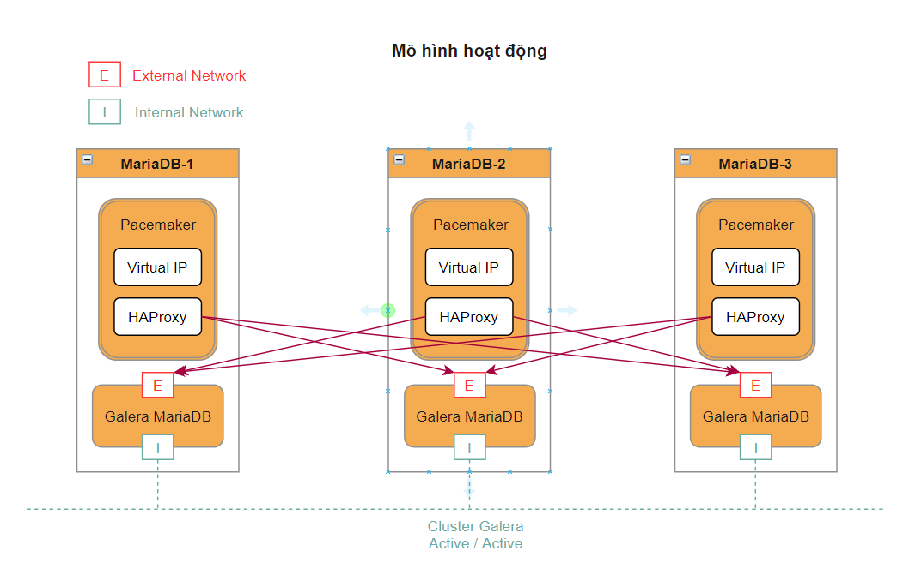

<h1 align="center">Hướng dẫn triển khai Haproxy Pacemaker cho Cluster Galera 3 node trên CentOS 7</h1>

# Mục Lục
Phần I. [Tổng quan](#tongquan)

Phần II. [Chuẩn bị](#chuanbi)

  1. [Phân hoạch](#phanhoach)
  2. [Mô hình triển khai](#mohinhtrienkhai)
  3. [Mô hình hoạt động](#mohinhhoatdong)

## Phần I. Tổng quan
**`HAProxy`** là viết tắt của High Availability Proxy, là một công cụ mã nguồn mở nổi tiếng ứng dụng cho giải pháp cân bằng tải `TCP/HTTP` cũng như giải pháp máy chủ Proxy (Proxy Server). HAProxy có thể hoạt động trên các môi trường Linux, Solaris, FreeBSD. Công dụng phổ biến nhất của HAProxy là cải thiện hiệu năng, tăng độ tin cậy của hệ thống bằng cách phân chia khối lượng công việc trên nhiều máy chủ như:Web, App, cơ sở dữ liệu,... HAproxy hiện đã và đang được sử dụng bới nhiều Website lớn như GoDaddy, GitHub, Bitbucket, Stack Overflow, Reddit, Speedtest, Twitter và trong nhiều sản phẩm cung cấp bởi `Amazon Web Service.`

**`MariaDB Galera Cluster`** là giải pháp sao chép và động bộ nâng cao tính năng sẵn sàng cho `MariaDB`. `Galera` hỗ trợ chế độ `Actie-Active` có nghĩa là có thể truy cập, ghi dữ liệu đồng thời trên tất cả các Node MariaDB thuộc Galera Cluster.

**`Pacemaker`** là trình quản lý tài nguyên trong Cluster được phát triển bởi `ClusterLabs`. Pacemaker tương thích với nhiều dịch vụ phổ biến hiện có à hoàn toàn có thể tự phát triển module để quản lý các tài nguyên mà hiện tại Pacemaker chưa hỗ trợ.

# Phần II. Chuẩn bị
## 1. Phân hoạch IP

| Hostname | hardware | Interface |
|--------------|-------|------|
| MariaDB-1 | 2 CPU - 2GB RAM - 30GB Disk| eth0: 10.10.13.31  (MNGT)- eth1: 10.10.11.31|
| MariaDB-2 | 2 CPU - 2GB RAM - 30GB Disk| eth0: 10.10.13.32 (MNGT)- eth1: 10.10.11.32|
| MariaDB-3 | 2 CPU - 2GB RAM - 30GB Disk| eth0: 10.10.13.33 (MNGT)- eth1: 10.10.11.33|

## 2. Mô hình triển khai
<h3 align="center"></h3>

## 3. Mô hình hoạt động
<h3 align="center"></h3>