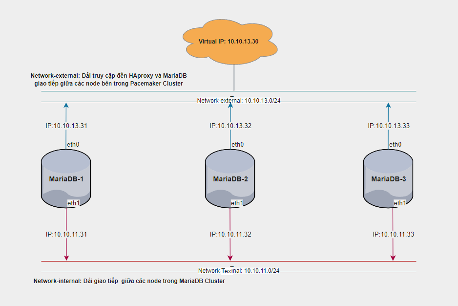
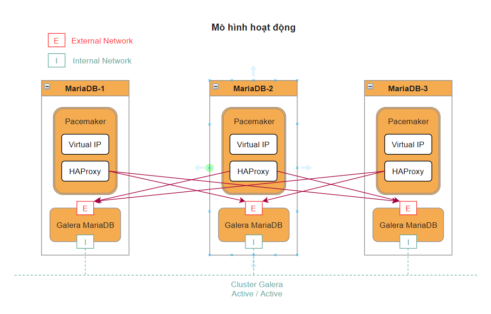
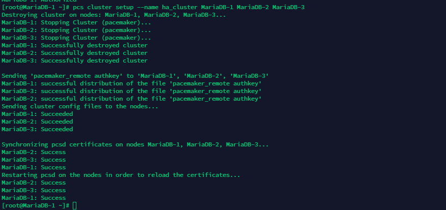

<h1 align="center">Hướng dẫn triển khai Haproxy Pacemaker cho Cluster Galera 3 node trên CentOS 7</h1>

# Mục Lục
Phần I. [Tổng quan](#tongquan)
  - HAProxy
  - MariaDB Galera Cluster
  - Pacemaker

Phần II. [Chuẩn bị](#chuanbi)
  1. [Phân hoạch](#phanhoach)
  2. [Mô hình triển khai](#mohinhtrienkhai)
  3. [Mô hình hoạt động](#mohinhhoatdong)

Phần III. [Thiết lập ban đầu](#thietlap)

Phần IV. [Cài đặt Galera Database 3 Node Wordpress ](#installGaleraDatabaseWordpress)
  1. [Cài đặt Haproxy bản 2.2.3](#4.1)
  2. [Cài đặt Cluster Pacemaker](#4.2)
  3. [Cài đặt web server wordpress](#4.3)

Phần V. [Đưa web server apache vào pacemaker để quản lý](#pacemaker)

Phần VI. [Một số lưu ý](#6)

## Phần I. <a name="tongquan"></a>Tổng quan
**`HAProxy`** là viết tắt của High Availability Proxy, là một công cụ mã nguồn mở nổi tiếng ứng dụng cho giải pháp cân bằng tải `TCP/HTTP` cũng như giải pháp máy chủ Proxy (Proxy Server). HAProxy có thể hoạt động trên các môi trường Linux, Solaris, FreeBSD. Công dụng phổ biến nhất của HAProxy là cải thiện hiệu năng, tăng độ tin cậy của hệ thống bằng cách phân chia khối lượng công việc trên nhiều máy chủ như:Web, App, cơ sở dữ liệu,... HAproxy hiện đã và đang được sử dụng bới nhiều Website lớn như GoDaddy, GitHub, Bitbucket, Stack Overflow, Reddit, Speedtest, Twitter và trong nhiều sản phẩm cung cấp bởi `Amazon Web Service.`

**`MariaDB Galera Cluster`** là giải pháp sao chép và động bộ nâng cao tính năng sẵn sàng cho `MariaDB`. `Galera` hỗ trợ chế độ `Actie-Active` có nghĩa là có thể truy cập, ghi dữ liệu đồng thời trên tất cả các Node MariaDB thuộc Galera Cluster.

**`Pacemaker`** là trình quản lý tài nguyên trong Cluster được phát triển bởi `ClusterLabs`. Pacemaker tương thích với nhiều dịch vụ phổ biến hiện có à hoàn toàn có thể tự phát triển module để quản lý các tài nguyên mà hiện tại Pacemaker chưa hỗ trợ.

# Phần II. <a name="chuanbi"></a>Chuẩn bị
## 1. <a name="phanhoach"></a>Phân hoạch IP

| Hostname | hardware | Interface |
|--------------|-------|------|
| MariaDB-1 | 2 CPU - 2GB RAM - 30GB Disk| eth0: 10.10.13.31  (MNGT)- eth1: 10.10.11.31|
| MariaDB-2 | 2 CPU - 2GB RAM - 30GB Disk| eth0: 10.10.13.32 (MNGT)- eth1: 10.10.11.32|
| MariaDB-3 | 2 CPU - 2GB RAM - 30GB Disk| eth0: 10.10.13.33 (MNGT)- eth1: 10.10.11.33|

## 2. <a name="mohinhtrienkhai"></a>Mô hình triển khai
<h3 align="center"></h3>

## 3. <a name="mohinhhoatdong"></a>Mô hình hoạt động
<h3 align="center"></h3>

# Phần III. <a name="thietlap"></a>Thiết lập ban đầu

- Thực hiện cài đặt chuẩn bị môi trường Cluster Galera 3 node MariaDB theo tài liệu [tại đầy](https://github.com/thang290298/Cluster-HA/blob/main/1-Cluster/02-LAB/01-Cluster-Galera-3-node-MariaDB-CentOS7.md)

# Phần IV. <a name="installGaleraDatabaseWordpress"></a>Cài đặt Galera Database 3 Node Wordpress
## 1. <a name="4.1"></a>Cài đặt Haproxy bản 2.2.3
> ## Thực hiện trên tất cả các Node

- Cài đặt
```sh
sudo yum install wget socat -y
wget https://cbs.centos.org/kojifiles/packages/haproxy/1.8.23/3.el7/x86_64/haproxy18-1.8.23-3.el7.x86_64.rpm
yum install haproxy18-1.8.23-3.el7.x86_64.rpm -y
```

- Cấu hình file config cho haproxy:
```sh
cp /etc/haproxy/haproxy.cfg /etc/haproxy/haproxy.cfg.bak
echo 'global
    log         127.0.0.1 local2
    chroot      /var/lib/haproxy
    pidfile     /var/run/haproxy.pid
    maxconn     4000
    user        haproxy
    group       haproxy
    daemon
    stats socket /var/lib/haproxy/stats
defaults
    mode                    http
    log                     global
    option                  httplog
    option                  dontlognull
    option http-server-close
    option forwardfor       except 127.0.0.0/8
    option                  redispatch
    retries                 3
    timeout http-request    10s
    timeout queue           1m
    timeout connect         10s
    timeout client          1m
    timeout server          1m
    timeout http-keep-alive 10s
    timeout check           10s
    maxconn                 3000

listen stats
    bind :8080
    mode http
    stats enable
    stats uri /stats
    stats realm HAProxy\ Statistics

listen galera
    bind 10.10.13.30:3306
    balance source
    mode tcp
    option tcpka
    option tcplog
    option clitcpka
    option srvtcpka
    timeout client 28801s
    timeout server 28801s
    option mysql-check user haproxy
    server MariaDB-1 10.10.13.31:3306 check inter 5s fastinter 2s rise 3 fall 3
    server MariaDB-2 10.10.13.32:3306 check inter 5s fastinter 2s rise 3 fall 3 backup
    server MariaDB-3 10.10.13.33:3306 check inter 5s fastinter 2s rise 3 fall 3 backup' > /etc/haproxy/haproxy.cfg
```

- Cấu hình Log cho HAProxy
```sh
sed -i "s/#\$ModLoad imudp/\$ModLoad imudp/g" /etc/rsyslog.conf
sed -i "s/#\$UDPServerRun 514/\$UDPServerRun 514/g" /etc/rsyslog.conf
echo '$UDPServerAddress 127.0.0.1' >> /etc/rsyslog.conf

echo 'local2.*    /var/log/haproxy.log' > /etc/rsyslog.d/haproxy.conf

systemctl restart rsyslog

```
- Bổ sung cấu hình cho phép kernel có thể binding tới IP VIP
```sh
echo 'net.ipv4.ip_nonlocal_bind = 1' >> /etc/sysctl.conf

sysctl -p

```

- Tắt dịch vụ HAProxy
```sh
systemctl stop haproxy
systemctl disable haproxy
```
- Tại Node `MariaD-1` tạo user `haproxy`, phục vụ plugin health check của HAProxy (option mysql-check user haproxy)
```sh
mysql -u root -p
CREATE USER 'haproxy'@'MariaD-1';
CREATE USER 'haproxy'@'MariaD-2';
CREATE USER 'haproxy'@'MariaD-3';
CREATE USER 'haproxy'@'%';
```
<h3 align="center"></h3>

## 2. <a name="4.2"></a>Cài đặt Cluster Pacemaker
### Bước 1: Cài đặt pacemaker corosync
> ### Thực hiện trên tất cả các Node
- Cài đặt gói `pacemaker pcs`:
```sh
yum -y install pacemaker pcs

systemctl start pcsd 
systemctl enable pcsd

```
- Thiết lập mật khẩu cho user hacluster:
```sh
passwd hacluster
```
**`Lưu ý`**: Nhập chính xác và nhớ mật khẩu user hacluster, đồng bộ mật khẩu trên tất cả các node.

### Bước 2: Tạo Cluster
- Chứng thực `cluster` (Chỉ thực thiện trên cấu hình trên một node duy nhất, trong bài sẽ thực hiện trên node MariaDB-1), nhập chính xác tài khoản user hacluster.
```sh
pcs cluster auth MariaDB-1 MariaDB-2 MariaDB-3
```
- kết quả:
<h3 align="center"></h3>

- Khởi tạo cấu hình `cluster` ban đầu:
```sh
pcs cluster setup --name ha_cluster MariaDB-1 MariaDB-2 MariaDB-3
```
<h3 align="center"></h3>

Trong đó:
  - `ha_cluster`: Tên của cluster khởi tạo
  - `MariaDB-1 MariaDB-2 MariaDB-3`: Hostname các node thuộc cluster, yêu cầu khai báo trong /etc/host.

- Khởi động `Cluster`:
```sh
pcs cluster start --all
```
- Cho phép `cluster` khởi động cùng OS:
```sh
pcs cluster enable --all
```
<h3 align="center"></h3>

### Bước 3: Thiết lập Cluster (Thực hiện trên 1 node ở bài lab là MariaDB-1)
- Bỏ qua cơ chế `STONITH`:

```
pcs property set stonith-enabled=false
```

- Cho phép `Cluster` chạy kể cả khi `mất` quorum:

```
pcs property set no-quorum-policy=ignore
```

- Hạn chế `Resource` trong `cluster` chuyển node sau khi `Cluster khởi động lại`:

```
pcs property set default-resource-stickiness="INFINITY"
```

- Kiểm tra thiết lập `cluster`:

```
pcs property list
```

<h3 align="center"></h3>

- Tạo `Resource IP VIP Cluster`:

```
pcs resource create Virtual_IP ocf:heartbeat:IPaddr2 ip=10.10.13.30 cidr_netmask=24 op monitor interval=30s
```

- Tạo Resource quản trị dịch vụ HAProxy:

```
pcs resource create Loadbalancer_HaProxy systemd:haproxy op monitor timeout="5s" interval="5s"
```

- Ràng buộc thứ tự khởi động dịch vụ, khởi động dịch vụ `Virtual_IP` sau đó khởi động dịch vụ `Loadbalancer_HaProxy`:

```
pcs constraint order start Virtual_IP then Loadbalancer_HaProxy kind=Optional
```

- Ràng buộc resource `Virtual_IP` phải khởi động cùng node với `resource Loadbalancer_HaProxy`:

```
pcs constraint colocation add Virtual_IP Loadbalancer_HaProxy INFINITY
```

- Kiểm tra trạng thái `Cluster`:

```
pcs status
```
<h3 align="center"></h3>

- Kiểm tra cấu hình `Resource`:

```
pcs resource show --full
```

- Kiểm tra ràng buộc trên `resource`:

```
pcs constraint
```

### Bước 4: kiểm tra

- Kiểm tra trạng thái dịch vụ
  - Truy cập IP VIP **`http://10.10.13.30:8080/stats`**

<h3 align="center"></h3>

- Kết nối tới database MariaDB thông qua IP VIP:
```sh
mysql -h 10.10.13.30 -u haproxy -p
```
<h3 align="center"></h3>

- Tắt node `MariaDB-1` chứa `Virtual_IP, Loadbalancer_HaProxy`

<h3 align="center"></h3>
<h3 align="center"></h3>
<h3 align="center"></h3>

- Kiểm tra trạng thái `Cluster`, node MariaDB-2 đã bị tắt. Dịch vụ Virtual_IP và Loadbalancer_HaProxy được chuyển sang node `MariaDB-2` tự động.

<h3 align="center"></h3>
<h3 align="center"></h3>

- Tiến hành tắt thêm `MariaDB-2`

<h3 align="center"></h3>
<h3 align="center"></h3>

- Thử kết nối tới Database MariaDB thông qua IP VIP:
<h3 align="center"></h3>

- Bật lại 2 node: `MariaDB-1` và `MariaDB-2`

Thời gian `uptime` của 2 Node hiển thị:
<h3 align="center"></h3>

## 3. <a name="4.3"></a>Cài đặt web server wordpress
### Bước 1: Tạo database sử dụng cho wordpress
Do sử dụng galera để quản lý cluster database nên chỉ cần đứng ở 1 node tạo database sẽ đồng bộ sang các node khác.
```sh
mysql -u root -p
CREATE DATABASE galera_cluster;
CREATE USER 'thangnv'@'%' IDENTIFIED BY '0962012918tT';
GRANT ALL PRIVILEGES ON galera_cluster.* TO 'thangnv'@'%' IDENTIFIED BY '0962012918tT';
FLUSH PRIVILEGES;
exit
```
> ## Thực hiện trên tất cả các Node

### Bước 2: Cài đặt `apache`
```sh
yum install httpd -y
systemctl start httpd
systemctl enable httpd
```
### Bước 3: Cài đặt PHP 7.4
```sh
yum install -y epel-release yum-utils
yum install -y http://rpms.remirepo.net/enterprise/remi-release-7.rpm
yum-config-manager --enable remi-php74
yum install -y php php-fpm php-common php-mysql php-gd php-xml php-mbstring php-opcache php-devel php-pear php-bcmath
```
- Kiểm tra version PHP:
```sh
php -v
echo "<?php phpinfo(); ?>" > /var/www/html/info.php
systemctl restart httpd
```

```sh
http://10.10.13.31/info.php
http://10.10.13.32/info.php
http://10.10.13.33/info.php
```
### Bước 4: Cài đặt website wordpress

- Thời gian uptime của 2 Node hiển thị:
```sh
yum -y install php-gd
yum install wget -y
```
- Download Wordpress:
```sh
wget http://wordpress.org/latest.tar.gz
tar xvfz latest.tar.gz
cp -Rvf /root/wordpress/* /var/www/html
cd /var/www/html
```
- Cấu hình Database vừa tạo ở trên vào cấu hình của Wordpress:
```sh
cp wp-config-sample.php wp-config.php
sed -i 's/wp_user/thangnv/g' /var/www/html/wp-config.php
sed -i 's/database_name_here/galera_cluster/g' /var/www/html/wp-config.php
sed -i 's/password_here/0962012918tT/g' /var/www/html/wp-config.php
chmod -R 755 /var/www/*
chown -R apache:apache /var/www/*
systemctl restart httpd
```
- Đặt Host 10.10.13.30 nvt273.com để truy cập Wordpress theo tên miền:

<h3 align="center"></h3>

## Phần V. <a name="pacemaker"></a>Đưa web server apache vào pacemaker để quản lý
### Đưa web server apache vào pacemaker để quản lý kiểu đổi port 80 sang port khác
> ## Thực hiện trên tất cả các Node

Lúc này luồng request sẽ là `Người dùng` -> `IP_VIP` -> `Truy cập đến 3 node`.

Chuyển port web server:
  - trên node MariaDB-1:
```sh
sed -i "s/Listen 80/Listen 10.10.13.31:80/g" /etc/httpd/conf/httpd.conf
systemctl restart httpd
```
  - trên node MariaDB-2:
```sh
sed -i "s/Listen 80/Listen 10.10.13.32:80/g" /etc/httpd/conf/httpd.conf
systemctl restart httpd
```
  - trên node MariaDB-3:
```sh
sed -i "s/Listen 80/Listen 10.10.13.33:80/g" /etc/httpd/conf/httpd.conf
systemctl restart httpd
```
- thêm đoạn cấu hình `listen` trên 3 node vào file: `/etc/haproxy/haproxy.cfg`
```sh
listen web-backend
    bind *:80
    balance  roundrobin
    cookie SERVERID insert indirect nocache
    mode  http
    option  httpchk
    option  httpclose
    option  httplog
    option  forwardfor
    server MariaDB-1 10.10.11.31:80 check cookie node1 inter 5s fastinter 2s rise 3 fall 3
    server MariaDB-2 10.10.11.32:80 check cookie node2 inter 5s fastinter 2s rise 3 fall 3
    server MariaDB-3 10.10.11.33:80 check cookie node3 inter 5s fastinter 2s rise 3 fall 3

```

- Restart lại `haproxy` và `pcs`:
```sh
systemctl restart haproxy

pcs resource restart Loadbalancer_HaProxy
```

### Đưa web server apache vào pacemaker để quản lý kiểu đổi port 80 sang port khác

  - trên node MariaDB-1:
```sh
sed -i "s/Listen 80/Listen 10.10.11.31:80/g" /etc/httpd/conf/httpd.conf
systemctl restart httpd
```
  - trên node MariaDB-2:
```sh
sed -i "s/Listen 80/Listen 10.10.11.32:80/g" /etc/httpd/conf/httpd.conf
systemctl restart httpd
```
  - trên node MariaDB-3:
```sh
sed -i "s/Listen 80/Listen 10.10.11.33:80/g" /etc/httpd/conf/httpd.conf
systemctl restart httpd
```
- thêm đoạn cấu hình `listen` trên 3 node vào file: `/etc/haproxy/haproxy.cfg`
```sh
listen web-backend
    bind *:80
    balance  roundrobin
    cookie SERVERID insert indirect nocache
    mode  http
    option  httpchk
    option  httpclose
    option  httplog
    option  forwardfor
    server MariaDB-1 10.10.11.31:80 check cookie node1 inter 5s fastinter 2s rise 3 fall 3
    server MariaDB-2 10.10.11.32:80 check cookie node2 inter 5s fastinter 2s rise 3 fall 3
    server MariaDB-3 10.10.11.33:80 check cookie node3 inter 5s fastinter 2s rise 3 fall 3

```

- Restart lại `haproxy` và `pcs`:
```sh
systemctl restart haproxy

pcs resource restart Loadbalancer_HaProxy
```

## Phần VI. <a name="6"></a>Một số lưu ý

- Mô hình trên Mysql bind qua `IP public` tới các `IP Public` của các `node client`
- Chuyển về quy trình Connect từ ngoài vào -> IP VIP Public 3306 -> Tới các client qua được haproxy xử lý qua IP LAB
> ## Thực hiện trên tất cả các Node

- Sửa file `hosts` về `IP Local`: vi /etc/hosts
```sh
10.10.13.31 MariaDB-1
10.10.13.32 MariaDB-2
10.10.13.33 MariaDB-3
```
- Cấu hình lại `haproxy` trên cả 3 node:  `vi /etc/haproxy/haproxy.cfg`
```sh
listen galera
    bind 10.10.13.30:3306
    balance source
    mode tcp
    option tcpka
    option tcplog
    option clitcpka
    option srvtcpka
    timeout client 28801s
    timeout server 28801s
    option mysql-check user haproxy
    server MariaDB-1 10.10.13.31:3306 check inter 5s fastinter 2s rise 3 fall 3
    server MariaDB-2 10.10.13.32:3306 check inter 5s fastinter 2s rise 3 fall 3 backup
    server MariaDB-3 10.10.13.33:3306 check inter 5s fastinter 2s rise 3 fall 3 backup'

```

- Cấu hình lại `mysql`, `galera` trên cả 3 node `bind-address` về `IP Local` của node đó:
```sh
[server]
[mysqld]
bind-address=10.10.13.33

[galera]
wsrep_on=ON
wsrep_provider=/usr/lib64/galera/libgalera_smm.so
#add your node ips here
wsrep_cluster_address="gcomm://10.10.11.31,10.10.11.32,10.10.11.33"
binlog_format=row
default_storage_engine=InnoDB
innodb_autoinc_lock_mode=2
#Cluster name
wsrep_cluster_name="ha_cluster"
# Allow server to accept connections on all interfaces.
bind-address=10.10.13.33
# this server ip, change for each server
wsrep_node_address="10.10.11.33"
# this server name, change for each server
wsrep_node_name="MariaDB-3"
wsrep_sst_method=rsync
[embedded]
[mariadb]
[mariadb-10.3]
```
- Để khởi tạo lại `cluster`, thay đổi giá trị **`safe_to_bootstrap`** bằng `1` và chạy câu lệnh `galera_new_cluster`. Sau khi chạy câu lệnh `galera_new_cluster` cluster sẽ `khởi tạo trở lại`.
```sh
sed -i "s/safe_to_bootstrap: 0/safe_to_bootstrap: 1/g" /var/lib/mysql/grastate.dat
```
- Restart lại các services:
```sh
systemctl restart mariadb
systemctl restart haproxy
```