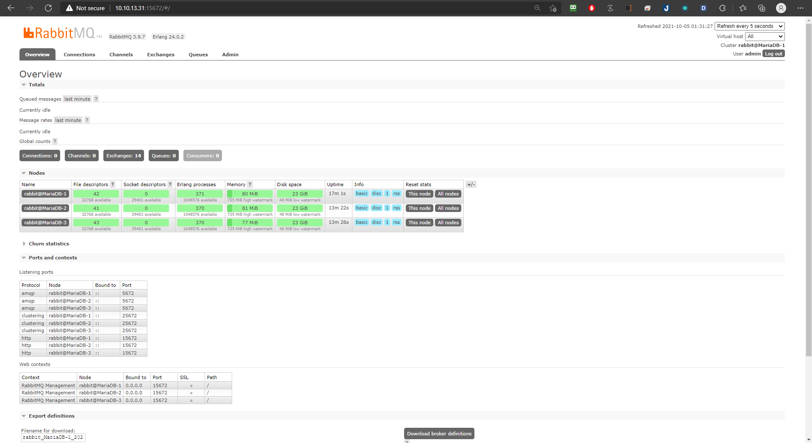

<h1 align="center">Hướng dẫn Cài đặt rabitmq 3 node CentOS7</h1>

# Mục Lục
Phần I. [Chuẩn bị](#chuanbi)
  1. [Phân hoạch](#phanhoach)
  2. [Mô hình triển khai](#mohinhtrienkhai)
  3. [Mô hình hoạt động](#mohinhhoatdong)

Phần II. [Triển khai](#trienkhai)
  1. [Thiết lập ban đầu](#2.1)
  2. [Cài đặt rabitmq 3 node CentOS7](#2.2)

# Phần I. <a name="chuanbi"></a>Chuẩn bị
## 1. <a name="phanhoach"></a>Phân hoạch IP

| Hostname | hardware | Interface |
|--------------|-------|------|
| MariaDB-1 | 2 CPU - 2GB RAM - 30GB Disk| eth0: 10.10.13.31  (MNGT)- eth1: 10.10.11.31|
| MariaDB-2 | 2 CPU - 2GB RAM - 30GB Disk| eth0: 10.10.13.32 (MNGT)- eth1: 10.10.11.32|
| MariaDB-3 | 2 CPU - 2GB RAM - 30GB Disk| eth0: 10.10.13.33 (MNGT)- eth1: 10.10.11.33|

## 2. <a name="mohinhtrienkhai"></a>Mô hình triển khai
<h3 align="center"></h3>


# Phần II. <a name="trienkhai"></a>Triển khai
## 1. <a name="2.1"></a>Thiết lập ban đầu
> ## **`Thực hiên trên cả 3 Node: MariaDB-1, MariaDB-2, MariaDB-3`**
### Bước 1: Tắt firewall, Selinux
```sh
sudo systemctl disable firewalld
sudo systemctl stop firewalld
sudo systemctl disable NetworkManager
sudo systemctl stop NetworkManager
sudo systemctl enable network
sudo systemctl start network
sed -i 's/SELINUX=enforcing/SELINUX=disabled/g' /etc/sysconfig/selinux
sed -i 's/SELINUX=enforcing/SELINUX=disabled/g' /etc/selinux/config

### Bước 2: Cài đặt Epel repository và Update các gói cài đặt
```sh
yum install epel-release -y
yum update -y
```
### Bước 3: Cài đặt NTP
```sh
yum install chrony -y 

systemctl start chronyd 
systemctl enable chronyd
systemctl restart chronyd 

chronyc sources -v

sudo date -s "$(wget -qSO- --max-redirect=0 google.com 2>&1 | grep Date: | cut -d' ' -f5-8)Z"
ln -f -s /usr/share/zoneinfo/Asia/Ho_Chi_Minh /etc/localtime

```

### Bước 4: Set hostname
```sh
echo "10.10.13.31 MariaDB-1" >> /etc/hosts
echo "10.10.13.32 MariaDB-2" >> /etc/hosts
echo "10.10.13.33 MariaDB-3" >> /etc/hosts
```
### Bước 5: Cài đặt Erlang, các gói phụ trợ
```sh
yum -y install epel-release
yum update -y
yum -y install erlang socat wget
```
### Bước 6: CMD Log
```
curl -Lso- https://raw.githubusercontent.com/nhanhoadocs/ghichep-cmdlog/master/cmdlog.sh | bash

```
### Bước 6: Khởi động lại máy để load được cấu hình selinux
```sh
init 6
```
## 2. <a name="2.2"></a>Cài đặt rabitmq 3 node CentOS7
> ## **`Thực hiên trên cả 3 Node: MariaDB-1, MariaDB-2, MariaDB-3`**

- Cài đặt
```
wget https://github.com/rabbitmq/rabbitmq-server/releases/download/rabbitmq_v3_6_10/rabbitmq-server-3.6.10-1.el7.noarch.rpm
rpm --import https://www.rabbitmq.com/rabbitmq-release-signing-key.asc
rpm -Uvh rabbitmq-server-3.6.10-1.el7.noarch.rpm
```

- Start service

```
systemctl start rabbitmq-server
systemctl enable rabbitmq-server
systemctl status rabbitmq-server
```

> ## **`Thực hiên trên Node: MariaDB-1`**

- Kiểm tra trạng thái node:

```
sudo rabbitmqctl status|grep rabbit
```

- Tạo User cho App (nhcluster), phân quyền:
```sh
rabbitmqctl add_user admin 0962012918tT# //Tạo user admin/0962012918tT#
rabbitmqctl set_user_tags admin administrator //Phân quyền administrator
rabbitmqctl add_vhost admin_vhost
rabbitmqctl set_permissions -p admin_vhost admin ".*" ".*" ".*"
```
- Copy file `/var/lib/rabbitmq/.erlang.cookie` từ `MariaDB-1` sang các node còn lại. (Có nhập password)
```sh
scp /var/lib/rabbitmq/.erlang.cookie root@MariaDB-2:/var/lib/rabbitmq/.erlang.cookie

scp /var/lib/rabbitmq/.erlang.cookie root@MariaDB-3:/var/lib/rabbitmq/.erlang.cookie
```
- Cấu hình policy HA Rabbit Cluster:
```sh
rabbitmqctl -p admin_vhost set_policy ha-all '^(?!amq\.).*' '{"ha-mode": "all"}'
```
- Kiểm tra trạng thái cluster:

```
rabbitmqctl cluster_status
```

```
[root@MariaDB-1 ~]# rabbitmqctl cluster_status
Cluster status of node 'rabbit@MariaDB-1'
[{nodes,[{disc,['rabbit@MariaDB-1','rabbit@MariaDB-2','rabbit@MariaDB-3']}]},
 {running_nodes,['rabbit@MariaDB-2','rabbit@MariaDB-3','rabbit@MariaDB-1']},
 {cluster_name,<<"rabbit@MariaDB-1">>},
 {partitions,[]},
 {alarms,[{'rabbit@MariaDB-2',[]},
          {'rabbit@MariaDB-3',[]},
          {'rabbit@MariaDB-1',[]}]}]
```

- Khởi chạy app:

```
rabbitmqctl start_app
```

```
[root@node1 ~]# rabbitmqctl start_app
Starting node rabbit@MariaDB-1
```
> ## **`Thực hiên trên Node: MariaDB-2,MariaDB-3`**

- Phân quyền file `/var/lib/rabbitmq/.erlang.cookie`

```
chown rabbitmq:rabbitmq /var/lib/rabbitmq/.erlang.cookie
chmod 400 /var/lib/rabbitmq/.erlang.cookie
```

- Khởi động lại Dịch vụ:

```
systemctl restart rabbitmq-server.service
```

- Join cluster `MariaDB-1`

```
rabbitmqctl stop_app
rabbitmqctl join_cluster rabbit@MariaDB-1
rabbitmqctl start_app
```
- Kiểm tra trên tất cả các node
```
[root@MariaDB-1 ~]# rabbitmqctl cluster_status
Cluster status of node 'rabbit@MariaDB-1'
[{nodes,[{disc,['rabbit@MariaDB-1','rabbit@MariaDB-2','rabbit@MariaDB-3']}]},
 {running_nodes,['rabbit@MariaDB-2','rabbit@MariaDB-3','rabbit@MariaDB-1']},
 {cluster_name,<<"rabbit@MariaDB-1">>},
 {partitions,[]},
 {alarms,[{'rabbit@MariaDB-2',[]},
          {'rabbit@MariaDB-3',[]},
          {'rabbit@MariaDB-1',[]}]}]
[root@MariaDB-1 ~]#
```

```
[root@MariaDB-2 ~]# rabbitmqctl cluster_status
Cluster status of node 'rabbit@MariaDB-2'
[{nodes,[{disc,['rabbit@MariaDB-1','rabbit@MariaDB-2','rabbit@MariaDB-3']}]},
 {running_nodes,['rabbit@MariaDB-1','rabbit@MariaDB-3','rabbit@MariaDB-2']},
 {cluster_name,<<"rabbit@MariaDB-1">>},
 {partitions,[]},
 {alarms,[{'rabbit@MariaDB-1',[]},
          {'rabbit@MariaDB-3',[]},
          {'rabbit@MariaDB-2',[]}]}]
[root@MariaDB-2 ~]#
```

```
[root@MariaDB-3 ~]# rabbitmqctl cluster_status
Cluster status of node 'rabbit@MariaDB-3'
[{nodes,[{disc,['rabbit@MariaDB-1','rabbit@MariaDB-2','rabbit@MariaDB-3']}]},
 {running_nodes,['rabbit@MariaDB-2','rabbit@MariaDB-1','rabbit@MariaDB-3']},
 {cluster_name,<<"rabbit@MariaDB-1">>},
 {partitions,[]},
 {alarms,[{'rabbit@MariaDB-2',[]},
          {'rabbit@MariaDB-1',[]},
          {'rabbit@MariaDB-3',[]}]}]
[root@MariaDB-3 ~]#
```
### Kích hoạt plugin rabbit management

- Thực hiện trên tất cả các Node

```
rabbitmq-plugins enable rabbitmq_management
chown -R rabbitmq:rabbitmq /var/lib/rabbitmq
```

- Truy cập giao diện web quản lý rabbitmq

```
http://IP:15672
```

Tài khoản: `admin` / `0962012918tT#`

<h3 align="center"></h3>
