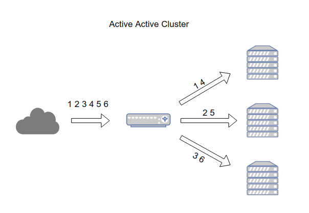
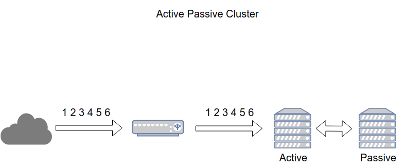

# High Availability : Tổng quan về Cluster

## Mục lục
I. [Lời nói đầu](#loinoidau)

II.  [Tính năng](#tinhnang)

III. [Các thuật ngữ](#thuatngu)

IV. [Cơ chế hoạt động](#cochehoatdong)
  - 4.1 [Active - Active](#Active)
  - 4.2 [Active - Passive](#Passive)

## I. Lời nói đầu
- **`Cluster`** là kiến trúc nâng cao khả năng sẵn sàng cho các hệt thống dịch vụ. Hệ thống Cluster cho phép nhiều máy chủ chạy kết hợp, đồng bộ với nhau.**Clusster** nâng cao khả năng chịu lỗi của hệ thống, tăng độ tin cậy, tăng tính đảm bảo, nâng cao khả năng mở rộng cho hệ thống. Trong trường hợp lỗi xảy ra , các dịch vụ hoạt động bên trong Cluster tự động loại trừ lỗi, khắc phục sự cố, duy trì tính ổn định, sẵn sàng của các dịch vụ
- **`Cluster`** thường được sử dụng trên các hệ thống thanh toán trực tuyến, ngân hàng, cơ sở dữ liệu, hệ thống lưu trữ...
## II. Tính năng

- Cân bằng tải ( **Load Balancing** ): Các Node hoạt động bên trong Cluster hoạt động song song, chia sẻ các tác vụ, hỗ trợ lần nhau để nâng cao hiệu năng hệ thống.
- Tính sẵn sàng cao (**High availability**): Hệ thống cluster luôn sẵn sàng xử lý yêu cầu cho các ứng dụng và service ngay cả những thời điểm mà các thành phần `hardware` hay `Software` bị lỗi.
-  Khả năng mở rộng (**scalability**): Tại thời điểm tài nguyên hệ thống đạt mức giới hạn, ta có thể bổ sung mở rộng tài nguyên bằng các thêm các `Node` mới vào hệ thống **`Cluster`**.
- Độ tin cậy(**reliability**): Hệ thống Cluster giảm thiểu tối tần số lỗi đến các úng dụng và service, giảm thiểu các vấn đề dẫn tới ngừng hoạt động hệ thống

## III. Các thuật ngữ

- **`Cluster`**: Nhóm server sử dụng để giải quyết 1 vấn đề, có khả năng kết nối và chia sẻ các tác vụ với nhau
- **`Node`**: 1 hoặc nhiều server nào đó được cài đặt Cluster service và hoạt động trên hệ thống Cluster
- **`Failover`**: Khi 1 hoặc nhiều Node trong hệ thống Cluster gặp vấn đề , tài nguyên sẽ tự động được chuyển sang các Node sẵn sàng phục vụ và đảm bảo hoạt động
- **`Failback`**: Khi mà các node lỗi đã phục hồi có thể sẵn sàng phục vụ, Cluster tự động trả lại tài nguyên cho node đó
- **`Fault-tolerant cluster`**: Đề cập đến khả năng chịu lỗi của hệ thống trên các thành phần, cho phép dịch vụ hoạt động ngay cả khi một vài thành phần gặp sự cố
- **`Heartbeat`**: Tín hiệu xuất phát từ các node để xác mình chúng còn sống và đang hoạt đông. Nếu Heartbeat tại 1 node ngừng hoạt động, Cluster sẽ đánh dâu xác nhận node đó đang gặp sự cố và chuyển tài nguyên tại node lỗi sang 1 node sẵn sàng phục vụ
-  **`Interconnect`**: thông tin về trạng thái, heartbeat, dữ liệu chia sẻ giữa các node
- **`Primary server, secondary server`**: Trong cluster dạng `Active/Passise`, node đang đáp ứng giải quyết yêu cầu gọi là `Primary server`. Node đang chờ hay dự phòng cho node Primary server được gọi là `secondary server`
- **`Quorum`**: Hệ thống Cluster chứa nhiều tài nguyên, nên dễ xảy ra sự phân mảnh (`split-brain` - Tức cluster lớn bị tách ra thành nhiều cluster nhỏ). Điều này sẽ dẫn đến sự mất đồng bộ giữa các tài nguyên, ảnh hướng tới sự toàn vẹn của hệ thống. Quorum được thiết kế để ngăn chặn hiện tượng phân mảnh
- **`Resource`**: Tài nguyên của cụm, cũng có thể hiểu là tài nguyên mà dịch vụ cung cấp
- **`STONITH/ Fencing`**: `STONITH` là viết tắt của cụm từ `Shoot Other Node In The Head` đây là một kỹ thuật dành cho `fencing`. `Fencing` là kỹ thuật cô lập tài nguyên tại từng node trong Cluster. Mục tiêu `STONITH` là tắt hoặc khởi động lại node trong trường hợp Node trong trường hợp dịch vụ không thể khôi phục.

## IV. Cơ chế hoạt động

### 4.1 Active - Active
- **`Active-Active cluster`** được tạo ra từ ít nhất `2 node`, cả 2 node chạy đồng thời xử lý cùng 1 loại dịch vụ. Mục đích chính của `Active-Active Cluster` là tối ưu hóa cho hoạt động cân bằng tải (Load balancing). Hoạt động cân bằng tải (Load balancing) sẽ phân phối các tác vụ hệ thống tới tất cả các node bên trong cluster, tránh tình trạng các node xử lý tác vụ không cân bằng dẫn tới tình trạng quả tải. Bên cạnh đó, Active-Active Cluster nâng cao thông lượng (thoughput) và thời gian phản hổi

***Lưu ý***: chế độ **`Active-Active Cluster`** là các node trong cụm cần được cấu hình giống nhau tránh tình trạng phân mảnh cụm.

<h3 align="center"></h3>

<h3 align="center">
Active-Active Cluster
</h3>

>***`Active-Active cluster`***: Hoạt động để tối ưu, đảm bảo năng cân bằng tải tác vụ các node.

### 4.2 Active - Passive
- Giống cấu hình `Active-Active`, **`Active-Passive Cluster`** cần ít nhất 2 node, tuy nhiên không phải tất cả các node đều sẵn sàng xử lý yêu cầu. VD: Nếu có 2 node thì 1 node sẽ chạy ở chế độ Active, node còn lại sẽ chạy ở chế độ `passive` hoặc `standby`.
- `Passive Node` sẽ hoạt động như 1 bản `backup` của `Active Node`. Trong trường hợp `Active Node` xảy ra vấn đề,`Passive Node` sẽ chuyển trạng thái thành `active`, tiếp quản xử lý các yêu cầu

<h3 align="center"></h3>
<h3 align="center">
Active-Passive Cluster
</h3>

>***`Active-Passive cluster`***: Hoạt động nhằm mục đích backup cho `Active-Active Cluster`