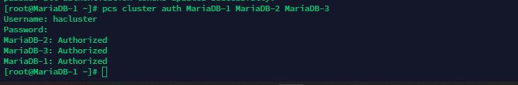
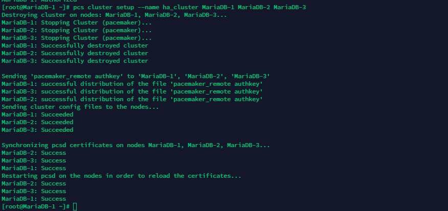

<h1 align="center">Tạo và quản lý một Cluster</h1>

# I. <a name="I"></a>Tạo một Cluster
## 1. Khởi động pacemaker
- Để khởi động dịch vụ Pacemaker và cho phép tự khởi động cùng OS, thực hiện chạy 2 câu lệnh
```sh
systemctl start pcsd
systemctl enable pcsd
```

## 2. Xác thực các node tham gia vào Cluster

- Trước khi tạo mới 1 cluster, ta cần kiểm tra kết nối tới các node sẽ tham gia hình hành lên cluster xem ở thời điểm đó các node có liên kết với nhau hay không? Ví dụ: tạo 1 Cluster-HA với 3 node có thông tin như sau: 

| Hostname | IP |
|--------------|-------|
| MariaDB-1 | 10.10.13.31 |
| MariaDB-2 | 10.10.13.32 |
| MariaDB-3 | 10.10.13.33 |

thực hiện add file cấu hình `/etc/hosts`
 ```sh
10.10.13.31 MariaDB-1
10.10.13.32 MariaDB-2
10.10.13.33 MariaDB-3
 ```

- Tiếp theo, cần sử dụng một mật khẩu giống nhau cho user `hacluster` trên tất cả các node. Câu lệnh để tạo xác thực liên lạc giữa các node có cú pháp như sau:
```sh
  pcs cluster auth [node] [...] [-u username] [-p password]
```

- Trong đó:
    - username: phải là `hacluster`
    - password: là mật khẩu của user `hacluster`
    - node: có thể là địa chỉ `ip` hoặc `tên` của node tham gia trong cluster

- Ví dụ: Câu lệnh kiểm tra quá trình xác thực với 3 node đã nêu trên
```sh
pcs cluster auth MariaDB-1 MariaDB-2 MariaDB-3
```
- kết quả:
<h3 align="center"></h3>

> trong trường hợp tất cả các node đều được thông báo `Authorized` ,ta mới tiến hành cấu hình một cluster.

## 3. Cấu hình và khởi động các node trong cluster
### Để tiến hành cấu hình cho một cluster. Ta sử dụng câu lệnh:

```sh
  pcs cluster setup [--start] [--local] --name cluster_name node1 [node2] [...]
```
  - Trong đó: 
    - `cluster_name`: là tên của cluster sẽ được tạo ra
    - node1 [node2] [...]: là dãy tên các node tham gia vào cluster.

  ví dụ:
```sh
pcs cluster setup --name ha_cluster MariaDB-1 MariaDB-2 MariaDB-3
```
<h3 align="center"></h3>

## 4. bật và tắt cluster

- Cho phép `Cluster` khởi động cùng hệ thống
```sh
pcs cluster enable --all
```
- Hủy bỏ, không cho phép cluster khởi động cùng hệ thống
```sh
pcs cluster disable --all
```

## Phần II. <a name="II"></a>Quản lý các node trong cluster

### 1. Dừng dịch vụ cluster trong các nodes

- Dừng hoạt động của một node trong cluster:
```sh
pcs cluster stop node_name
```
  - Trong đó:
    - node_name: là tên muốn dừng hoạt động trong cluster

  - hoặc
```sh
pcs cluster stop --all  // dừng tất cả các node
```
## 2. Thêm node mới vào cluster
- Để thêm mới note ta tiến hành xác thực liên kết rồi sau đó tiến hành add node mới vào cụm cluster
```sh
pcs cluster auth node_name
pcs cluster node add node_name --start
```
  - Trong đó: node_name là tên node cần được thêm vào Cluster

## 3. Xóa bỏ node trong cluster

- Để xóa bỏ một node đã tồn tại trong cluster,ta sử dụng câu lệnh sau trên một node đã nằm trong cluster:

```sh
pcs cluster node remove node_name   //node_name là tên node cần xóa khỏi cluster
```


## Phần III. <a name="III"></a>Xóa cấu hình cluster

-  Bước 1: Dùng dịch vụ Cluster trên các node
```sh
pcs cluster stop --all
```
- Bước 2: Xóa vĩnh viễn dịch vụ trên tất cả các node
```sh
pcs cluster destroy --all
```

## Phần IV. <a name="IV"></a> Hiển thị trạng thái cluster

- Kiểm tra trạng thái hoạt động Cluster
```sh
pcs status
```