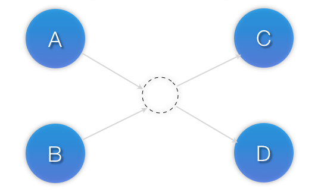
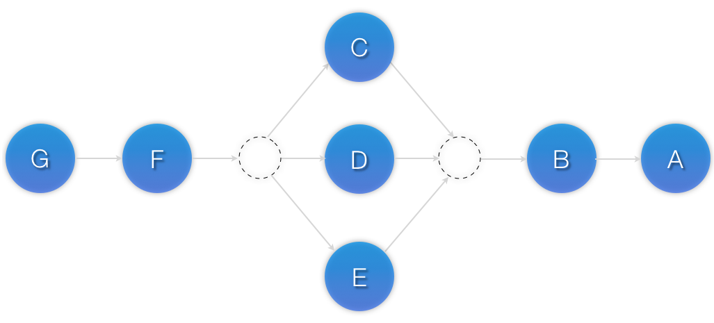

<h1 align="center">Các ràng buộc resources trong pacemaker</h1>

## 1. Ràng buộc vị trí
- ý nghĩa của ràng buộc này quy định **`Resource`** có thể hoạt động trên node nào. Có thể thực hiện cấu hình để xác định ràng buộc vị trí cho phép resource hoạt động hay không hoạt động trên node nào đó?
####  Để tạo ra một ràng buộc về vị trí cho phép resource hoạt động trên node :
```sh
pcs constraint location resource_id prefers node_id
```
Trong đó:
  - `resource_id`: tên của resource
  - `node_id`: tên của node

####  Tạo ràng buộc mà vị trí `resource` không được phép hoạt động:
```sh
pcs constraint location resource_id avoids node_id
```
Trong đó:
  - `resource_id`: tên của resource
  - `node_id`: tên của node

#### Có 2 hướng cấu hình ràng buộc vị trí đối với các resource
- **`"Opt-In"`** Cluster: Cấu hình Cluster mà mặc định các resource không thể hoạt động trên bất kỳ node nào đó. Sau đó ta sẽ khai báo resource có thể được hoạt động trên node nào
- **`"Opt-Out"`** Cluster: Cấu hình Cluster mà mặc định các resource có thể chạy trên tất cả các node. Sau đó ta sẽ khai báo resource không được phép hoạt động trên node nào

- Việc lựa chọn cấu hình `Cluster` theo hướng nào phụ thuộc vào ý tưởng cá nhân và cách mà ta tạo ra cluster. Nếu hầu hết các node đều có thể chạy resource thì việc lựa chọn hướng Opt-Out sẽ khiến cho việc cấu hình đơn giản hơn. Mặc khác, nếu các resource chỉ có thể chạy trên một tập nhỏ các node trong cluster thì việc lựa chọn hướng Opt-In sẽ khiến việc cấu hình đơn giản hơn.

### 1.1 Cấu hình một "Opt-In" Cluster
- Để tạo ra một cấu hình `Opt-In cluster`, ta cần phải đặt lại giá trị `symmetric-cluster` để ngăn việc `resource` chạy được bất cứ trên node nào trong cluster bằng việc sử dụng câu lệnh:
```sh
pcs property set symmetric-cluster=false
```

- Trong trường hợp triển khai mô hình Cluster gồm 3 node, tiếp theo ta cần cấu hình cho phép resource hoạt động trên những node được chỉ định trong mô hình Cluster

```sh
pcs constraint location Virtual_IP prefers MariaDB-1
pcs constraint location Virtual_IP prefers MariaDB-3

pcs constraint location Webserver_cluster prefers MariaDB-2
pcs constraint location Webserver_cluster prefers MariaDB-3

```
ý nghĩa:
  - Cho phép resource `Virtual_IP` hoạt động trên 2 node `MariaDB-1,MariaDB-3`
  - Cho phép resource `Webserver_cluster` hoạt động trên 2 node `MariaDB-2,MariaDB-3`
  - khi các node MariaDB-1 và MariaDB-2 gặp lỗi thì quá trình `fail-over` sẽ xảy ra - resource Virtual_IP, Webserver_cluster sẽ được dịch chuyển sang node `MariaDB-3`

### 1.2. Cấu hình một "Opt-Out" Cluster

- Để tạo ra một cấu hình theo hướng Opt-Out cluster, ta cần phải đặt giá trị symmetric-cluster để cho phép resource chạy được bất cứ trên node nào trong cluster:
```sh
pcs property set symmetric-cluster=true
```

> Lưu ý: đây là hướng cấu hình mặc định, nếu như chưa từng chỉnh sửa giá trị này thì có thể bỏ qua bước này.

- Trong trường hợp triển khai mô hình Cluster gồm 3 node, tiếp theo ta cần cấu hình cho phép resource chỉ được hoạt động trên những node được chỉ định trong mô hình Cluster
```sh
pcs constraint location Virtual_IP prefers MariaDB-1
pcs constraint location Virtual_IP avoids MariaDB-2

pcs constraint location Web_Cluster prefers MariaDB-2
pcs constraint location Web_Cluster avoids MariaDB-1
```
## 2. Ràng buộc về thứ tự

- Ràng buộc nay quy định thứ tự mà các resource sẽ hoạt động. Có thể thực hiện quy định `resource` hoạt động hay dừng khi có 1 hoatf động nào đó xảy ra
- Cú pháp thực hiện ràng buộc thứ tự
```sh
pcs constraint order [action] resource_id then [action] resource_id [options] 
```
trong đó
```
- resource_id: tên của resource
- action: hành động của constraint
```

- Giá trị của các **`action`** trong câu lệnh tạo ràng buộc bao gồm:

| Action | Mô tả |
| ------------- | ------------- |
| start (mặc định) | Khởi động resource |
| stop | Dừng hoạt động resource |
| promote | Thực hiện chuyển resource từ một resource slave thành một resource master |
| demote | Thực hiện chuyển resource từ một resource master thành một resource slave|

- Ngoài ra còn có thể thêm 2 trường nữa trong câu lệnh tạo ràng buộc trên được cho theo bảng sau:

| Trường | Giá trị và mô tả |
| ------------- | ------------- |
| kind | <ul><li>`Optionnal`: Chỉ áp dụng ràng buộc nếu cả hai resource đều đang hoạt động hoặc không hoạt động</li><li>`Mandatory` (mặc định): Nếu resource đầu tiên khai bao mà không hoạt động hoặc không thể khởi động, thì resource thứ hai đã khai bao trong câu lệnh bắt buộc phải không được hoạt động</li><li>`Serialize`: Đảm bảo rằng sẽ không có hành động dừng lại/ khởi động (stop/start) cùng xảy ra cho cùng một nhóm các resource</li></ul> |
| symmetrical | <ul><li>true (mặc định): buộc các resource dừng hoạt động theo thứ tự ngược lại, resource khai bao sau sẽ dùng hoạt động trước rồi mới đến resource khai báo đầu tiên</li><li>false: Dừng hoạt động dịch vụ theo đúng thứ tự đã khai báo trong câu lệnh</li></ul> |

### 2.1 Thứ tự bắt buộc
- Ràng buộc chi ra rằng `resource` khai báo thứ 2 trong câu lệnh tạo sự ràng buộc không thể hoạt động khi không có `resource` đầu tiên được khai báo trong câu lệnh `đang hoạt động`
- Nếu resouce đầu tiên khai báo đang hoạt động và dừng lại thì resource thứ 2 được khai báo trong câu lệnh sẽ thực hiện đừng hoạt động ( Nếu resource đó đang hoạt động ) 
- Nếu `resource` đầu tiên khai báo đang `không hoạt động` và `không thể khởi động` thì resource thứ hai sẽ phải `dừng lại` nếu nó đang hoạt động
- Nếu resource đầu tiên khai báo khởi động hay khởi động lại trong khi resource khai báo thứ hai đang hoạt động thì resource thứ hai cũng sẽ phải dừng và khởi động lại

- Ví dụ:
```sh
pcs constraint order start Virtual_IP then Loadbalancer_HaProxy
```
trong đó:
```
  - Virtual_IP: là resource khai báo đầu tiên hay resource thứ nhất
  - Web_Cluster: là resource khai báo thứ hai hay resource thứ hai.
```
### 2.2. Thứ tự không bắt buộc
- Ràng buộc thứ tự này chỉ ra rằng nó có hiệu lực khi và chỉ khi cả hai resource cùng đang dừng hoạt động hoặc đang khởi động. Các thay đổi trạng thái của resource thứ nhất sẽ không có ảnh hưởng gì đến resource thứ hai.
- ví dụ:
```sh
pcs constraint order start Virtual_IP then Loadbalancer_HaProxy kind=Optional
```

### 2.3. Thứ tự tập các resource

- Trong trường hợp ta có nhiều resource hoạt động phụ thuộc vào nhau, hay nói các khác resource này là tiền đề để resource khác hoạt động. Ví dụ có 4 resource A,B,C,D và thực hiện cầu hình ràng buộc khởi động như sau:

```sh
pcs constraint order start A then start B
pcs constraint order start B then start C
pcs constraint order start C then start D
```
như vậy ta được một mô tả tương tự như hình sau:
<h3 align="center"></h3>

Để giải quyết vấn đề trên, bạn có thể dùng đến việc quản lý các resource theo nhóm . Các nhóm resource nếu như các resource này đều cùng nằm trên cùng 1 node. Tuy nhiên, nếu các resource này không cùng nằm trên một node. Bạn có thể tạo ra một ràng buộc trên một tập các node với câu lệnh:

```sh
pcs constraint order set resource1 resource2 [resourceN]... [options] [set resourceX resourceY ... [options]] [setoptions [constraint_options]]
```

câu lệnh trên cung cấp các tùy chọn cấu hình như sau:

| Tùy chọn | Mô tả cho tùy chọn |
| ------------- | ------------- |
| sequentical | Có thể thiết lập giá trị <br><ul><li>true</li><li>false</li></ul><br> để thế hiện bất cứ khi nào các resource cũng phải có thứ tự liên quan tới một resource khác. Nếu được cho giá trị là `false` thì nó cho phép tập các resource có thế được ràng buộc thứ tự liên quan tới các tập resource khác mà không có các resource nó chứa trong tập resource khác ấy.Vì vậy mà nó thực sự có ý nghĩa nếu có nhiều tập resource được thiết lập ràng buộc.|
| require-all | Có thể có giá trị thiết lập là `true` hoặc `false` với ý nghĩa yêu cầu tất cả các resource phải được hoạt động trước khi tiếp tục chuyển sang tập khác. Nếu đặt là `false` có nghĩa chỉ một resource trong tập resource cần được hoạt động trước khi nó tiếp tục hướng tới tập khác. Tùy chọn này với giá trị false sẽ không có ảnh hưởng trừ khi được sử dụng cùng với các tập không có ràng buộc thứ tự (sequentical phải được đặt là false)|
| action | với các giá trị `start`, `promote`, `demote`, `stop` được mô tả giống như ở mục |
| id | Tên của constraint |
|role| Với các giá trị: Stopped/Started/Master/Slave|

Với mô tả như đã nói ở phần đầu mục này,có thể thực hiện cấu hình như sau với câu lệnh:
```sh
pcs constraint set A B C D sequentical=true
```
- Ví dụ:

  - Với mô hình nhưu sau:
  <h3 align="center"></h3>

     Ta cần thực hiện cấu hình sử dụng các câu lệnh như sau:
  ```sh
  pcs constraint order set A B sequentical=false set C D sequentical=false id=AB-CD
  ```
 
  - Với mô hình như sau:
  <h3 align="center"></h3>
  ta cần thực hiện cấu hình sử dụng câu lệnh sau:

  ```sh
  pcs constraint order set A B sequentical=false set C D sequentical=true set E F sequentical=false
  ```

  - Với mô hình phức tạp hơn
  <h3 align="center"></h3>
  ta cần thực hiện cấu hình sử dụng câu lệnh sau:

  ```sh
  pcs constraint order set G F sequentical=true set C D E sequentical=false set B A sequentical=true id=GF-CDE-BA
  ```

  ### 2.4. Xóa bỏ resource từ các ràng buộc thứ tự
  - Xóa bỏ sàng buộc thứ tự:
  ```sh
  pcs constraint order remove resource1 [resourceN]...
  ```
## 3. Ràng buộc colocation của resources

- Ràng buộc này quy định vị trí của một resource A phụ thuộc vào vị trí của một resource B đang chạy trên node nào trong cluster. Hay nói cách khác resource A muốn hoạt động thì phải có resource B cũng đang hoạt động và cùng nằm chung trên một node_id với resource A.
- Tạo ra một ràng buộc `colocation`
```sh
pcs constraint colocation add [master|slave] source_resource with [master|slave] target_resource [score] [options]
```
- trong đó:
  - `source_resource`: là resource_id hay tên của resource `phụ thuộc vào resource khác`
  - `target_resource`: là resource_id hay tên của resource được `resource khác phụ thuộc vào`
  - `source_resource` và `target_resource` không có ranh giới phân biệt
`Cluster` sẽ quyết định vị trí của `target_resource` trước tiên sau đó sẽ quyết định tới `vị trí` của `source_resource`

### 3.1. Vị trí bắt buộc

- Ràng buộc này thực sự có hiệu lực khi tùy chọn `score` được đặt giá trị là: **`+INFINITY`** hoặc **`-INFINITY`**. Với ý nghĩa:
  - **`+INFINITY`**: Quy định source_resource phải chạy cùng trên một node với target_resource. Đây là giá trị mặc định
  - **`-INFINITY`**: Quy định source_resource không được chạy cùng trên một node với target_resource.

### 3.2. Vị trí không bắt buộc

- Đối với số lượng các ràng buộc có `score=-INFINITY` ít hơn `score=INFINITY` thì cluster sẽ cố gắng thực hiện mong muốn của bạn

### 3.3. Colocation các tập resource

- Đây là ràng buộc có các thuộc tính giống với như ràng buộc các nhóm resource và ràng buộc thứ tự app dụng cho các nhóm resource phải cùng nằm trên 1 node với nhau

```sh
pcs constraint colocation set resource1 resource2 [resourceN]... [options] [set resourceX resourceY ... [options]] [setoptions [constraint_options]]
```

### 3.4. Xóa bỏ ràng buộc colocation

- Xóa bảo ràng buộc colocation đã tạo
```sh
pcs constraint colocation remove source_resource target_resource [constraint_id]
```
trong đó: `constraint_id` là tên của ràng buộc.


## 4. Hiển thị cấu hình các ràng buộc

- Để hiển thị thống kê các ràng buộc
```sh
pcs constraint
```
hoặc
```sh
pcs constraint show --full
```
để hiển thị cụ thể chi tiết về từng constraint

- Để hiển thị các ràng buộc về thứ tự
```sh
pcs constraint order show [--full]
```
- Hiển thị ràng buộc về vị trí
```sh
pcs constraint location show [--full]
```
- Để hiển thị ràng buộc colocation
```sh
pcs constraint colocation show [--full]
```