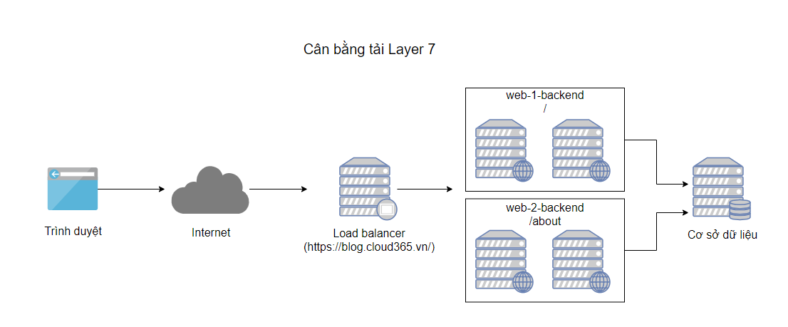

<h1 align="center">Tổng quan và các khái niệm quan trọng về cân bằng tải trong HAProxy</h1>

# I. Tổng quan 
- HAProxy viết tắt của High Availability Proxy, là công cụ mã nguồn mở nổi tiếng ứng dụng cho giải pháp cân bằng tải TCP/HTTP cũng như giải pháp máy chủ Proxy (Proxy Server). HAProxy có thể chạy trên các mỗi trường Linux, Solaris, FreeBSD. Công dụng phổ biến nhất của HAProxy là cải thiện hiệu năng, tăng độ tin cậy của hệ thống máy chủ bằng cách phân phối khối lượng công việc trên nhiều máy chủ (như Web, App, cơ sở dữ liệu). HAProxy hiện đã và đang được sử dụng bởi nhiều website lớn như GoDaddy, GitHub, Bitbucket, Stack Overflow, Reddit, Speedtest.net, Twitter và trong nhiều sản phẩm cung cấp bởi Amazon Web Service.

# II. Một số thuật ngữ 

## 1. Access Control List (ACL)
- **`Access Control List`** sử dụng để kiểm tra một số điều kiện và thực hiện hành động tiếp theo dựa trên kết quả kiểm tra (vd: chọn 1 server va thực hiện chặn 1 request).Sử dụng ACL cho phép điều tiết mạng linh hoạt dựa vào các yêu tố khác nhau(vd:dwuaj theo đường dẫn, dựa theo số lượn kết nối tới backend)
## 2. Backend

- Backend là tập các server nhận những requesst được điều tiết ( HAproxy điều tiết các request tới các backend). Các backend được định nghĩa trong mục backend khi cấu hình HAProxy.
- 2 cấu hình thường được định nghĩa trong mục `Backend`
  - Thuật toán cân bằng tải : Round Robin, Least Connection, IP Hash
  - Danh sách các Server, Port: Nhận và xử lý request

Backend có thể chưa một hoặc nhiều server. Khi thiêm nhiều server vào backup sẽ cải thiện mức độ chịu tải, hiệu năng và tăng độ tin cậy dịch vụ. Khi 1 server thuộc backend gặp vấn đề thì server khác cũng thuộc backend đó sẽ chịu tải thay cho server đang gặp vấn đề

```sh
backend web-backend
   balance roundrobin
   server web1 web1.yourdomain.com:80 check
   server web2 web2.yourdomain.com:80 check

backend blog-backend
   balance roundrobin
   mode http
   server blog1 blog1.yourdomain.com:80 check
   server blog1 blog1.yourdomain.com:80 check
```

- `balance roundrobin` chỉ định thuật toán cân bằng tải: các Request phân phối tuần tự tới các server, đây cũng là phương thức được sử dụng mặc định.

- `mode http` chỉ định proxy layer 7 sẽ được sử dụng

## 3. Frontend
- **`Frontend`** định nghĩa cách các request điều tiết tới backend. Các cấu hình Frontend được định nghĩa trong mục frontend khi cấu hình HAProxy.
- Các cấu hình frontend bao gồm các thành phần:
  - Tập các IP và port : 10.10.13.31:80, *:443
  - Các ACL
  - Các backend nhận, xử lý request.

# III. Các mô hình Load Balancing
## 1. Mô hình không sử dụng Load Balancing
<h3 align="center"></h3>
- Người dùng sẽ kết nối trực tiếp đến webserver và không sử dụng dịch vụ cân bằng tải. Nếu Webserver xảy ra vấn đề, người dùng sẽ không thể thực hiện kết nối đến website được nữa

## 2. Layer 4 Load Balancing

- Cách đơn giản nhất để thực hiện cân bằng tải các request tới nhiều server là sử dụng cân bằng tải mắc layer 4 TCP(Tầng giao vận - Transport layer). Phương pháp sẽ thực hiện điều hướng request dựa theo IP và port. Theo ví dụ: Nếu 1 request được điều hướng tới website thì request đó sẽ được haproxy điều hướng đến backend để xử lý

<h3 align="center"></h3>

Lưu ý: 
  - Hai máy chủ web cần phục vụ nội dung giống nhau. Nếu không, người dùng sẽ nhận thông tin không thống nhất (Tùy theo thuật toán cân bằng tải).
  - Nên sử dụng chung database giữ 2 web server.

## 3. Layer 7 Load Balancing
- Đây là phương pháp phức tạp hơn, cân bằng tải sử dụng tầng layer 7 mức request (Tầng ứng dụng - Application layer). Sử dụng bộ cân bằng tại layer 7 sẽ điểu hướng đến các backend khác nhau dựa trên nội dung request
- Chế độ này cho phép triển khai nhiều Web Server  khác nhau trên cùng domain

<h3 align="center"></h3>
- Trong hình, nếu người dùng gửi request tới ‘https://blog.cloud365.vn/’, haproxy sẽ điều hướng request tới 1, còn khi người dùng request tới https://blog.cloud365.vn/about/ haproxy sẽ điều hường request tới web-2-backend

# IV. Các thuật toán cân bằng tải

Thuật toán cân bằng tải được sử dụng nhằm mục đích các request và điều hướng đến các server nằm trong `backend` trong quá trình load balancing. HAproxy cung cấp một số thuật toán mặc định

- **`Roundrobin`** : request sẽ được gửi đến theo lượt, đây là thuật toán mặc định sử dụng trên HAProxy
- **`leastconn`** : Các request sẽ được gửi đến những server có ít kết nối nhất
- **`Source`** : các request được chuyển đến server băng cách hash IP của người dùng. Phương pháp đảm bảo luôn kết nối đến 1 server

# V. Sticky Sessions

- Một ứng dụng yêu cầu người dùng phải giữ kết nối đế cùng một server thuộc backend, để giữ kết nối giữa 1 client đến 1 server backend có thể sử dụng tùy chọn `sticky sessions`. [Xem thêm](https://www.haproxy.com/blog/load-balancing-affinity-persistence-sticky-sessions-what-you-need-to-know/)

# VI. Health Check
- `HAProxy` sử dụng **health** check để phát hiện các backend server sẵn sàng xử lý request. Kỹ thuật này sẽ tránh việc loại bỏ server khỏi backend thủ công khi backend server không sẵn sàng. health check sẽ cố gắnh thiết lập kết nối TCP tới server để kiểm tra backend server có sẵn sàng xử lý request.

- Nếu `health check` không thể kết nối tới `server`, nó sẽ tự động loại bỏ server khởi `backend`, các traffic tới sẽ không được `forward` tới server cho đến khi nó có thể thực hiện được `health check`. Nếu tất cả server thuộc backend đều xảy vấn đề, dịch vụ sẽ trở trên không khả dụ (trả lại status code 500) cho đến khi 1 server thuộc backend từ trạng thái không khả dụ chuyển sang trạng thái sẵn sàng.