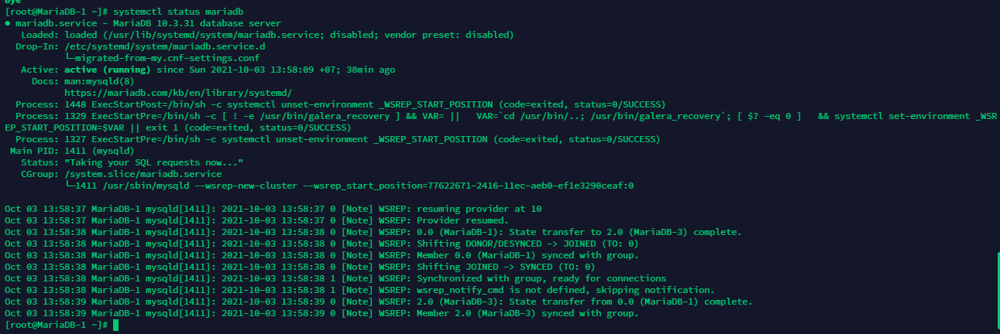
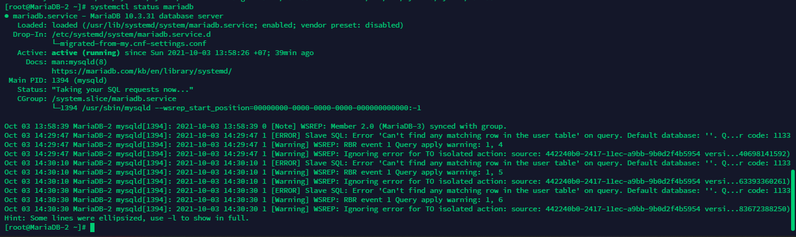
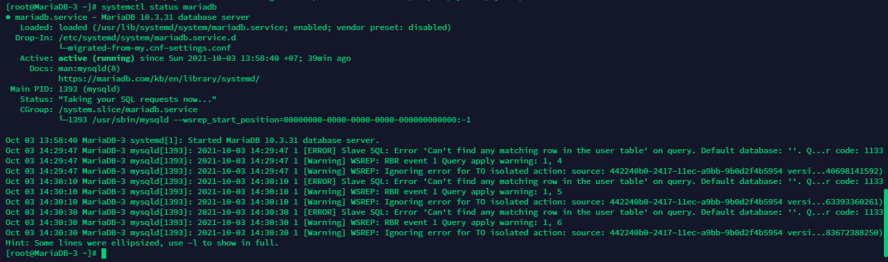
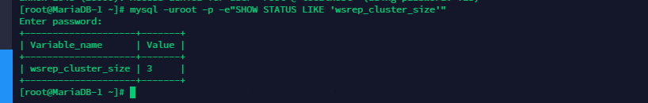

<h1 align="center">Hướng dẫn triển khai Cluster Galera 3 node Mariadb trên CentOS 7</h1>

# Mục Lục
Phần I. [Tổng quan](#tongquan)

Phần II. [Chuẩn bị](#chuanbi)

  1. [Phân hoạch](#phanhoach)
  2. [Mô hình triển khai](#mohinhtrienkhai)

Phần III. [Triển khai](#trienkhai)

  1. [Thiết lập ban đầu](#3.1)
  2. [Cài đặt MariaDB và Galera](#3.2)

Phần IV. [Cấu hình Galera Cluster](#cauhinh)

  1. [Thực hiện trên Node MariaDB-1](#MariaDB-1)
  1. [Thực hiện trên Node MariaDB-2](#MariaDB-2)
  1. [Thực hiện trên Node MariaDB-3](#MariaDB-3)
  1. [Thiết lập mật khẩu MariaDB](#passwd)

Phần V. [Kiểm tra hệ thống](#kiemtra)


## Phần I. <a name="tongquan"></a>Tổng quan
**`MariaDB`** là một sản phẩm mã đóng tách ra từ mã mở do cộng đồng phát triển của hệ quản trị cơ sở dữ liệu quan hệ `MySQL` nhằm theo hướng không phải trả phí với `GNU GPL`. MariaDB được phát triển từ sự dẫn dắt của những nhà phát triển ban đầu của `MySQL`, do lo ngại khi `MySQL` bị `Oracle Corporation` mua lại. Những người đóng góp được yêu cầu chia sẽ quyền tác giả của họ với **`MariaDB Foundation`**.

**`MariaDB`** được định hướng để duy trì khả năng tương thích cao với `MySQL`, để đảm bảo khả năng hỗ trợ về thư viện đồng thời kết hợp một cách tốt nhất với các API và câu lệnh của `MySQL`. `MariaDB` đã có công cụ hỗ lưu trữ `XtraDB` thay cho `InnoDB`.

**`MariaDB Galera Cluster`** là giải pháp sao chép đồng bộ nâng cao tính sẵn sàng cho MariaDB. Galera hỗ trợ chế độ `Active-Active` tức có thể truy cập, ghi dữ liệu đồng thời trên tất các node MariaDB thuộc `Galera Cluster`.


# Phần II. <a name="chuanbi"></a>Chuẩn bị
## 1. <a name="phanhoach"></a>Phân hoạch IP

| Hostname | hardware | Interface |
|--------------|-------|------|
| MariaDB-1 | 2 CPU - 2GB RAM - 30GB Disk| eth0: 10.10.13.31  (MNGT)- eth1: 10.10.11.31|
| MariaDB-2 | 2 CPU - 2GB RAM - 30GB Disk| eth0: 10.10.13.32 (MNGT)- eth1: 10.10.11.32|
| MariaDB-3 | 2 CPU - 2GB RAM - 30GB Disk| eth0: 10.10.13.33 (MNGT)- eth1: 10.10.11.33|

## 2. <a name="mohinhtrienkhai"></a>Mô hình triển khai
<h3 align="center"></h3>

# Phần III. <a name="trienkhai"></a>Triển khai
## 1. <a name="3.1"></a>Thiết lập ban đầu

> ## **`Thực hiên trên cả 3 Node: MariaDB-1, MariaDB-2, MariaDB-3`**
### Bước 1: Tắt firewall, Selinux
```sh
sudo systemctl disable firewalld
sudo systemctl stop firewalld
sudo systemctl disable NetworkManager
sudo systemctl stop NetworkManager
sudo systemctl enable network
sudo systemctl start network
sed -i 's/SELINUX=enforcing/SELINUX=disabled/g' /etc/sysconfig/selinux
sed -i 's/SELINUX=enforcing/SELINUX=disabled/g' /etc/selinux/config
```

### Bước 2: Cài đặt Epel repository và Update các gói cài đặt
```sh
yum install epel-release -y
yum update -y
```
### Bước 3: Cài đặt NTP
```sh
yum install chrony -y 

systemctl start chronyd 
systemctl enable chronyd
systemctl restart chronyd 

chronyc sources -v

sudo date -s "$(wget -qSO- --max-redirect=0 google.com 2>&1 | grep Date: | cut -d' ' -f5-8)Z"
ln -f -s /usr/share/zoneinfo/Asia/Ho_Chi_Minh /etc/localtime

```

### Bước 4: Set hostname
```sh
echo "10.10.13.31 MariaDB-1" >> /etc/hosts
echo "10.10.13.32 MariaDB-2" >> /etc/hosts
echo "10.10.13.33 MariaDB-3" >> /etc/hosts
```
### Bước 5: Khởi động lại máy để load được cấu hình selinux
```sh
init 6
```
## 2. <a name="3.2"></a>Cài đặt MariaDB và Galera
### Bước 1: Cài đặt MariaDB phiên bản 10.3

- Khai báo repo 

```sh
echo '[mariadb]
name = MariaDB
baseurl = http://yum.mariadb.org/10.3/centos7-amd64
gpgkey=https://yum.mariadb.org/RPM-GPG-KEY-MariaDB
gpgcheck=1' >> /etc/yum.repos.d/MariaDB.repo
yum -y update
```
- Cài đặt MariaDB:
```sh
yum install -y mariadb mariadb-server
```
### Bước 2: Cài đặt các gói Galera
```sh
yum install -y galera rsync
```
>**Lưu ý:** KHông Khởi động Mariadb sau khi cài đặt
```
systemctl stop mariadb
```
# Phần IV. <a name="cauhinh"></a>Cấu hình Galera Cluster
> ## **`Thực hiên trên từng Node`**
## 1. <a name="MariaDB-1"></a>Thực hiện trên Node MariaDB-1

- Tắt dịch vụ MariaDB
```sh
systemctl stop mariadb
```
- Cấu hình Galera tại node MariaDB-1
```sh
cp /etc/my.cnf.d/server.cnf /etc/my.cnf.d/server.cnf.bak

echo '[server]
[mysqld]
bind-address=10.10.13.31

[galera]
wsrep_on=ON
wsrep_provider=/usr/lib64/galera/libgalera_smm.so
#add your node ips here
wsrep_cluster_address="gcomm://10.10.11.31,10.10.11.32,10.10.11.33"
binlog_format=row
default_storage_engine=InnoDB
innodb_autoinc_lock_mode=2
#Cluster name
wsrep_cluster_name="ha_cluster"
# Allow server to accept connections on all interfaces.
bind-address=10.10.13.31
# this server ip, change for each server
wsrep_node_address="10.10.11.31"
# this server name, change for each server
wsrep_node_name="MariaDB-1"
wsrep_sst_method=rsync
[embedded]
[mariadb]
[mariadb-10.3]
' > /etc/my.cnf.d/server.cnf

```
- Ta sẽ dùng node mariadb-1 làm node khởi tạo Galera cluster ( Tức là các node khác sẽ đồng bộ dữ liệu từ MariaDB-1 )

- Ta thực hiện khởi tạo tại node MariaDB-1
```sh
galera_new_cluster
systemctl start mariadb
systemctl enable mariadb
```
**Lưu ý**:

- `wsrep_cluster_address`: Danh sách các node thuộc Cluster, sử dụng địa chỉ IP (Ví dụ sử dụng dải IP Replicate 10.10.11.31, 10.10.11.32, 10.10.11.33)

- `wsrep_cluster_name`: Tên của cluster

- `wsrep_node_address`: Địa chỉ IP của node đang thực hiện.

- `wsrep_node_name`: Tên node (Giống với hostname)

- Không được bật mariadb (Quan trọng, nếu không sẽ dẫn tới lỗi khi khởi tạo Cluster)
## 2. <a name="MariaDB-2"></a>Thực hiện trên Node MariaDB-2
- Tắt dịch vụ MariaDB
```sh
systemctl stop mariadb
```
- Cấu hình Galera tại node MariaDB-2
```sh
cp /etc/my.cnf.d/server.cnf /etc/my.cnf.d/server.cnf.bak

echo '[server]
[mysqld]
bind-address=10.10.13.32

[galera]
wsrep_on=ON
wsrep_provider=/usr/lib64/galera/libgalera_smm.so
#add your node ips here
wsrep_cluster_address="gcomm://10.10.11.31,10.10.11.32,10.10.11.33"
binlog_format=row
default_storage_engine=InnoDB
innodb_autoinc_lock_mode=2
#Cluster name
wsrep_cluster_name="ha_cluster"
# Allow server to accept connections on all interfaces.
bind-address=10.10.13.32
# this server ip, change for each server
wsrep_node_address="10.10.11.32"
# this server name, change for each server
wsrep_node_name="MariaDB-2"
wsrep_sst_method=rsync
[embedded]
[mariadb]
[mariadb-10.3]
' > /etc/my.cnf.d/server.cnf
```
- Bật MariaDB
```sh
systemctl start mariadb
systemctl enable mariadb
```
## 3. <a name="MariaDB-3"></a>Thực hiện trên Node MariaDB-3
- Tắt dịch vụ MariaDB
```sh
systemctl stop mariadb
```
- Cấu hình Galera tại node MariaDB-3
```sh
cp /etc/my.cnf.d/server.cnf /etc/my.cnf.d/server.cnf.bak

echo '[server]
[mysqld]
bind-address=10.10.13.33

[galera]
wsrep_on=ON
wsrep_provider=/usr/lib64/galera/libgalera_smm.so
#add your node ips here
wsrep_cluster_address="gcomm://10.10.11.31,10.10.11.32,10.10.11.33"
binlog_format=row
default_storage_engine=InnoDB
innodb_autoinc_lock_mode=2
#Cluster name
wsrep_cluster_name="ha_cluster"
# Allow server to accept connections on all interfaces.
bind-address=10.10.13.33
# this server ip, change for each server
wsrep_node_address="10.10.11.33"
# this server name, change for each server
wsrep_node_name="MariaDB-3"
wsrep_sst_method=rsync
[embedded]
[mariadb]
[mariadb-10.3]
' > /etc/my.cnf.d/server.cnf
```
- Bật MariaDB
```sh
systemctl start mariadb
systemctl enable mariadb
```
## 4. <a name="passwd"></a>Thiết lập mật khẩu MariaDB

- Thực hiện trên 1 Node bât kỳ . VÍ dụ: MariaDB-1

Sử dụng lệnh **`mysql_secure_installation`** để thiết lập mật khẩu root, vô hiệu hóa đăng nhập root từ xa, xóa database test, xóa anonymous user và reload các table liên quan đến quyền hạn.

```sh
[root@MariaDB-1 ~]# mysql_secure_installation

NOTE: RUNNING ALL PARTS OF THIS SCRIPT IS RECOMMENDED FOR ALL MariaDB
      SERVERS IN PRODUCTION USE!  PLEASE READ EACH STEP CAREFULLY!

In order to log into MariaDB to secure it, we'll need the current
password for the root user.  If you've just installed MariaDB, and
you haven't set the root password yet, the password will be blank,
so you should just press enter here.

Enter current password for root (enter for none): 
OK, successfully used password, moving on...

Setting the root password ensures that nobody can log into the MariaDB
root user without the proper authorisation.

Set root password? [Y/n] y
New password: 
Re-enter new password: 
Password updated successfully!
Reloading privilege tables..
 ... Success!


By default, a MariaDB installation has an anonymous user, allowing anyone
to log into MariaDB without having to have a user account created for
them.  This is intended only for testing, and to make the installation
go a bit smoother.  You should remove them before moving into a
production environment.

Remove anonymous users? [Y/n] Y
 ... Success!

Normally, root should only be allowed to connect from 'localhost'.  This
ensures that someone cannot guess at the root password from the network.

Disallow root login remotely? [Y/n] Y
 ... Success!

By default, MariaDB comes with a database named 'test' that anyone can
access.  This is also intended only for testing, and should be removed
before moving into a production environment.

Remove test database and access to it? [Y/n] Y
 - Dropping test database...
 ... Success!
 - Removing privileges on test database...
 ... Success!

Reloading the privilege tables will ensure that all changes made so far
will take effect immediately.

Reload privilege tables now? [Y/n] Y
 ... Success!

Cleaning up...

All done!  If you've completed all of the above steps, your MariaDB
installation should now be secure.

Thanks for using MariaDB!
[root@MariaDB-1 ~]#
```
## Phần V. <a name="kiemtra"></a>Kiểm tra hệ thống

## 1. Kiểm tra trạng thái MariaDB trên các node

```sh
systemctl status mariadb
```
<h3 align="center"></h3>
<h3 align="center"></h3>
<h3 align="center"></h3>

## 2. Kiểm tra số lượng node

```h
mysql -uroot -p -e"SHOW STATUS LIKE 'wsrep_cluster_size'"
```
<h3 align="center"></h3>

## 2. Tạo database trên một node bất kỳ
- thực hiện tạo database trên node MariaDB-2

```sh
mysql -uroot -p -e"CREATE DATABASE galera_cluster;"
FLUSH PRIVILEGES;
```
- Kết quả: 
  - Node MariaDB-2
```sh
[root@MariaDB-2 ~]# mysql -uroot -p
Enter password: 
Welcome to the MariaDB monitor.  Commands end with ; or \g.
Your MariaDB connection id is 24
Server version: 10.3.31-MariaDB MariaDB Server

Copyright (c) 2000, 2018, Oracle, MariaDB Corporation Ab and others.

Type 'help;' or '\h' for help. Type '\c' to clear the current input statement.

MariaDB [(none)]> SHOW DATABASES;
+--------------------+
| Database           |
+--------------------+
| galera_cluster     |
| information_schema |
| mysql              |
| performance_schema |
+--------------------+
4 rows in set (0.006 sec)

MariaDB [(none)]>
```
  - MariaDB-3
```sh
[root@MariaDB-3 ~]# mysql -u root 
Welcome to the MariaDB monitor.  Commands end with ; or \g.
Your MariaDB connection id is 13
Server version: 10.3.31-MariaDB MariaDB Server

Copyright (c) 2000, 2018, Oracle, MariaDB Corporation Ab and others.

Type 'help;' or '\h' for help. Type '\c' to clear the current input statement.

MariaDB [(none)]> 
MariaDB [(none)]> show databases;
+--------------------+
| Database           |
+--------------------+
| galera_cluster     |
| information_schema |
| mysql              |
| performance_schema |
+--------------------+
4 rows in set (0.004 sec)

MariaDB [(none)]>
```